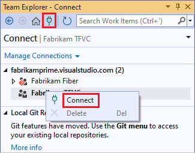
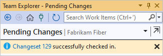

# Set up Team Foundation Version Control on your dev machine

[!INCLUDE [version-lt-eq-azure-devops](../../includes/version-lt-eq-azure-devops.md)]
[!INCLUDE [version-vs-gt-eq-2019](../../includes/version-vs-gt-eq-2019.md)]

To set up Team Foundation Version Control (TFVC) on your dev machine, you create a workspace and then add your code.

## Prerequisites

- [Visual Studio installed](https://visualstudio.microsoft.com).

- An Azure DevOps project. If you don't have a project, [create one](../../organizations/projects/create-project.md) or [get access to one](../../organizations/accounts/add-external-user.md).

## Create a workspace and get the code

1. Press Ctrl+0, C to open the **Connect** page of the Visual Studio **Team Explorer** window.

1. Right-click a project, and then select **Connect**.

   

   If the project you want isn't listed, select **Manage Connections**, select **Connect to a Project**, and then select the project you want. For more information, see [connect to a project](../../organizations/projects/connect-to-projects.md).

1. Select **Configure your workspace** to map the project to a folder on your dev machine.

   

1. Select **Map & Get** to map the workspace and get your code.

   

## Work in a Main folder

To prepare for when your team grows large enough to need [branches](./branching-strategies-with-tfvc.md) to manage your work, put all your code in a parent folder called *Main*, for example *$/MyTeamProject/Main*.

1. Press Ctrl+0, H to open the **Home** page of **Team Explorer**.

1. Select **Source Control Explorer**.

1. In the **Source Control Explorer** window, select your project in the left pane.

1. On the Visual Studio menu bar, choose **File** > **Source Control**> **New Folder**.

1. In **Source Control Explorer**, rename the folder *Main*.

   

1. Right-click the *Main* folder and choose **Check in Pending Changes**.

1. On the **Pending Changes** page, select **Check In**.

   

   Your changeset is checked in.

   

When your team decides to branch the codebase, you can convert the *Main* folder to a branch. For more information, see [Branch folders and files](branch-folders-files.md).

## Add your code to version control

If you've got an idea for a new app, you can use TFVC version control from the start. Or, you can put an app in progress under TFVC source control.

1. When you create a new code project that you want to put under TFVC solution control, put it in your mapped workspace folder like *c:\Users\\\<YourName>\\Source\\Workspaces\\YourTeamProject\\Main\\*.

   Or, if you already have an app in progress that you want to put under TFVC source control, move the solution into your workspace folder.

1. In Visual Studio, press Ctrl+Shift+O and open your solution, and open **Solution Explorer** by pressing Ctrl+Alt+L.

1. In **Solution Explorer**, right-click your solution and select **Add Solution to Source Control**.

   

1. In the **Add Solution to Source Control** dialog box, review the details, and then select **OK**.

1. When you're ready, press Ctrl+0, P to [check in your changes](check-your-work-team-codebase.md).

## Next steps

- If you're new to this process, you can [get a detailed step-by-step walkthrough](share-your-code-in-tfvc-vs.md).

- If your folder structure is complex or you use branches, you can [create one or more workspaces](create-work-workspaces.md) and [optimize them to meet your needs](optimize-your-workspace.md).

## Related articles

- [Set up a CI build](../../pipelines/build/triggers.md) 
- [Develop your app in Team Foundation version control](develop-your-app-team-foundation-version-control.md)