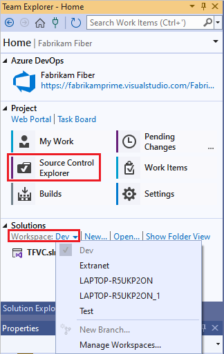
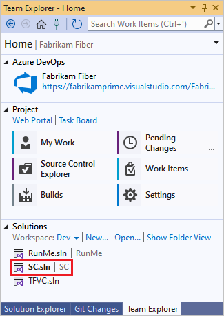
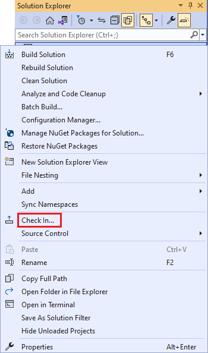
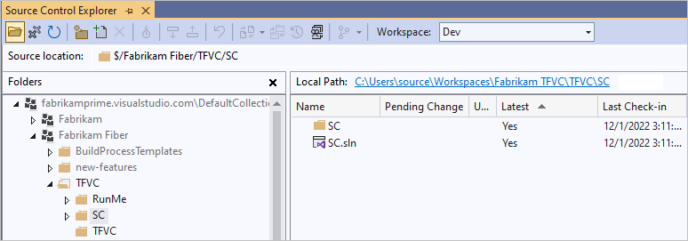
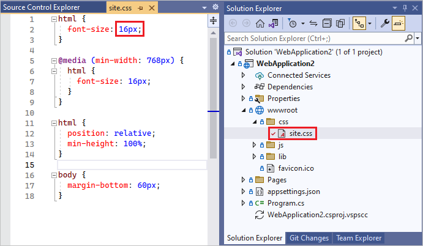
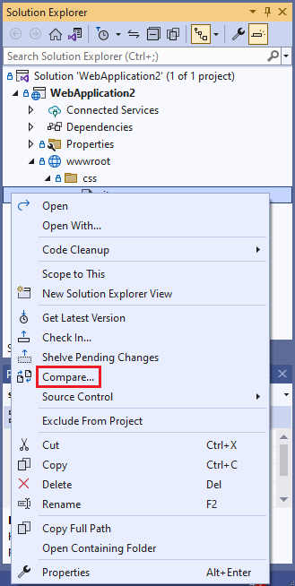
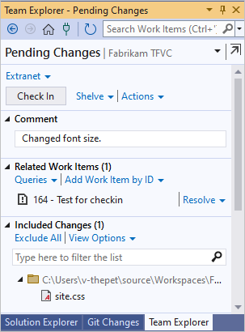
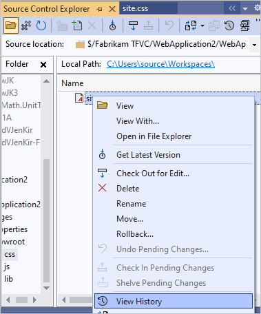

# Develop and share code in TFVC with Visual Studio

[!INCLUDE [version-lt-eq-azure-devops](../../includes/version-lt-eq-azure-devops.md)]
[!INCLUDE [version-vs-gt-eq-2019](../../includes/version-vs-gt-eq-2019.md)]

Whether your software project is large, small, or brand new, it's best to use version control as early as possible. This article shows you how to get started with Team Foundation Version Control (TFVC), a centralized version control system.

- If you want to work in a distributed version control system, you can instead use [Git with Azure Repos](../../repos/git/share-your-code-in-git-vs.md).

- If you have code you want to migrate into Azure DevOps Services, see [Migration options](../../migrate/migrate-from-tfs.md).

## Prerequisites

- [Sign up for Azure DevOps and create a project](../../organizations/accounts/create-organization.md).

- Install [Visual Studio](https://visualstudio.microsoft.com/downloads).

## Connect to your project

1. In Visual Studio, from the **Home** page of **Team Explorer**, select the **Manage Connections** icon.

1. On the **Connect** page of **Team Explorer**, right-click the project that contains your repository, and select **Connect**.

   

   If the project you want isn't listed, select **Manage Connections**, select **Connect to a Project**, and then select the project you want. For more information, see [Connect from Visual Studio or Team Explorer](../../organizations/projects/connect-to-projects.md#connect-from-visual-studio-or-team-explorer).

> [!NOTE]
> Some TFVC menu options aren't displayed in Visual Studio until you connect to TFVC.

## Configure your workspace

1. On the **Home** page of Visual Studio **Team Explorer**, select **Configure your workspace** to map the project to a folder on your dev machine.

1. Confirm your workspace path, and select **Map & Get** to map the workspace and get your code.

   

   Now you can check in source, queue builds, and manage work.

   

If you don't see the **Configure your workspace** link, you might already have a workspace on your computer. To see existing workspaces, open **Source Control Explorer**, or look under **Solutions** in **Team Explorer**. For more information, see [Use Source Control Explorer to manage files in TFVC](./use-source-control-explorer-manage-files-under-version-control.md) and [Create and work with workspaces](./create-work-workspaces.md).

> [!NOTE]
> TFVC doesn't support workspaces on network drives or UNC paths.

## Add your code to version control

1. To create a new code project to put under TFVC source control, select **New** under **Solutions** in the **Home** page of **Team Explorer**. Put the new solution in your mapped workspace folder like *c:\Users\\\<YourName>\\Source\\Workspaces\\YourTeamProject\\*.

   

   Or, if you already have an app in progress that you want to put under TFVC source control, move the solution into your workspace folder in Windows File Explorer.

   

1. Open your solution in Visual Studio.

   
   
1. Press Ctrl+Alt+L to open **Solution Explorer**, and in **Solution Explorer**, right-click the solution and select **Add Solution to Source Control**.

   

1. In the **Add Solution to Source Control** dialog box, review the details, and then select **OK**.

## Check in the solution

1. When you're ready to [check in your code](check-your-work-team-codebase.md), right-click your solution in **Solution Explorer** and select **Check In**.

   

1. On the **Pending Changes** page of **Team Explorer**, add a check-in comment and then select **Check in**.

   

1. From the **Home** page of **Team Explorer**, select **Source Control Explorer**.

   

   In **Source Control Explorer**, you can see the solution in TFVC.

   

Your whole team can work on the code now. All changes are tracked in version control.

## Check in changes

1. When you edit code in Visual Studio that's under TFVC source control, the changed file is automatically checked out. For example, *site.css* is checked out after the `font-size` has been changed to `16px`.

   

1. To compare the modified file with the latest version in source control, right-click the file in **Solution Explorer** and select **Compare**.

   

   The **Diff** window opens, and you can see the difference between the two versions.

   

1. In **Solution Explorer**, right-click the file and select **Check In** to check in the change.

   

   You can also check in from the code editor or from **Team Explorer**.

1. If you're working on a task or fixing a bug that's tracked as a work item, you can associate that work item with your pending changes. TFVC resolves the bug, closes the task, or links the changeset to the work item.

   

1. Add a comment and check in.

   

1. In **Source Control Explorer**, right-click the file you changed and select **View History** to view its history.

   

   The **History** window lists all the changesets that include this file.

   

## Next steps

- [Get your code reviewed](get-code-reviewed-vs.md)
- [Migrate from Azure DevOps Server into Azure DevOps Services](../../migrate/migrate-from-tfs.md)