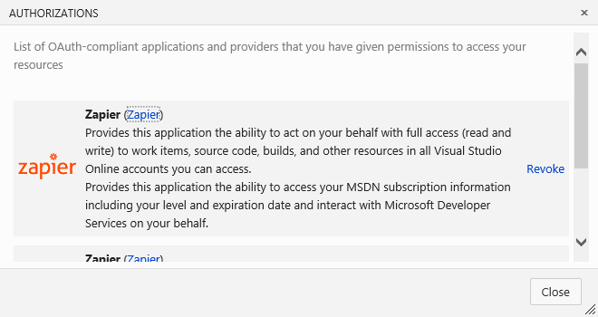

#  Manage authorization of services to access Azure DevOps 

[!INCLUDE [version-lt-eq-azure-devops](../includes/version-lt-eq-azure-devops.md)]

When you use a service that's integrated with Azure DevOps,
we use the industry-standard OAuth 2.0 authorization framework to provide safe,
secure access to your resources by those other services.
With OAuth, you grant a service the authorization to access your Azure DevOps Services
resources such as work items, source code, build results.

- Authorizations are bound to your credentials,
so the service can use the authorization to access resources
in Azure DevOps that you have access to.

- Use your Microsoft account (like ```me@live.com```) or your work account
(your account in Azure AD - like ```me@my-workplace.com```) to authorize the service.

- The service that you authorize never has access to your Azure DevOps credentials.

- Revoke any authorizations that you've granted to other services.

## Authorize a service

A typical authorization flow might go like this:

1. You're using a service that uses Azure DevOps Services resources,
so the service requests authorization.

1. If you're not already signed in, Azure DevOps Services prompts you for your credentials.

    

2. After you've signed in, you get the authorization approval page.

   

   At this point in time, services can only request full access to all of the resources that are available to you through the REST APIs, so don't be surprised that the authorization request isn't more specific.

3. You review the request and approve the authorization.

4. The authorized service uses that authorization to access resources in your Visual Studio account.

To ensure an authorization request is legitimate:

- Look for the Azure DevOps Services branding across the upper portion of the authorization approval page.

- Ensure the authorization approval page URL begins with ```https://app.vssps.visualstudio.com/```.

- Pay attention to any HTTPS-related security warnings in your browser.

- Remember that other services don't ask for your credentials directly. They let you provide them to Azure DevOps Services through the authorization approval page.

## Manage authorizations

To see the services that you've authorized to access your account,
go to [https://app.vssps.visualstudio.com/Profile/View](https://app.vssps.visualstudio.com/Profile/View)
and follow the **Manage authorizations** link.



You can revoke any authorizations here and the service can no longer access your account on your behalf.
