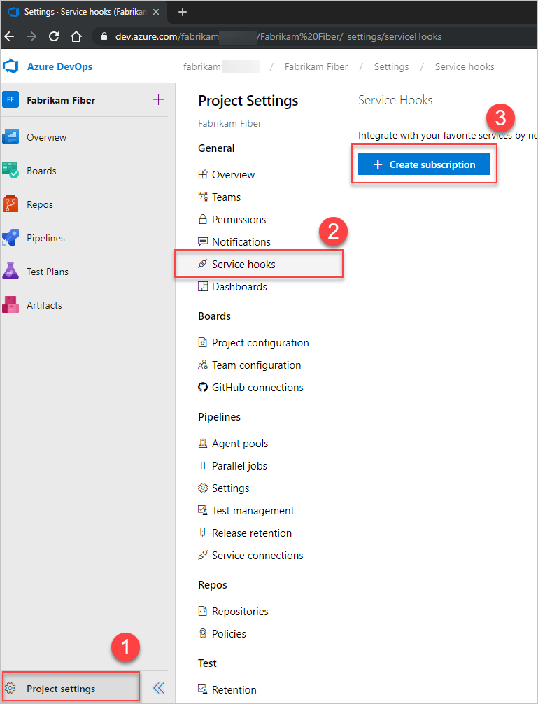

# Create a service hook for Azure DevOps with Datadog 

[!INCLUDE [version-azure-devops](../../includes/version-azure-devops.md)]

Create events and metrics in Datadog in response to events from Azure DevOps. Use these metrics and events in Datadog to create dashboards, troubleshoot issues, and create monitors to alert you of critical issues. Datadog accepts all Azure DevOps event types.

## Get your Datadog API key

1. If you don't have a Datadog account, [get started with Datadog](https://aka.ms/AzureDevOpsDataDog).
2. In the Datadog application, go to [Integrations > API](https://aka.ms/AzureDevOpsDataDogAPI)
3. Create a new key or select an existing one, and then copy the key to your clipboard. 

## Start sending DevOps events to Datadog

1. Go to **Project settings > Service hooks**: `https://{orgName}/{project_name}/_settings/serviceHooks`.

2. Select **Create subscription**.

   

3. Choose **Datadog** among the list of services, and then choose **Next**.

   :::image type="content" source="../media/select-datadog.png" alt-text="Screenshot with red box around Datadog and Next selections.":::

4. Select an event to trigger on, configure any filters, and then select **Next**.

   :::image type="content" source="../media/datadog-trigger-event.png" alt-text="Screenshot of configuration fields for triggering event in Azure DevOps.":::

5. Configure the action to perform.
   - Paste (ctrl+v) your Datadog API Key into the required field.
   - Indicate whether your Datadog account is US or EU.

6. Choose **Test** to verify that Azure DevOps can use the provided configuration and successfully create a subscription.

7. Once verified, choose **Finish** to complete the creation of subscription.

    :::image type="content" source="../media/datadog-api-key-account-type-selection.png" alt-text="Screenshot of screen where you select and configure the action to perform.":::

8.	Repeat steps 2-7 for each event type you want to send to Datadog. Datadog accepts and encourages users to send all event types.
9.	Go to Datadog to see events and metrics start to flow into your environment.

## FAQs

### Q: Can I create service hook subscriptions programmatically?

A: Yes. For more information, see [Create a service hooks subscription programmatically](../create-subscription.md). Submit to either of the following Datadog endpoints: 

- **US:** `https://app.datadoghq.com/intake/webhook/azuredevops?api_key=<API_KEY>`
- **EU:** `https://app.datadoghq.eu/intake/webhook/azuredevops?api_key=<API_KEY>`
- **US3:** `https://us3.datadoghq.com/intake/webhook/azuredevops?api_key=<API_KEY>`
- **Gov:** `https://app.ddog-gov.com/intake/webhook/azuredevops?api_key=<API_KEY>`

### Q: How can I use these events in Datadog?

A: Azure DevOps events that are sent to Datadog are useful for creating dashboards, setting up monitors, and finding correlations during troubleshooting. You can also use them to get insights into how your developer operations processes impact application performance. 

### Q: What event types can I send to Datadog?

A: Datadog accepts all event types.

### Q: Can I get more general information about Datadog?

A: Yes, see [datadoghq.com](https://datadoghq.com).

