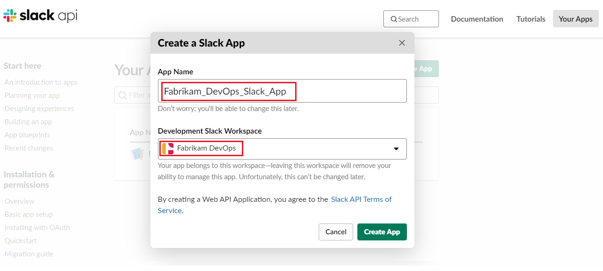
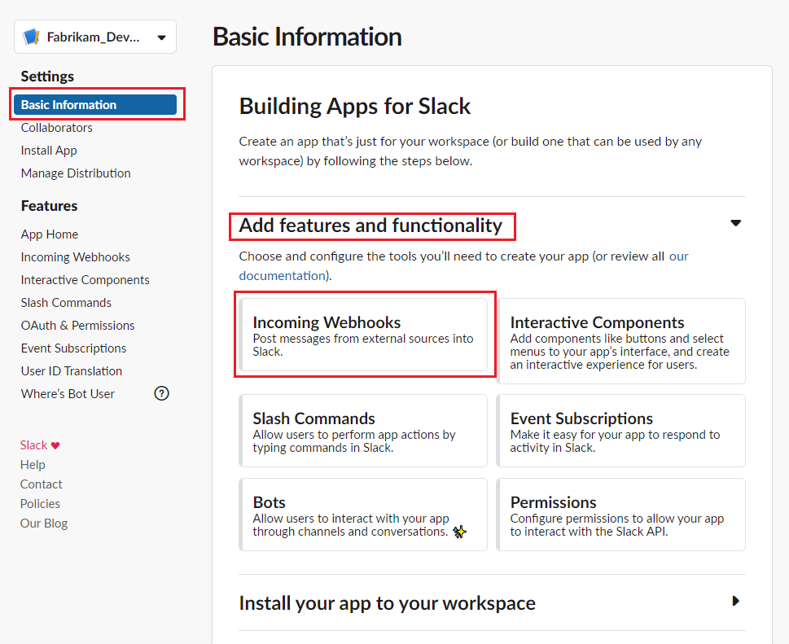
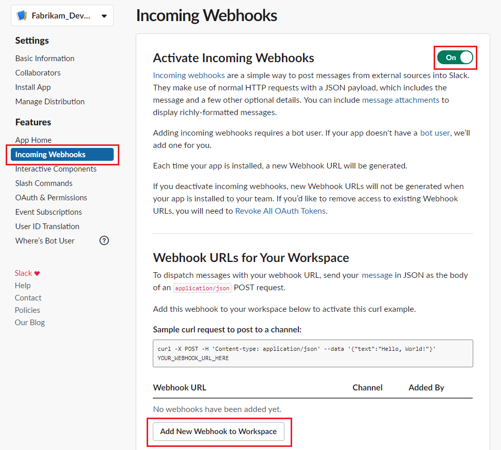

---
ms.technology: devops-collab
ms.topic: conceptual
title: Create a service hook with Slack
description: Use Slack with your Azure DevOps Services organization
ms.assetid: ea948249-1053-4971-99b9-ffa820c03803
monikerRange: '>= tfs-2017'
ms.date: 03/15/2019
---

# Create a service hook for Azure DevOps Server (TFS) with Slack

>[!NOTE]
>If you use Azure DevOps Services, we recommend you use the following suite of apps which offer rich features, to integrate with Slack.
>### Azure Boards app for Slack
>[Azure Boards app for Slack](https://aka.ms/AzureBoardsSlackIntegration) helps to easily create and monitor work items from your Slack channels.
Users can create work items using a slash command, or use message actions to convert conversations in the channel into work items. 
Users can also set up and manage subscriptions to get notifications in their channel whenever work items are created or updated. 
>### Azure Pipelines app for Slack
>[Azure Pipelines app for Slack](https://aka.ms/AzurePipelinesSlackIntegration) helps to easily monitor the events in your pipelines. Users can set up and manage 
subscriptions for completed builds, releases, pending approvals and more from the app and get notifications for these events in their channels. Users can also approve release deployments from their channels. 
>### Azure Repos app for Teams
>[Azure Repos app for Slack](https://aka.ms/AzureReposSlackIntegration) helps to easily monitor the events in your repositories. Users can set up and manage subscriptions for code commits, PR creation and PR updates and more from the app and get notifications for these events in their channels.

Post messages to [Slack](https://slack.com/) in response to events in your Azure DevOps organization,
like completed builds, code changes, pull requests, releases, work items changes, and more.

## Create the Slack integration

1. Refer to the [documentation](https://api.slack.com/messaging/webhooks) in Slack to understand the process of creating an incoming webhook.

2. Create a new [Slack app](https://api.slack.com/apps/new)



3. Toggle active incoming webhooks






1. From any page on your team's Slack (```https://[team].slack.com/...```), click your account name in the left window pane
to open up the menu, and find **Apps and integrations**:

   

1. Search for and click the Azure DevOps Services integration (Search "Visual Studio Team Services"):

   

1. On the Azure DevOps Services integration page, click **Install**.
1. Choose a channel to have notifications posted to from the dropdown and click **Add Visual Studio Integration**. 
1. Scroll down the page and copy the web hook URL to use when you create the service hook subscription in your organization.


## Create a service hook subscription in your organization

::: moniker range=">= azure-devops-2019"

1. Go to your project Service Hooks page: 

	`https://{orgName}/{project_name}/_settings/serviceHooks`

	

	Select **Create Subscription**.

1. Choose the types of events you want to appear in your Slack channel.
   > You can filter each of the triggers in specific ways.
   > For example, the *pull request created* trigger can be filtered on the repository in which the pull request occurs,
   > the target branch it applies to, and the team members that are required or invited to review the request.

1. Paste the web hook URL from the Slack integration that you created and select **Finish**.

   

1. Now, when the event you configured occurs in your project, a notification will appear in your team's Slack channel.

   

::: moniker-end

::: moniker range=">= tfs-2017 < azure-devops-2019"

1. Go to your project Service Hooks page: 

    `https://dev.azure.com/{orgName}/{project_name}/_apps/hub/ms.vss-servicehooks-web.manageServiceHooks-project`

	

	Select **Create Subscription**.

1. Choose the types of events you want to appear in your Slack channel.
   > You can filter each of the triggers in specific ways.
   > For example, the *pull request created* trigger can be filtered on the repository in which the pull request occurs,
   > the target branch it applies to, and the team members that are required or invited to review the request.

1. Paste the web hook URL from the Slack integration that you created and select **Finish**.

   

1. Now, when the event you configured occurs in your project, a notification will appear in your team's Slack channel.

   

::: moniker-end

## Pricing
Azure DevOps Services doesn't charge for the framework for integrating with external services. Check out the specific service's site
for pricing related to their services. 

## Q & A

<!-- BEGINSECTION class="m-qanda" -->

#### Q: Why don't I have the pull request events as an option when I configure my trigger?

A: Pull requests are only available with projects that use Git.
If your project uses TFVC, pull event triggers aren't available,
and your code event is called "Code checked in" instead of "Code pushed".

#### Q: How can I get multiple events to show up in my Slack channel?

A: Create a new subscription for each type of event you want.
For example, if you want to see build failures and new work items in your Slack channel,
create two additional subscriptions.


<!-- ENDSECTION -->
