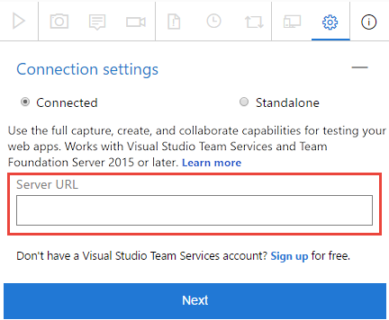
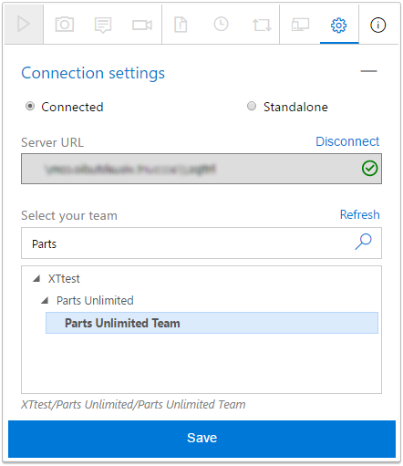
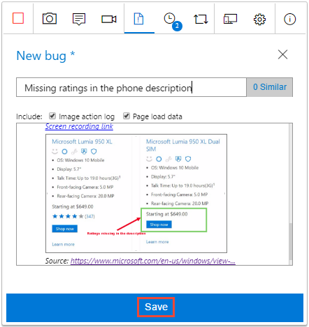
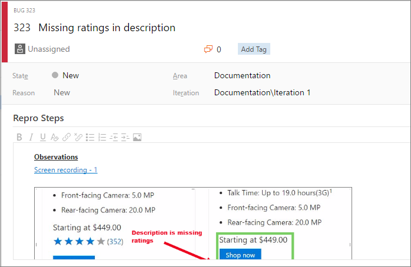
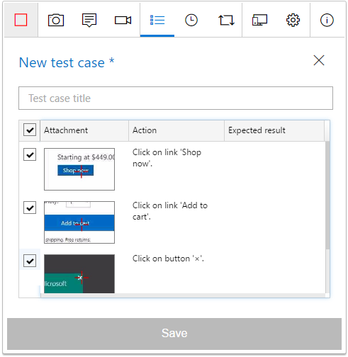
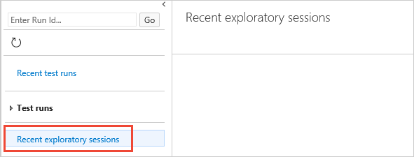

# Exploratory testing with the Test &amp; Feedback extension in Connected mode

[!INCLUDE [version-lt-eq-azure-devops](../includes/version-lt-eq-azure-devops.md)] 

To use the Test & Feedback extension in Connected mode, connect to an Azure DevOps project, which automatically configures the extension based on your access level: 

* Users with **Basic** access can use the extension to perform exploratory
  testing, as described in this article.

* Users with **Stakeholder** access can use the extension to respond to 
  feedback requests or to provide feedback voluntarily.
  [More details](provide-stakeholder-feedback.md#direct).
 
* Users with **Basic** or **Stakeholder** access can use extension to respond to feedback requests sent 
  by the team by choosing the **Provide feedback** link in the email.
  [More details](provide-stakeholder-feedback.md#email).

[!INCLUDE [prerequisites-define](includes/prerequisites-stakeholder.md)] 

## Connect to Azure DevOps 

1. If you haven't already, [sign up for a subscription](https://visualstudio.microsoft.com/products/visual-studio-team-services-vs). Make sure you create a project when you create your subscription.

2. If you haven't already, [install the Test &amp; Feedback extension](perform-exploratory-tests.md).

3. Open the extension in your web browser and select **Connected** mode.

   
 
4. Enter the Azure DevOps URL you want to connect to and choose **Next**.

   

   If you're connecting for the first time, you might be prompted to sign in. 
 
5. After you connect to the server, the extension shows 
   all the collections, projects and teams in that server. Select the
   project or team you want to connect to and choose **Save**.

   

   If there are many projects or teams, use the search textbox
   to find the one you need. 
 
The extension is now ready to be used in **Connected** mode. 
Depending on your access level (Basic or Stakeholder), you see the appropriate UI for either [exploratory testing](#create-bugs) or [providing feedback](provide-stakeholder-feedback.md#provide).
The extension remembers your selection and remains connected until
the session cookies expire or you explicitly disconnect from the server.

## Create bugs or tasks

After you connect, you're ready to begin testing your app.

1. Start your exploratory testing session. 

   

1. Open the web application you want to test, and start exploring it. 

1. When you find an area that has a bug, take a screenshot of any part of the screen,
   make notes, or record your actions as a video.

   

   >Some browsers may not provide all of the capture capabilities.
   See [Supported web browsers for the extension](perform-exploratory-tests.md#browser-support).

1. When you're done exploring and capturing information, create a bug or a task. 

   

1. The bug or task form contains all your captured information. 
   It also contains an image action log describing your interactions with the page
   (such as mouse select, keyboard typing events, touch gestures, and more) and
   page load data. Uncheck these options if you don't want to include this
   data in the bug or task.

   

   >The image action log is the sequence of steps you took that led to the issue.
   It can be used to reproduce the issue and understand the context.
   Page load data provides preliminary information about the time it takes to load
   the pages, such as the resource timings and navigation timelines.

1. Enter a title for the bug or task and add any other notes 
   you require to the description. Then save the bug or task.

   

   > You can also [add your findings to an existing similar bug](reference-qa.yml#addsimilar). 

1. View a list of all your activities in reverse chronological order
   in the **Session timeline** page. The timeline shows all the screenshots, videos, notes, the work items such as bugs, tasks, and test cases you already
   filed, and the work items you explored.

   

   You can use the extension to [explore work items](explore-workitems-exploratory-testing.md)
   in Azure DevOps.

2. To view a bug or task in Azure DevOps, choose the link in the session timeline.

   

   The work item form opens in Azure DevOps.

   

[How do I play the video recordings I created with the extension?](reference-qa.yml#recording-playback)
 

## Create test cases

The extension lets you create test cases as you explore your application.

1. When you find a scenario where you want to create a test case, select **Create test case**.

   

2. The test case form contains a list of all your actions up to this point
   while exploring the app (it reads them from the image action log).

   

3. Enter a title for the test case and then edit it as required. For example, 
   uncheck the action steps you don't want to include in the test case, edit the captured 
   text, and add the expected result. Then save the test case.
 
   

4. Continue exploring the application. Create more bugs, tasks, or test cases  as required. 

## End your testing session

1. When you're done, stop your session.

   

2. Open the **Session timeline** page and select the "view" icon to see your completed exploratory 
   sessions in Azure DevOps.

   

   Alternatively, open the **Recent exploratory sessions** list directly in the **Runs** page of the **Test Plans** web portal.
 
   

## See your exploratory session results 

After you file bugs, create tasks, or create test cases, they show up in the "Recent exploratory sessions" page in Azure Test Plans.

See how you can [view your sessions and get insights](insights-exploratory-testing.md).

[How do I play the video recordings I created with the extension?](reference-qa.yml#recording-playback)
