# Create manual test cases

[!INCLUDE [version-gt-eq-2015](../includes/version-gt-eq-2015.md)] 

Create manual test cases to check that each deliverable meets your users' needs. Manual test cases define individual steps testers perform, including steps that are shared across test cases. To test different data, you specify parameters for the test steps. To learn more, see [Share steps between test cases](share-steps-between-test-cases.md) and [Repeat a test with different data](repeat-test-with-different-data.md). For an overview of test artifacts, see [Test objects and terms](test-objects-overview.md).

Organize your test cases by adding them to test plans and test suites. Then assign testers to run the tests.

For an overview of test artifacts, see [Test objects and terms](test-objects-overview.md).

> [!NOTE]
> Test iterations are designed to support data-driven scenarios, not workflow-driven scenarios.
  From a best practice perspective, if you have two test scenarios where the workflows are
  different, consider creating separate test cases. Also see [FAQs for manual testing](reference-qa.yml#testcases).

[!INCLUDE [prerequisites-define](includes/prerequisites-define.md)] 

[!INCLUDE [note-new-ui](includes/note-new-ui.md)] 

## Create test cases
::: moniker range=">=azure-devops-2020"
1. If you haven't already, [create a test plan and requirement-based test suites](create-a-test-plan.md).

1. Select a requirement-based test suite.
   To the right, select the **New Test Case** button.
		
   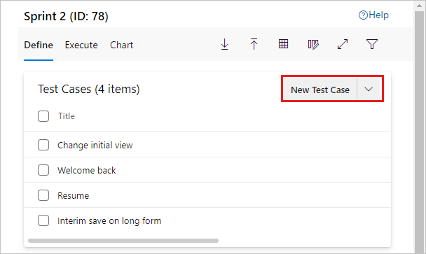

   If you have no existing test cases, the button appears in the lower right.

   > [!NOTE]
   > The [test suite](create-a-test-plan.md) shown here was created from a User Story work item in the team's backlog board.
   > When you add a test case to this kind of suite, the test case is automatically linked to the backlog item.
   > To create test cases this way, open the context menu for the work item and choose **Add test**.

1. In the new work item, enter a title. Select the **Click or type here to add a step** option.

   

   Add test steps with a description of the action required to carry out the test and the expected results so that any team member can run the test.
   You can add attachments to a step if you want.
   Repeat until you have added all the steps for the test.

   > [!NOTE]
   > You can share steps between test cases. For more information, see [Share steps](share-steps-between-test-cases.md).

   Now you've created a test case that you can run.

You can also copy test cases. For more information, see [Copy or clone stories, issues and other work items](../boards/backlogs/copy-clone-work-items.md).

## Assign configurations to test cases

You can specify configurations, such as different operating systems, web browsers, and other variations for your tests.

To assign test configurations to all test cases in a test suite, select the test suite, select **More options** or right-click to open the context menu, and then select **Assign configurations**.

In the **Assign configurations to test suite** dialog box, select the configurations you want.

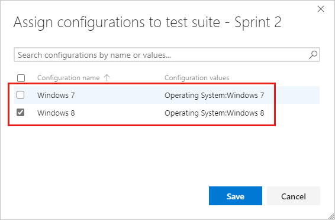

You can also assign configurations to individual test cases. Select one or more test cases, select **More options** or right-click to open the context menu, and then select **Assign configuration**.

The **Assign configurations to selected test cases** dialog box opens. Make and save your changes.

For more information about configurations, see [Test different configurations](test-different-configurations.md).

## Reorder test cases

You can reorder manual test cases in static suites, requirement-based suites, and query-based suites.
Open a test case, then use the up and down arrows to change the order.

There are also options to change order in the step context menu.

## Add existing test cases to a test suite

You can add existing test cases to a test suite.

1. Select a test suite. From the **New Test Case** menu, select **Add existing test case**.

   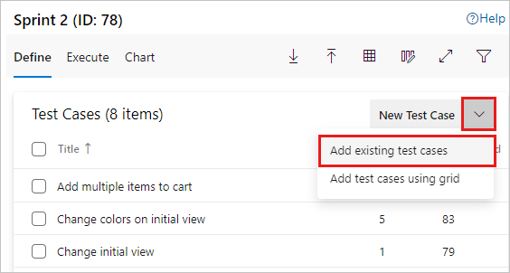

1. In the **Add test cases to suite** dialog box, add search clauses, as needed, and then select **Run query**.

   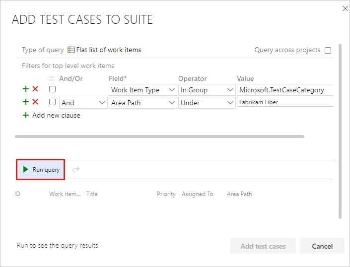

1. After you find the test cases you want, select **Add test cases**.

::: moniker-end

::: moniker range="<=azure-devops-2019"
1. If you haven't already, [create a test plan and requirement-based test suites](create-a-test-plan.md).

1. Select a requirement-based test suite. In the right-hand pane, choose **+** (New)
   and then choose **New test case**.

   

   > The [test suite](create-a-test-plan.md) shown here was created from a User Story work item in the team's backlog board. 
   > When you add a test case to this kind of suite, the test case is automatically linked to the backlog item.
   > To create test cases this way, open the shortcut menu for the work item and choose **Add test**.    

1. Choose the **Click or type here to add a step** link and add test steps
   with a description of the action required to carry out the test and the
   expected results so that any team member can run the test.
   You can add attachments to a step if you want. Repeat until you have added
   all the steps for the test. Now you've created a test case that you can run.

   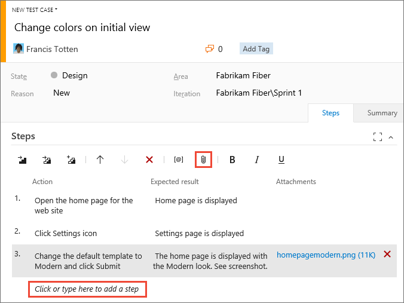

   You can share steps between test cases. For more information, see [Share steps](share-steps-between-test-cases.md).

   [How can I find an existing test case within a test plan?](create-a-test-plan.md#findplan)

You can reorder manual test cases in static suites, requirement-based suites, and query-based suites.
Choose **Order tests** on the tool bar, then drag and drop one or more tests.
Or open the shortcut menu for a test to move it to the top or to another position.
After reordering the tests, you can sort them by the **Order** field and then run them in that order with the web runner.

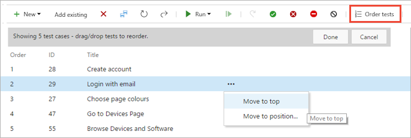

::: moniker-end

> [!TIP]
> You can create a test case that automatically links to a requirement&mdash;User Story ([Agile](../boards/work-items/guidance/agile-process.md)), Product Backlog Item ([Scrum](../boards/work-items/guidance/scrum-process.md)), Requirement ([CMMI](../boards/work-items/guidance/cmmi-process.md)), or Issue ([Basic](../boards/get-started/plan-track-work.md))&mdash;when you create a test from the Kanban board. To learn more, see [Add, run, and update inline tests](../boards/boards/add-run-update-tests.md). 
> 

## Use the Grid view to edit test cases
::: moniker range=">=azure-devops-2020"

You can copy and paste test cases into the **Grid** view.

To open the **Grid** view, select the **Grid View** icon at the right.

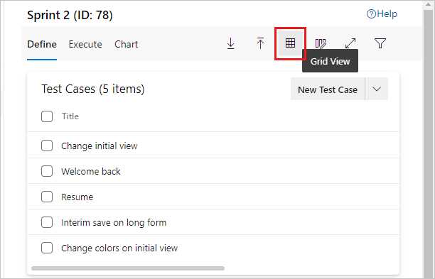

Instead, you can select several test cases and open them for editing in the **Grid** view. In the context menu, select **Edit test case(s) in grid**.

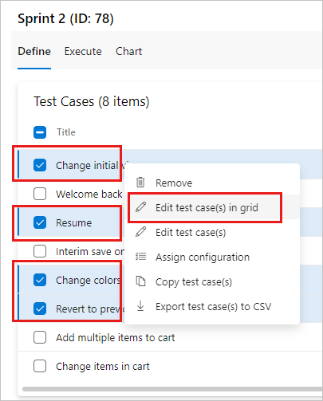

On the **Grid** context menu, you can add, delete, or clear rows.

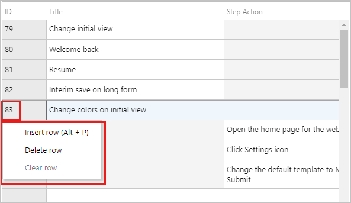

You can use the **Grid** view when you add multiple test cases to the test suite:

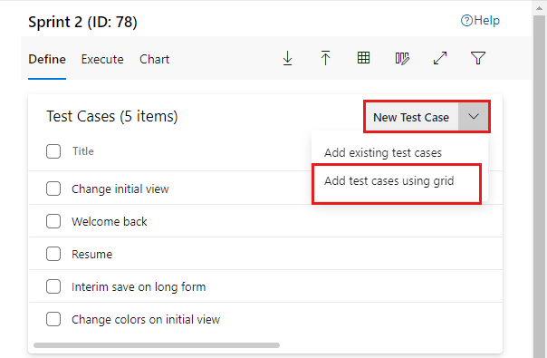

You can edit other fields in the **Grid** view.
In the **List** view, use the column options to select the fields in the test case work item.

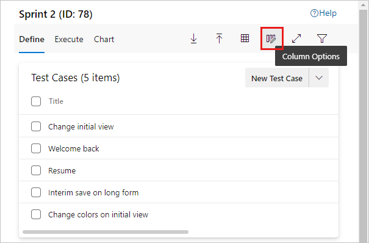

You can then view and edit these fields when you switch to the **Grid** view.
::: moniker-end

::: moniker range="<=azure-devops-2019"
Switch between **Grid** and **List** views using the **View** menu at the right of the window.

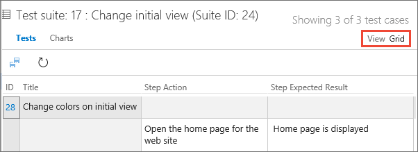

On the grid shortcut menu, you can add, delete, or clear rows.

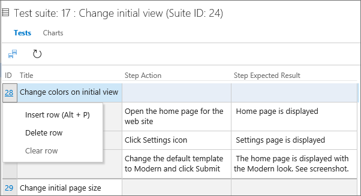

You can use the **Grid View** when you add multiple test cases to the test suite:

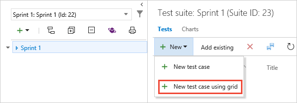
> [!NOTE]
> Do not use the Teams plugin for Excel to add or update test case work items.
> Excel cannot parse the format used to store test steps, and in some cases 
> this may affect the formatting of the test case work items. 

You can edit other fields in the **Grid** view.
In the **List** view, use the column options to select the fields in the test case work item.

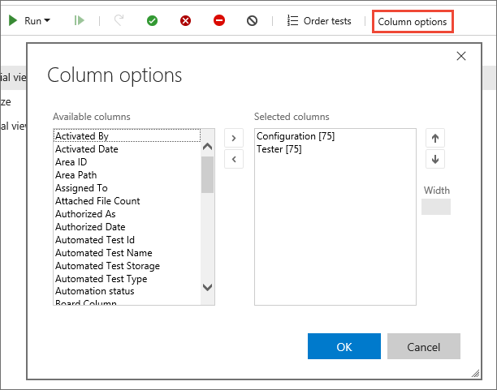

You can then view and edit these fields when you switch to the Grid view.
::: moniker-end

### Use Excel to copy test case information into a Grid view
::: moniker range=">=azure-devops-2020"
You can copy test cases and test steps from an existing Excel worksheet.
Copy the columns from Excel that you want to use for the title, action, and expected results fields.
Copying does not copy column formatting, other than multiline, from the worksheet.
Paste these columns into the **Grid** view, edit if necessary, and save them.

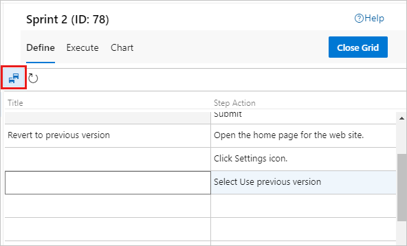

You can copy the data from the **Grid** view and paste it into your Excel worksheet.
Copying does not copy test step formatting, other than multiline, into the worksheet.

> [!NOTE]
> Do not use the Teams plugin for Excel to add or update test case work items.
> Excel cannot parse the format used to store test steps, and in some cases this may affect the formatting of the test case work items.

::: moniker-end

::: moniker range="<=azure-devops-2019"
You can copy test cases and test steps from an existing Excel worksheet.
This is supported only with Internet Explorer and Chrome browsers.

Copy the columns from Excel that you want to use for the title, action, and expected results fields.
Copying does not copy column formatting, other than multiline, from the worksheet.
Paste these columns into the **Grid** view, edit if necessary, and save them.

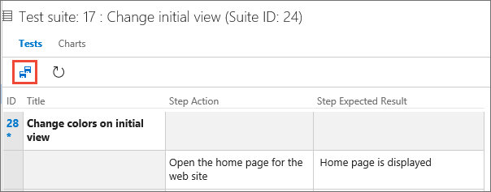

You can copy the data from the **Grid** view and paste it into your Excel worksheet.
Copying does not copy test step formatting, other than multiline, into the worksheet.
::: moniker-end

## Assign testers

::: moniker range=">=azure-devops-2020"
You can reassign test cases so that a different tester can run them.
You can assign all the test cases in a test suite to multiple testers, which is useful for acceptance testing.

Testers need [Basic access](../organizations/security/access-levels.md) to run tests from Azure Test Plans.

1. In the context menu for a test suite, select **Assign testers to run all tests**.

   

   The **Select testers to run all the tests in suite** dialog box opens.

1. Add or remove testers from the list. After you select the testers, select **Send email**
   and edit the message as required so they know that tests are ready for them to run.

   

   The email contains a link that testers can open to see the list of assigned tests.

You can assign an individual test case to a tester.

1. In the **Execute** tab for a test suite, select a test, and then open the context menu.

   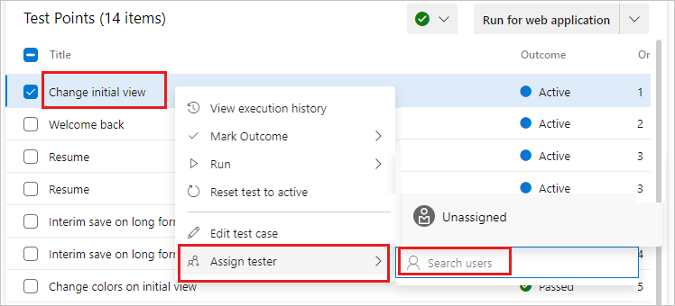

1. Select **Assign tester**. Search for and select a tester.

::: moniker-end

::: moniker range="<=azure-devops-2019"
1. You can reassign test cases so that another tester can 
   run them. Select the tests that you want to reassign. Then 
   open the shortcut menu (choose the "..." ellipses or right-click) 
   and select the tester you want to run the tests.

   

   Or, you can assign all the test cases in a test suite to multiple testers. 
   This is useful for acceptance testing. Open the shortcut menu for the test plan
   and choose **Assign testers to run all tests**. 
   
   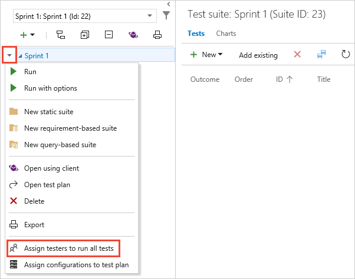

1. Add or remove testers from the list. After you select the testers, tick the **Send email**
   checkbox and edit the message as required so they know that tests are ready for them to run.

   

   The email contains a link that testers can open to see the list of assigned tests.
   Testers need just [Basic access](../organizations/security/access-levels.md)
   to run tests from Azure Test Plans.

::: moniker-end

## Manage test cases
::: moniker range=">=azure-devops-2020"

You can open a test case to view it or edit it.
To open a test case in a test suite, in the **Define** tab, double-select the name of the test case to open.
In the **Execute** tab, select a test case, open its context menu, and select **Edit test case**.

A test case can be linked to test suites, requirements, and bugs.
To see linked items, in the **Define** tab, open the context menu for a test case, and select **View Linked Items**.

In the **Linked Items** dialog box, you can view **Test Suites**, **Requirements**, and **Bugs**.

## Bulk edit test cases

You can edit more than one test case at a time. Select several test cases in a test suite and select **Edit test case(s)**.

Select a **Field** and enter a **Value**. Select **Add new field** to add another field-value pair.

### Use tags for test cases

You can tag test cases and view only the ones with specific tags.
For example, tag all the tests related to signing in so that you can rerun these tests if a bug is fixed for that page.
You can filter on that tag from the **Test Plans** web portal.

To add new tags to add to work items, you must have **Basic** access or higher and have the project-level **Create new tag definition permissions** set to **Allow**. for more information, see [Add work item tags](../boards/queries/add-tags-to-work-items.md).

You can add and edit tags when you edit a test case, or bulk edit tags in the **Grid** view.
You can also create suites based on queries when you use tags.

## Rename or remove test cases

You can rename or remove test cases. Open the test case from its context menu.

Here you can rename the test case.

Or you can remove the test case from the test suite. From the context menu for the test case, select **Remove**.

To permanently delete test plans and test suites, you must be a member of the Project Administrators group or have the Area Path node-level [**Manage test plans** or **Manage test suites**](../organizations/security/set-permissions-access-work-tracking.md#manage-test-artifacts) permission set to **Allow**. To manage or delete test artifacts, you must also have your [access level](../organizations/security/access-levels.md) set to **Basic + Test Plans** or **Visual Studio Enterprise**. For more information, see [Delete test artifacts in Azure Boards](../boards/backlogs/delete-test-artifacts.md).
::: moniker-end

::: moniker range="<=azure-devops-2019"
You can tag test cases and view test cases only with specific tags.
For example, tag all the tests related to signing in so that you can rerun these tests if a bug is fixed for that page.
Then you can filter on that tag from the **Test Plans** web portal.

To add new tags to add to work items, you must have **Basic** access or higher and have the project-level **Create new tag definition permissions** set to **Allow**. for more information, see [Add work item tags](../boards/queries/add-tags-to-work-items.md).

You can add and edit tags when you edit a test case, or bulk edit tags in the grid view.
You can also create suites based on queries when you use tags.

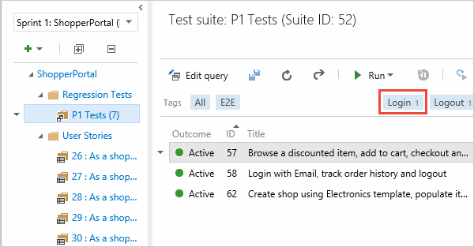

You can rename or delete test cases. Open the test case from its shortcut menu.

Here you can rename the test case.

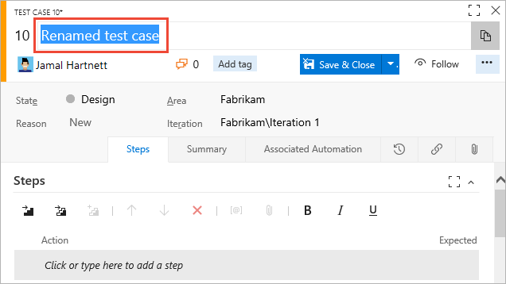

Or you can permanently delete the test case.

To delete test plans and test suites, you must be a member of the Project Administrators group or have the Area Path node-level Manage test plans or Manage test suites permission set to Allow.
To manage or delete test artifacts, you must also have your access level set to Basic + Test Plans or Visual Studio Enterprise.

To delete test plans and test suites, you must be a member of the Project Administrators group or have the Area Path node-level [**Manage test plans** or **Manage test suites**](../organizations/security/set-permissions-access-work-tracking.md#manage-test-artifacts) permission set to **Allow**. To manage or delete test artifacts, you must also have your [access level](../organizations/security/access-levels.md) set to **Basic + Test Plans** or **Visual Studio Enterprise**. For more information, see [Delete test artifacts in Azure Boards](../boards/backlogs/delete-test-artifacts.md).
::: moniker-end

## Next step

> [!div class="nextstepaction"]
> [Run manual tests](run-manual-tests.md)

## Related articles

- [Copy or clone stories, issues and other work items](../boards/backlogs/copy-clone-work-items.md)
- [Delete test artifacts in Azure Boards](../boards/backlogs/delete-test-artifacts.md)
- [FAQs for manual testing](reference-qa.yml#testcases)
- [Repeat a test with different data](repeat-test-with-different-data.md)
- [Share steps between test cases](share-steps-between-test-cases.md)
- [Test different configurations](test-different-configurations.md)
- [Test objects and terms](test-objects-overview.md)
