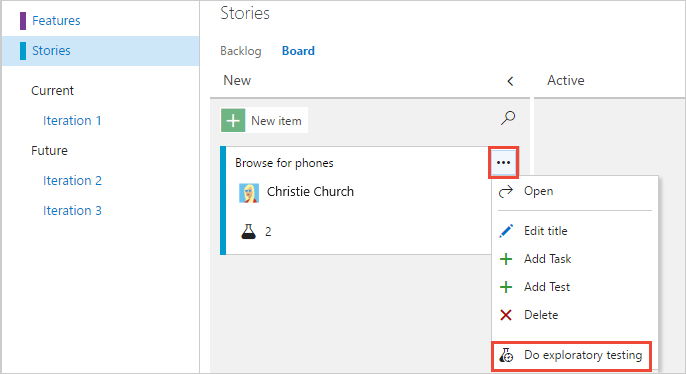
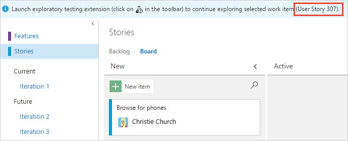
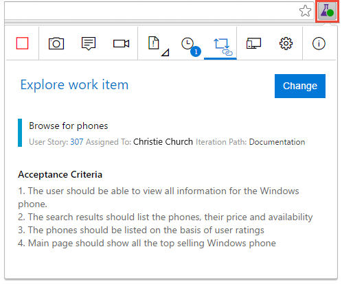
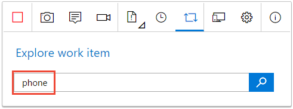
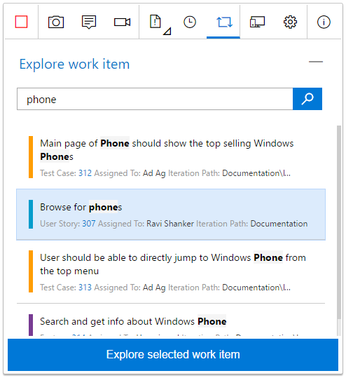
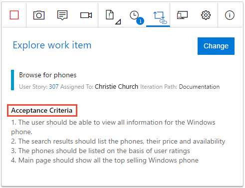
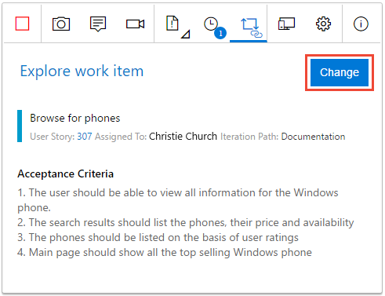

# Explore work items with the Test & Feedback extension

[!INCLUDE [version-lt-eq-azure-devops](../includes/version-lt-eq-azure-devops.md)]

Use the Test & Feedback extension to explore existing work items and 
associate them with a new or an in-progress exploratory session. 
After a work item is associated with a session, all new bugs, tasks and test cases created 
in the current session are automatically linked to that work item, which enables end-to-end traceability, and simplifies tracking and management of issues.

Explore the following items:
- Work items belonging to a requirement category, a feature category, or an epic category and requirements-based test suites and test cases
- A work item from the [board](#kanban) or from the [extension](#extension)
- [Multiple work items in the same session](#multipleitems)

[!INCLUDE [prerequisites-define](includes/prerequisites-stakeholder.md)] 

## Explore work items from the board

1. In the board, open the shortcut menu of the work item you want to explore, and select **Do exploratory testing**.

   
   
2. A banner in the Work hub shows which work item is associated with your session.

   

3. Launch the Test & Feedback extension. 
   Any acceptance criteria for the work item are shown.

   
 
   If you didn't already start a session, start one now. 
   The work item automatically associates with the current or new session. 

4. All bugs, tasks, and test cases you create automatically link to the current work item.

   

## Explore work items from the Test- Feedback extension

1. Open the **Explore work item** page in the extension and search for 
   the work item you want to explore.
 
   

   You can search using the work item identifier or keywords in the work item title.
  
2. Select the work item in the search results and choose **Explore selected work item**.

   
 
3. The work item is now associated with the in-progress session and acceptance criteria are shown.

   
 
4. All bugs, tasks, and test cases you create automatically link to the current work item.

   
 

## Explore multiple work items in the same session

To explore another work item, you must first dissociate the current work item from the in-progress session.

1. Open the **Explore work item** page and select **Change**. 

   

2. Associate the new work item with the in-progress session as [previously described](#extension).

## See your exploratory session results 

After you file bugs, create tasks, or create test cases, they show up in the "Recent exploratory sessions" page in Azure Test Plans.

See how you can [view your sessions and get insights](insights-exploratory-testing.md).

## Related articles

* [FAQs for manual testing](reference-qa.yml#tandfext)
* [Use the Test &amp; Feedback extension in Connected mode](connected-mode-exploratory-testing.md)
* [Add findings to existing bugs with exploratory testing](add-to-bugs-exploratory-testing.md)
* [Get insights across your exploratory testing sessions](insights-exploratory-testing.md)
* [Use the Test &amp; Feedback extension in Standalone mode](standalone-mode-exploratory-testing.md)
* [Exploratory testing with Microsoft Test Manager](/previous-versions/azure/devops/test/mtm/exploratory-testing-using-microsoft-test-manager)
* [Overview of manual and exploratory testing](index.yml)
