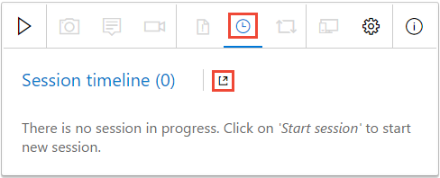
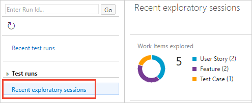
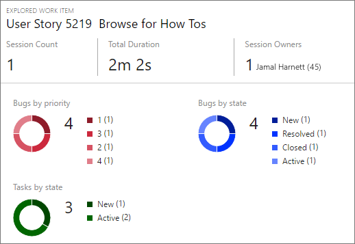
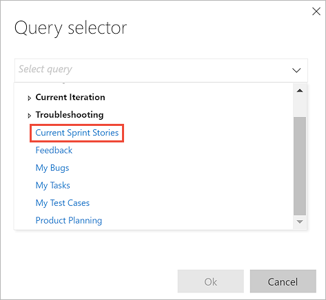
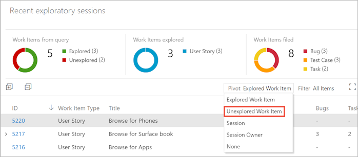

# Get insights across your exploratory testing sessions

[!INCLUDE [version-lt-eq-azure-devops](../includes/version-lt-eq-azure-devops.md)]
 
View completed exploratory testing sessions and derive meaningful insights
at team or individual level, and for a specific period. 

[!INCLUDE [prerequisites-define](includes/prerequisites-run.md)] 

1. Open the **Recent exploratory sessions** page, with either of the following actions:

   - From the Test - Feedback extension, select the "view" icon on the **Session timeline** page.
 
     
 
   - From **Test Plans**, select **Runs** > **Recent exploratory sessions**.  

     

2. Explore the **Recent exploratory sessions** page. It contains the following three main sections:

   - **Summary view** - shows a graphical breakdown of the work items explored, work items created, session owners, and the total time for these sessions.
 
   
 
   - **Pivot view** - shows a collapsible nested and sortable list of items grouped in different ways. 
 
   
 
   - **Details view** - shows the work item selected in the Pivot view or a summary of information about a selection of items.
 
   

## Get insights from your exploratory testing sessions:

Use the **Recent exploratory sessions** page to get insights about your
app from the information collected during your exploratory testing sessions.

1. **Set the scope for the data**. 
   Summary view  provides the highest level view of your test results.
   Use it to get insights into the overall effort and results of the 
   exploratory testing sessions. 

   - Use the **View** filter to scope the summary view to all sessions or just your own sessions.
   - Use the **Period** filter to scope the summary view to sessions in the period from the last 7 to the last 90 days.
 
   

2. **Pivot the data on the type of work item**.
   Pivot view lets you focus on all the work items you created
   in your exploratory testing sessions, or just on bugs, tasks, or test cases; 
   and group the results in different ways. 

   - Use the **Pivot** filter to group the work items as a nested list based on explored and unexplored (requires a [query](#not-explored)), by the session in which they were created, or by session owner.
   - Use the **Show** filter to show all items, or only bugs, tasks, or test cases.

   

3. **Get deep insights from Details view**.
   The Details view gives insights into the items selected in Pivot view. Depending on the type of item you select, you see the work item as an editable form, or a series of charts. 
 
   - Select a row in Pivot view to see a summary of all the related information in Details view. For example, if you pivoted the list based on sessions, select a session to see a summary of all the information from the work items in just that session.
   - Select a child row in Pivot view to display the work item form for that individual item. For example, if you pivoted the list based on explored work items, expand a work item and select a child bug, task, or test case to see the work item form for just that item.

   

## Discover work items not yet explored

Use a query to discover unexplored work items.

1. Create a shared query that selects work items using the Test - Feedback extension, such as work items in the epic category, feature category, requirement category, requirement-based suites, or test cases. 

   You must use a **shared** query. If this query returns a mix of supported and unsupported work items, only supported categories display.   

2. Use the **View** and **Period** filters to scope the view to the type of session (all sessions or just your own sessions) and the time span (from the last 7 to the last 90 days).
   Open the **Query** list and select **Select query**.

   

3. In the **Query selector** dialog, select the shared query you created earlier.

   

4. View all the work items returned by the query in the **Summary** view. You see a breakdown of explored and unexplored work items, work items filed, sessions, and total session duration. 

   

5. Open the **Pivot** list and choose **Unexplored Work Item**.

   

   The view shows only the unexplored work items.   

   

## Related articles

* [Use the Test &amp; Feedback extension in Connected mode](connected-mode-exploratory-testing.md)
* [Add findings to existing bugs with exploratory testing](add-to-bugs-exploratory-testing.md)
* [Explore work items with exploratory testing](explore-workitems-exploratory-testing.md)
* [Use the Test &amp; Feedback extension in Standalone mode](standalone-mode-exploratory-testing.md)
* [Exploratory testing with Microsoft Test Manager](/previous-versions/azure/devops/test/mtm/exploratory-testing-using-microsoft-test-manager)
* [Overview of manual and exploratory testing](index.yml)
