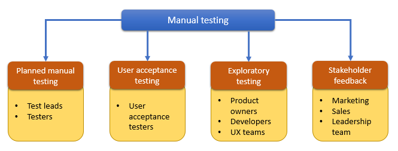
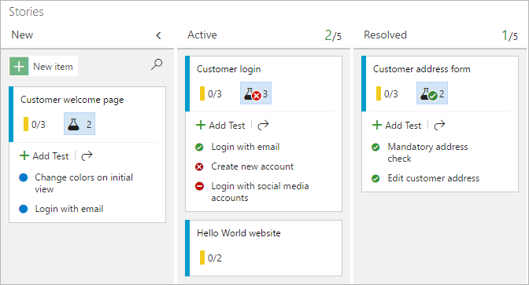
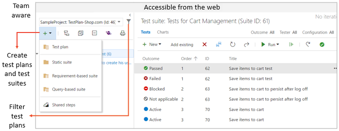
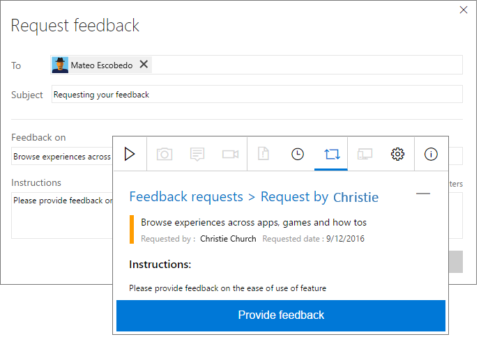

# What is Azure Test Plans?  

**Azure Test Plans | Azure DevOps Server 2020**

Quality is a vital aspect of software systems, and manual testing 
and exploratory testing continue to be important techniques for maximizing this.
In today's software development processes,
everybody in the team owns quality - including developers, managers, 
product owners, user experience advocates, and more.

Azure Test Plans provides rich and powerful
tools everyone in the team can use to drive quality and collaboration
throughout the development process. The easy-to-use, browser-based 
test management solution provides all the capabilities required for 
planned manual testing, user acceptance testing, exploratory testing,
and gathering feedback from stakeholders.

:::image type="content" source="media/overview/intro-test-plans.png" alt-text="Screenshot of Azure Test Plans, Test Plans, All":::

<!--- Elements to discuss: 

Dev Inner Loop – Unit Testing in Visual Studio IDE
Testing in Continuous Integration (CI) and Release Management (RM) or Continuous Delivery
Manual and exploratory Testing
Load and Performance Testing
Integration with 3rd party test services

--> 

> [!NOTE]  
> This article applies to Azure DevOps Services and Azure DevOps Server 2020 and later versions. Most of the information is valid for earlier on-premises versions, however, images show only examples for the latest version. Also, the user interface changed significantly with the release of Azure DevOps Server 2020. For an overview of the new interface and supported capabilities, see [Navigate Test Plans](navigate-test-plans.md). 

## How does Azure Load Testing work?

Azure Test Plans provides several browser-based hubs to support planning, authoring, execution, and analysis of manual and automated tests. In addition, it provides the following tools to link tests to requirements, run tests, create bugs, and capture feedback.  

- **Kanban board inline test tools**: An Azure Boards feature that supports defining test cases from the user stories, features, or bugs from the Kanban board. Also, you can launch the Test Runner or the Test & Feedback extension to run tests or perform exploratory testing. 
- **Test Runner**: A browser-based tool that you launch from the **Test plans** hub to run manual tests. Test Runner supports rich data collection while performing tests, such as: image action log, video recording, code coverage, etc. It also allows users to create bugs and mark the status of tests.  
- **Test & Feedback extension**: A free extension to support exploratory testing that you access from Chrome, Edge, or Firefox browsers. The extension captures interactions with the application being explored through images or video and entering verbal or type-written comments. Information is captured in the Feedback Response work item type to help track response data.
 
All test planning and authoring is captured in one of the following test-specific work item types: **Test Plans**, **Test Suites**, **Test Cases**, **Shared Steps**, and **Shared Parameters**. These objects are stored in the work tracking data store as specific types of work items. Various links exist among these items to track testing of user stories or requirements. For a description of each of these test objects, see [Test objects and terms](test-objects-overview.md).

 
 
## Supported scenarios and access level requirements 

Access to Azure DevOps web portal features are managed through access levels assigned to users. The three main access levels are **Stakeholder**, **Basic**, and **Basic+Test** plans as described in [About access levels](../organizations/security/access-levels.md). The following table indicates the access-level required to exercise the associated tasks with Azure Test Plans.    
 

|Scenario         | Task                                  | Stakeholder | Basic | Basic +Test Plans |  
|---------------------------------------------------------|-------------|------|--------------|  
|Test Planning    | Create test plans and test suites     |             |      |      ✔️      |   
|                 | Manage test plan run settings         |             |      |      ✔️      |   
|                 | Manage configurations                 |             |      |      ✔️      |   
|Test Authoring   | Author individual tests (test cases)  |             |      |      ✔️      |   
|                 | Author tests with Excel like grid     |              |      |      ✔️      |   
|                 | Copy paste tests to/from Excel        |            |      |      ✔️      |    
|                 | Create and manage shared parameters for data driven testing |            |      |      ✔️      |   
|                 | Set up user acceptance testing for multiple users|             |      |      ✔️      |   
|Test Execution   | Run tests on any platform (Windows, Linux, Mac) with Test Runner|           |    ✔️   |     ✔️         | 
|                 | Perform exploratory testing |    ✔️  |  ✔️ |  ✔️ | 
|Analyze and Review Tests | Browse test results |           |   ✔️    |      ✔️        |   
|                 | Create charts with various pivots like priority, configuration, etc., to track test progress|     |  ✔️   |   ✔️   |  
|                 | Export test plans and test suites for review |    ✔️       |     |           | 
|                 | User Acceptance Testing – Assign tests and invite by email|    ✔️       |   ✔️   |     ✔️       | 
 

## Manual and exploratory testing 

- **[Planned manual testing](#manual-testing)**. Manual testing by organizing tests into test plans and test suites by designated testers and test leads.
- **[User acceptance testing](#user-acceptance)**. Testing carried out by designated user acceptance testers to verify the value delivered meets customer requirements, while reusing the test artifacts created by engineering teams. 
- **[Exploratory testing](#exploratory-testing)**. Testing carried out by development teams, including developers, testers, UX teams, product owners and more, by exploring the software systems without using test plans or test suites. 
- **[Stakeholder feedback](#stakeholder-feedback)**. Testing carried out by stakeholders outside the development team, such as users from marketing and sales divisions.  

  
&nbsp; &nbsp; **Holistic approach to manual testing, types of manual testing, and personas involved**

## Define, execute, chart progress of test plans and test suites 

The **Test plans** hub of Azure Test Plans provides the tools you need to define, manage, and run your tests. Test cases, both manual and automated, are organized within test suites which are grouped under test plans.  

:::image type="content" source="media/overview/test-plan-define-execute-chart.png" alt-text="Screenshot of Azure Test Plans, Selected test plans":::

### Test cases

## View progress reports 

With the [Progress Report](progress-report.md) hub, teams can track progress of more than one test plan or test suite. It helps answer the following questions:

- *How much testing is complete?*
- *How many tests have passed, failed or are blocked?*
- *Is testing likely to complete in time?*
- *What is the daily rate of execution?*
- *Which test areas need attention?*

:::image type="content" source="media/overview/progress-report.png" alt-text="Screenshot of Azure Test Plans, Progress Report hub":::

## Manage shared parameters and the test cases they reference

Teams use the [Parameters](repeat-test-with-different-data.md) hub, to define and manage parameters shared across test cases. Shared parameters provide support for repeating manual tests several times with different test data. For example, if your users can add different quantities of a product to a shopping cart, then you want to check that a quantity of 200 works just as well as a quantity of 1.  
 
:::image type="content" source="media/overview/parameters.png" alt-text="Screenshot of Azure Test Plans, Parameters hub":::

## Add and manage test configurations and variables

With the [Configurations](test-different-configurations.md) hub, teams can define, review, and manage test configurations and variables referenced by test plans. Test configurations provide support for testing your applications on different operating systems, web browsers, and versions. As with shared parameters, test configurations can be shared across multiple test plans. 

:::image type="content" source="media/overview/configurations.png" alt-text="Screenshot of Azure Test Plans, Configurations hub":::

## 

The [Runs](test-different-configurations.md) hub displays the results of test runs. 

:::image type="content" source="media/overview/recent-test-runs.png" alt-text="Screenshot of Recent test runs":::

:::image type="content" source="media/overview/example-run-summary.png" alt-text="Screenshot of selected Test Runs summary":::

## Planned manual testing

Manual testing has evolved with the software development process
into a more agile-based approach. Azure DevOps and TFS integrate manual testing into your agile processes; the team
can begin manual testing right from their Kanban boards in the Work
hub. Teams that need more advanced capabilities can use the Test
hub for all their test management needs.

Learn how to create tests plans and test cases, and run them using the Azure DevOps web portal. Use the Test &amp; Feedback extension to explore and find bugs in your apps. 

:::row:::
    :::column:::
        :::image type="icon" source="media/testplan-icon.png" border="false":::  
        [Create a test plan](create-a-test-plan.md)  

        :::image type="icon" source="media/marketplace-icon.png" border="false":::  
        [Install the extension](perform-exploratory-tests.md)  
    :::column-end:::
    :::column:::
        :::image type="icon" source="media/testcases-icon.png" border="false":::  
        [Create test cases](create-test-cases.md)  

        :::image type="icon" source="media/connectedmode-icon.png" border="false":::  
        [Test in Connected mode](connected-mode-exploratory-testing.md)  
    :::column-end:::
    :::column:::
        :::image type="icon" source="media/runtests2-icon.png" border="false":::  
        [Run manual tests](run-manual-tests.md)  

        :::image type="icon" source="media/standalonemode-icon.png" border="false":::  
        [Test in Standalone mode](standalone-mode-exploratory-testing.md)  
    :::column-end:::
:::row-end:::

## Manual testing from the Kanban board

Get started with manual testing easily using the Kanban board in 
the Work hub. Add, view, and interact with test cases directly
from the cards on the Kanban board, and then progressively monitor
status directly from the card. Developers and testers can use these
rich capabilities to simplify maximizing quality within their teams.
In Azure DevOps, you need just [Basic access](../organizations/billing/buy-basic-access-add-users.md)
to use these features. See more at [Add, run, and update inline tests](../boards/boards/add-run-update-tests.md?toc=/azure/devops/test/toc.json&bc=/azure/devops/test/breadcrumb/toc.json).

## Manual testing in Test Manager

the **Test Plans** web portal. provides
a rich test management solution for teams that need advanced manual
testing capabilities. It includes all the capabilities
required for the testing lifecycle - including test planning, authoring,
execution, and tracking. Get started using the advanced manual 
testing features with the
[Test Manager extension for Azure Test Plans](https://marketplace.visualstudio.com/items?itemName=ms.vss-testmanager-web).

### Test planning

Create and manage test plans and test suites for your teams with ease.
Create static suites, requirement-based suites, or query-based suites.
Export and share the test plans and test suites with your team.
See more at [Create test plans](create-a-test-plan.md)

### Test authoring

Create multiple test cases in one operation, or easily add existing
test cases to a test suite. Assign single or multiple testers to 
execute the tests. View test results and references to a test case
across test suites. See more at [Create test cases](create-test-cases.md).

### Testing applications

the **Test Plans** web portal. provides
test runners to run tests for your web and desktop applications. Mark test steps and test outcomes as pass or fail, and collect
diagnostic data such as system information, image action logs, screen recordings, and screen captures as you test. Bugs filed during the tests automatically include all the captured diagnostic data
to help your developers reproduce the issues. See more at [Run tests for web apps](run-manual-tests.md#run-web) and [Run tests for desktop apps](run-manual-tests.md#run-desktop).

## Test tracking

Quickly configure lightweight charts to track your manual test results
using the chart types of your choice, and pin the charts to your dashboard to
easily analyze these results. Choose a retention policy to control how
long your manual testing results are retained.
See more at [Track test status](track-test-status.md).

## User acceptance testing

User acceptance testing (UAT) is a key factor in software development
that ensures the value requested by customers is being delivered
by the engineering team. Azure DevOps and TFS
include capabilities and tools to manage user acceptance testing.
Quickly create UAT plans and suites, and invite multiple testers to
execute these tests using test artifacts provided by the engineering team.
Easily monitor UAT progress and results using lightweight charts.
See more at [User acceptance testing](user-acceptance-testing.md).

## Exploratory testing for everyone

Maximizing quality in modern software development processes is a
shared responsibility between developers, managers, product owners,
user experience teams, and more. Collaborative testing processes and
tools are the key factors in driving quality in these scenarios.

The [Test &amp; Feedback extension](perform-exploratory-tests.md)
is a simple browser-based extension you can use to test web apps 
anytime and anywhere, and is simple enough for everyone in the team to use.
It helps to improve productivity by allowing you to spend more time
finding issues, and less time filing them.

Using the extension is a simple, three step process:

 
* **Capture your findings** quickly and easily using the tools in the extension. 
  Capture notes, screenshots with annotations, and screen recordings 
  to describe your findings and highlight issues. Additionally, in 
  the background the extension automatically captures rich data such
  as user actions as an image action log, page load data,
  and system information about the browser, operating system, memory,
  and more that can serve as a starting point for debugging. 

* **Create work items** such as bugs, tasks, and test cases directly from 
  the extension. The captured findings automatically become a part of the work item. 
  Users can file a bug to report an issue with the product, or create a task that
  indicates a new work requirement. The extension can also be used to 
  create test cases for scenarios discovered during exploration. 

* **Collaborate with your team** by sharing your findings. 
  Export your session report in Standalone mode, or connect to Azure DevOps or
  Team Foundation Server (2015 or later) for a fully integrated experience
  including exploring user stories and backlog items, simplified tracking and triaging of 
  bugs and tasks, and managing feedback requests in one place.

As users perform exploratory testing, you can
[get insights from the sessions](insights-exploratory-testing.md) in **Azure Test Plans**  of 
Azure DevOps or TFS. View completed exploratory sessions and derive meaningful
insights across all the sessions. Get end-to-end traceability such as a breakdown 
of the work items created, the work items explored and not explored, session owners,
and more.

## Stakeholder feedback

Seeking feedback from stakeholders outside the development team, such
as marketing and sales teams, is vital to develop good quality software.
Using Azure DevOps and TFS, developers can request
feedback on their user stories and features. Stakeholders can respond
to feedback requests using the browser-based Test &amp; Feedback extension -
not just to rate and send comments, but also by capturing rich diagnostic
data and filing bugs and tasks directly.
See more at [Request stakeholder feedback](request-stakeholder-feedback.md) 
and [Provide stakeholder feedback](provide-stakeholder-feedback.md).

## Key benefits

* **Test on any platform**. With the **Test Plans** web portal, you can use your browser to access all the manual testing capabilities. It enables you to [create](create-test-cases.md) and [run manual tests](run-manual-tests.md) through an easy-to-use, web-based interface that can be accessed from all major browsers on any platform.

* **Rich Diagnostic data collection**. Using the web-based Test Runner and Test Runner client you can [collect rich diagnostic data](collect-diagnostic-data.md) during your tests. This includes screenshots, an image action log, screen recordings, code coverage, IntelliTrace traces, and test impact data for your apps under test. This data is automatically included in all the bugs you create during test, making it easy for developers to reproduce the issues.

* **End to End Traceability**. Azure DevOps and TFS provide [end-to-end traceability of your requirements, builds, tests and bugs](../boards/queries/link-work-items-support-traceability.md?toc=/azure/devops/test/toc.json&bc=/azure/devops/test/breadcrumb/toc.json). Users can track their requirement quality from cards on the Kanban board. Bugs created while testing are automatically linked to the requirements and builds being tested, which helps you track the quality of the requirements or builds.

* **Extensible platform**. You can combine the tools and technologies you already know with the development tools that work best for you to integrate with and [extend Azure DevOps](../integrate/index.md). Use the REST APIs and contribution model available for the Test platform to create extensions that provide the experience you need for your test management lifecycle.

## Load testing

Azure DevOps cloud-based load testing service is deprecated. However, Azure Load Testing Preview is available. Azure Load Testing Preview is a fully managed load testing service that enables you to use existing Apache JMeter scripts to generate high-scale load. To learn more, see [What is Azure Load Testing Preview?](/azure/load-testing/overview-what-is-azure-load-testing). 

To learn more about the deprecation of Azure DevOps load testing and other, alternative services see [Changes to load test functionality in Visual Studio and cloud load testing in Azure DevOps](/previous-versions/azure/devops/test/load-test/overview).

### Supported tasks for test objects 

|Test object        | Task                                         | Web portal  | TCM |  
|----------------------------------------------------------------|-------------|-----|  
|Test plans       | Create                                       |    ✔️       |     |  
|                 | Copy                                         |    ✔️       |     |  
|                 | Clone                                        |             |  ✔️ |  
|                 | Add requirements                             |    ✔️       |    |  
|                 | New suites                                   |    ✔️       |    |  
|                 | Export                                       |    ✔️       |    |  
|                 | Import test suites                           |    ✔️       |    |  
|                 | Charts                                       |    ✔️       |    |  
|                 | Configurations                               |    ✔️       |    |  
|                 | Properties                                   |    ✔️       |    |  
|                 | Run settings                                 |    ✔️       |    |
|                 | View/list                                    |    ✔️       |  ✔️ |                  
|Test suite       | Create                                       |    ✔️       |    |  
|                 | Clone                                        |             |  ✔️ |  
|                 | Export                                       |    ✔️       |    |  
|                 | Add and view requirement(s)                  |    ✔️       |    |  
|                 | Assign configurations                        |    ✔️       |    |  
|                 | Assign testers                               |    ✔️       |    |  
|                 | Run                                          |    ✔️       |    |  
|                 | Run with options                             |    ✔️       |    |  
|                 | Run in client                                |    ✔️       |    | 
|                 | View/list                                    |    ✔️       | ✔️ |  
|Test case        | Create                                       |    ✔️       |    |  
|                 | Author test cases using Excel like Grid      |    ✔️       |    |   
|                 | Add existing                                 |    ✔️       |    |  
|                 | View results                                 |    ✔️       |    |  
|                 | Set state: Active, Passed, Fail, Blocked, N/A|    ✔️       |    |  
|Shared steps     | Create                                       |    ✔️       |    |  
|                 | Add to test cases                            |    ✔️       |    |   
|Shared parameters| Create                                       |    ✔️       |     |  
|                 | Add to test cases                            |    ✔️       |     |   
|                 | Manage global view                           |    ✔️       |     |   
|Test runs        | Create                                       |             |  ✔️  |   
|                 | Execute                                      |    ✔️       |  ✔️  |   
|                 | Export                                       |             |  ✔️  |   
|                 | Abort                                        |             |  ✔️  |  
|                 | Delete                                       |    ✔️       |  ✔️  |   
|                 | Publish                                      |              |  ✔️  |  
|                 | View/list                                    |    ✔️       |  ✔️ |  
|Test environments| Create                                       |    ✔️       |     |  
|                 | View/list                                    |    ✔️       |  ✔️ |  

<!--- TCM commands: 

Commands:

tcm configs          Lists test configurations

tcm fieldmapping     Imports or exports the XML file that maps to the type
                     provided.

tcm plans            Provides operations to list and clone test plans

tcm run              Creates, deletes, lists, aborts, publishes,
                     exports, or runs a group of tests.

tcm suites           Provides operations to list and clone test suites

tcm testenvironments Lists test environments

tcm testcase         Imports testcases from a specified assembly or a test file (NOT DOCUMENTED) 

The run command provides the ability to create, delete, list,
abort, execute, export, and publish runs.  The options
available for each of these actions are listed below.

tcm run /delete /id:id [/noprompt] /collection:teamprojectcollectionurl
        /teamproject:project [/login:username,[password]]

tcm run /abort /id:id /collection:teamprojectcollectionurl /teamproject:project
        [/login:username,[password]]

tcm run /export
        /id:id
        /resultsfile:path
        /collection:teamprojectcollectionurl
        /teamproject:project
        [/login:username,[password]]
        [/attachment:attachmentname]

tcm run /list
        /collection:teamprojectcollectionurl
        /teamproject:project
        [/planid:id  |  /querytext:query]
        [/login:username,[password]]

tcm run /create
        /title:title
        /planid:id
        /collection:teamprojectcollectionurl
        /teamproject:project
        (/suiteid:id /configid:configid  |  /querytext:query)
        [/settingsname:name]
        [/owner:owner]
        [/build:buildnumber /builddefinition:builddefinition]
        [/flavor:flavor]
        [/platform:platform]
        [/builddir:directory]
        [/testenvironment:name]
        [/login:username,[password]]
        [/include]

tcm run /publish
        /suiteid:id
        /configid:id
        /resultowner:owner
        /resultsfile:path
        /collection:teamprojectcollectionurl
        /teamproject:project
        [/title:runtitle]
        [/runowner:owner]
        [/build:buildnumber /builddefinition:builddefinition]
        [/flavor:flavor]
        [/platform:platform]
        [/assignfailurestouser:user]
        [/login:username,[password]]
        [/buildverification]

tcm run /execute
        /id:id
        /collection:teamprojectcollectionurl
        /teamproject:project
        [/login:username,[password]]

-->

## Next steps
> [!div class="nextstepaction"]
> [Test objects and terms](test-objects-overview.md)

## Related articles

- [Get started with manual testing](../boards/boards/add-run-update-tests.md?toc=/azure/devops/test/toc.json&bc=/azure/devops/test/breadcrumb/toc.json)
- [Get started with exploratory testing](perform-exploratory-tests.md)
- [Advanced exploratory testing techniques](explore-workitems-exploratory-testing.md)
- [Get stakeholder feedback with exploratory testing](request-stakeholder-feedback.md)
* [Continuous testing](../pipelines/index.yml)

## Additional resources

- [Test Planning and Management Guide](https://vsardata.blob.core.windows.net/projects/Test%20Planning%20and%20Management%20Guide.pdf) 
- [Unit testing](/visualstudio/test/developer-testing-scenarios) 
