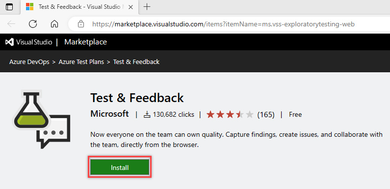
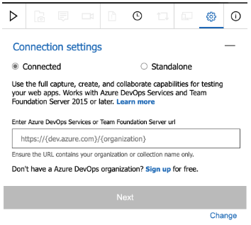

# Install the Test & Feedback extension

[!INCLUDE [version-lt-eq-azure-devops](../includes/version-lt-eq-azure-devops.md)]

The **Test & Feedback extension** helps teams perform exploratory testing and provide feedback. 
Everyone on your team can use the Test & Feedback extension to submit bugs or provide feedback and contribute to the quality of your product.

[!INCLUDE [prerequisites-define](includes/prerequisites-run.md)] 

## Supported web browsers for the extension

The Test & Feedback extension is currently available for [Google Chrome](https://www.google.com/chrome/), [Microsoft Edge (Chromium Only)](https://www.microsoft.com/edge/), and [Mozilla Firefox version 50.0 and higher](https://www.mozilla.org/).

Some browser versions don't support all the features of the Test & Feedback extension.

| Feature | Chrome | Microsoft Edge | Firefox |
| --- | --- | --- | --- |
| Capture screenshots with inline annotations | &nbsp; **Yes** | &nbsp; **Yes** | &nbsp; **Yes** |
| Capture notes | &nbsp; **Yes** | &nbsp; **Yes** | &nbsp; **Yes** |
| Capture screen recordings | &nbsp; **Yes** | &nbsp; **Yes** | &nbsp; **No** |
| Capture page load data | &nbsp; **Yes** | &nbsp; **Yes** | &nbsp; **No** |
| Capture user actions log | &nbsp; **Yes** | &nbsp; **Yes** | &nbsp; **Yes** |
| Capture system information | &nbsp; **Yes** | &nbsp; **Yes** | &nbsp; **No** |
| Create bugs | &nbsp; **Yes** | &nbsp; **Yes** | &nbsp; **Yes** |
| Create tasks and test cases | &nbsp; **Yes** | &nbsp; **Yes** | &nbsp; **Yes** |
| Create feedback requests | &nbsp; **Yes** | &nbsp; **Yes** | &nbsp; **Yes** |
| Export session report for sharing | &nbsp; **Yes** | &nbsp; **Yes** | &nbsp; **Yes** |
| End-to-end traceability for work items | &nbsp; **Yes** | &nbsp; **Yes** | &nbsp; **Yes** |
| Simplified bug and task tracking and triage | &nbsp; **Yes** | &nbsp; **Yes** | &nbsp; **Yes** |
| View and get insights from sessions | &nbsp; **Yes** | &nbsp; **Yes** | &nbsp; **Yes** |
| View similar existing bugs | &nbsp; **Yes** | &nbsp; **Yes** | &nbsp; **Yes** |
| Test app on devices using cloud providers such as Perfecto | &nbsp; **Yes** | &nbsp; **Yes** | &nbsp; **No** |
| Manage feedback requests | &nbsp; **Yes** | &nbsp; **Yes** | &nbsp; **Yes** |

For more information, see [Visual Studio Marketplace](https://marketplace.visualstudio.com/items?itemName=ms.vss-exploratorytesting-web).

## Install the extension

1. Check the list of [supported browsers](#browser-support) and decide which you want to use.

2. Download and install your chosen browser, if you haven't already, and then open it.

3. Go to [Visual Studio Marketplace > Test & Feedback](https://marketplace.visualstudio.com/items?itemName=ms.vss-exploratorytesting-web)
   and select **Install**.

   

4. Follow the instructions shown to install the Test & Feedback extension in your browser.

   You only need to install the extension or add-on once. Afterwards your browser updates the extension automatically.

##  Select an exploratory testing mode

1. Open the extension you installed in your browser by choosing the
    icon.

   
 
1. Decide if you want to use the extension in Connected or Standalone mode.

   

   **[Connected mode](connected-mode-exploratory-testing.md)**  
   Available to all users of Azure DevOps:

   - Users with at least **Basic** access: Full capture and create capabilities
     to submit bugs, tasks, and test cases. Includes collaboration capabilities, such as end-to-end traceability, rich insights across completed exploratory sessions, simplified tracking, and triage for bugs and tasks, and more.
   - Users with **Stakeholder** access: Full capture and create capabilities, except for test cases, to submit feedback and respond to feedback requests from the team. 
   - Feedback experience is available only in Azure DevOps.

 
   **[Standalone mode](standalone-mode-exploratory-testing.md)**  
   Available to everyone. No connection to Azure DevOps is required. Take notes and screenshots with inline annotations and capture issues. Create bugs and export a session report to share findings.
 
If you have any issues connecting to Azure DevOps, see [Troubleshoot connection](../user-guide/troubleshoot-connection.md).

## Next steps

> [!div class="nextstepaction"]
> [Use the Test & Feedback extension in Connected mode](connected-mode-exploratory-testing.md)

## Related articles

*  [FAQs for manual testing](reference-qa.yml#tandfext)
