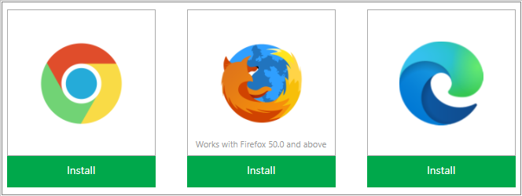
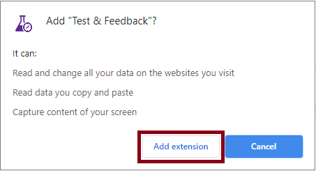
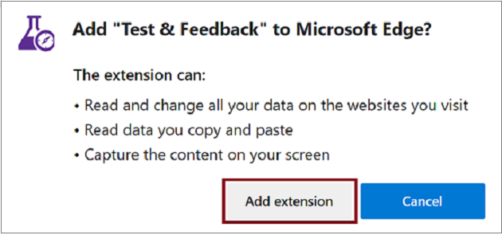
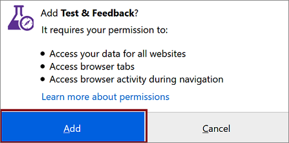

# Install the Test &amp; Feedback extension

[!INCLUDE [version-gt-eq-2015](../includes/version-gt-eq-2015.md)]

The **Test &amp; Feedback extension** helps teams perform exploratory testing and provide feedback. 
Everyone in the team, such as developers, product owners, managers, UX or UI engineers, 
marketing teams, early adopters, and other stakeholders can use the 
extension to submit bugs or provide feedback and contribute to the 
quality of your product. 

[!INCLUDE [prerequisites-define](includes/prerequisites-run.md)] 

## Supported web browsers for the extension

The Test &amp; Feedback extension is currently available for [Google Chrome](https://www.google.com/chrome/), [Microsoft Edge (Chromium Only)](https://www.microsoft.com/edge/), and [Mozilla Firefox version 50.0 and higher](https://www.mozilla.org/).

Some browser versions do not currently support all the features of the Test &amp; Feedback extension.

| Feature | Chrome | Microsoft Edge | Firefox |
| --- | --- | --- | --- |
| Capture screenshots with inline annotations | &nbsp; **Yes** | &nbsp; **Yes** | &nbsp; **Yes** |
| Capture notes | &nbsp; **Yes** | &nbsp; **Yes** | &nbsp; **Yes** |
| Capture screen recordings | &nbsp; **Yes** | &nbsp; **Yes** | &nbsp; **No** |
| Capture page load data | &nbsp; **Yes** | &nbsp; **Yes** | &nbsp; **No** |
| Capture user actions log | &nbsp; **Yes** | &nbsp; **Yes** | &nbsp; **Yes** |
| Capture system information | &nbsp; **Yes** | &nbsp; **Yes** | &nbsp; **No** |
| Create bugs | &nbsp; **Yes** | &nbsp; **Yes** | &nbsp; **Yes** |
| Create tasks and test cases | &nbsp; **Yes** | &nbsp; **Yes** | &nbsp; **Yes** |
| Create feedback requests | &nbsp; **Yes** | &nbsp; **Yes** | &nbsp; **Yes** |
| Export session report for sharing | &nbsp; **Yes** | &nbsp; **Yes** | &nbsp; **Yes** |
| End-to-end traceability for work items | &nbsp; **Yes** | &nbsp; **Yes** | &nbsp; **Yes** |
| Simplified bug and task tracking and triaging | &nbsp; **Yes** | &nbsp; **Yes** | &nbsp; **Yes** |
| View and get insights from sessions | &nbsp; **Yes** | &nbsp; **Yes** | &nbsp; **Yes** |
| View similar existing bugs | &nbsp; **Yes** | &nbsp; **Yes** | &nbsp; **Yes** |
| Test app on devices using cloud providers such as Perfecto | &nbsp; **Yes** | &nbsp; **Yes** | &nbsp; **No** |
| Manage feedback requests | &nbsp; **Yes** | &nbsp; **Yes** | &nbsp; **Yes** |

For more information, see <a href="https://marketplace.visualstudio.com/items/ms.vss-exploratorytesting-web" data-raw-source="[Visual Studio Marketplace](https://marketplace.visualstudio.com/items/ms.vss-exploratorytesting-web)">Visual Studio Marketplace</a>, Azure DevOps tab.

## Install the extension

1. Check the list of [supported browsers](#browser-support) and decide which you want to use.

1. Download and install your chosen browser, if you haven't already, then open it.

1. Go to [Visual Studio Marketplace > Test &amp; Feedback](https://marketplace.visualstudio.com/items?itemName=ms.vss-exploratorytesting-web)
   and choose **Install**.

   

   

1. Follow the instructions shown to install the Test &amp; Feedback extension in your browser:

   - If you are using Google Chrome, choose the **Install** link for Chrome from the above image to open the 
     Google Chrome web store and follow the instructions to install the extension.

     

     
     
   - If you are using Microsoft Edge (Chromium), choose the **Install** link for Edge from the above image to open the 
     Microsoft Edge Add-ons page and follow the instructions to install the extension.

     

     
     
   - If you are using Mozilla Firefox 50.0 and higher, choose the **Install** link for Firefox from the above image to open the 
     Firefox Browser Add-ons page and follow the instructions to install the extension.

     

     

>You need to install the extension or add-on only once. Afterwards your browser will
update it automatically.

##  Select an exploratory testing mode

1. Open the extension you installed in your browser by choosing the
    icon.

   
 
1. Decide if you want to use the extension in Connected or Standalone mode.

   

   **[Connected mode](connected-mode-exploratory-testing.md)**  
   Available to all users of Azure DevOps and TFS 2015 or later:

   - Users with **Basic** access or higher: Full capture and create capabilities
     to submit bugs, tasks, and test cases. Includes collaboration
     capabilities such as end-to-end traceability, rich insights
     across completed exploratory sessions, simplified tracking
     and triaging for bugs and tasks, and more.
   - Users with **Stakeholder** access: Full capture and create capabilities,
     except for test cases, to submit feedback and respond to feedback
     requests from the team. 
   - Feedback experience is available only in Azure DevOps and TFS 2017 or later.

 
   **[Standalone mode](standalone-mode-exploratory-testing.md)**  
   Available to everyone. No connection to Azure DevOps or TFS is required. Take notes and screenshots with
   inline annotations to capture issues. Create bugs and export
   a session report to share findings.
 
If you have problems connecting to Azure DevOps or TFS, you may find
the topic [TF31002: Unable to connect](../organizations/projects/tf31002-unable-connect-tfs.md) useful.

## Related articles

*  [FAQs for manual testing](reference-qa.yml#tandfext)

## Next step

> [!div class="nextstepaction"]
> [Use the Test &amp; Feedback extension in Connected mode](connected-mode-exploratory-testing.md)
