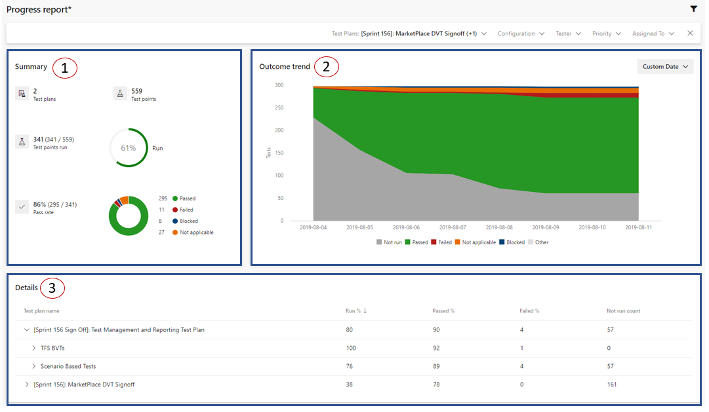
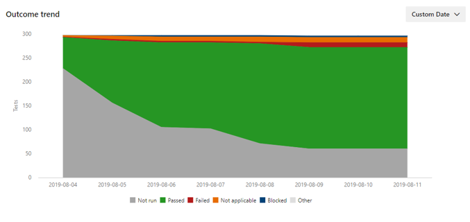

# Progress Report

[!INCLUDE [version-gt-eq-2020](../includes/version-gt-eq-2020.md)]  
  
To track the progress of more than one test plan or test suite, use the Progress Report. It helps you track the team's progress with respect to planned testing of your product or service by answering the following questions:
- How much testing is complete?
- What is the current status how many tests have passed, failed or are blocked?
- Is the testing likely to complete in time?
- What is the rate of execution on a daily basis?
- Get a breakdown by test plan and suite to understand where execution is going slow or has many failed or blocked tests.
- View the progress each suite has made within a test plan and identify the areas that need attention.

> [!NOTE] 
> - The Progress Report lets you view data for one or more Test Plans in a single project. To view data across projects, use the [OData APIs](../report/extend-analytics/data-model-analytics-service.md). This report is also rendered using the same OData APIs. 
> - The report, always shows you the data for the test plan you last accessed. Filter selections aren't stored.  
> - Report data corresponds to the the current test suite hierarchy in the selected test plans. Hierarchy history isn't stored.
> - Report data is updated approximately every 15 minutes. Do not use this report for real-time analysis or reporting. Expect ~15 mins of duration between a test execution and the same to show up in the report. 
> - Data for test plans migrated from an on-premises Azure DevOps server won't show up in this report.
> - Percentage Data will not display the decimal values in this report.
> - Some Outcomes are not identified on the Details section even though they contribute to the "Run%" column. Test Cases with Outcome "Blocked", "Not Applicable", and in the paused state are not reflected on the "Passed%" or "Failed%". If you have Test Cases with these Outcomes there will be a difference between the "Run%" and the "Passed%" + "Failed%" sum. The "Not Run" column only counts Test Cases that are showing as "Active" in the current Outcome. You can use the report filters to fine tune the results.   

## Prerequisites

::: moniker range="azure-devops"
- You must be a member of a project with Basic access or higher. If you don't have a project yet, create one. For more information, see [Sign up for free](../user-guide/sign-up-invite-teammates.md). 
- If you haven't been added as a project member, [get added now](../organizations/accounts/add-organization-users.md). Anyone with access to the project, except stakeholders, can view Analytics views.
- **Test Plans** must be enabled. If it is disabled, the **Test Plans>Progress Report** page won't display. To re-enable **Test Plans**, see [Turn an Azure DevOps service on or off](../organizations/settings/set-services.md)
- Have the **View Analytics**  permission set to *Allow*. For more information, see [Grant permissions to access the Analytics service](../report/powerbi/analytics-security.md).
::: moniker-end

::: moniker range=">= azure-devops-2019 < azure-devops"

- You must be a member of a project with Basic access or higher. If you haven't been added as a project member, [get added now](../organizations/security/add-users-team-project.md). Anyone with access to the project, except Stakeholders, can view Analytics views.
- [Verify that Analytics](../report/dashboards/analytics-extension.md)] is installed, and if not, then enable it. You must be the **Organization owner** or a member of the [**Project Collection Administrators** group](../organizations/security/change-organization-collection-level-permissions.md) to add extensions or enable the service. 
- **Test Plans** must be enabled. If it is disabled, the **Test Plans>Progress Report** page won't display. To re-enable **Test Plans**, see [Turn an Azure DevOps service on or off](../organizations/settings/set-services.md)
- Have the **View Analytics**  permission set to *Allow*. For more information, see [Grant permissions to access the Analytics service](../report/powerbi/analytics-security.md).

::: moniker-end

## Configure the report

Open the report from the web portal by going to **Test Plans>Progress Report**. The report shows you the status of the test plan you last accessed. However, using the filter bar, you can select one or more test plans in the project.

## Understand the report

The progress report consists of three sections:
1. **Summary**: This section provides you with a consolidated view for the selected test plans. To understand what test points are, see [Navigate Test Plans](navigate-test-plans.md).
2. **Outcome trend**: This graph renders a daily snapshot to give you an execution and status trendline. It can show data for 14 days (default), 30 days, or a custom range of your choice. Data for today may or may not appear in this chart based on the time of the day you are looking at the report.
3. **Details**: This section lets you drill down by each test plan and gives you summary of each test suite in it. The section also lets you navigate to a test plan or suite of choice by double-clicking on it.

An example of a healthy outcome trend is as follows because as time is progressing, the number of not run tests are decreasing (because tests are being executed) and the number of passed tests are on the rise.

An example of an unhealthy outcome trend is as follows because as time is progressing, there is no significant execution occurring and the # of passed and failed tests are continuing to remain flat. In such situations, use the details card to drill down and take suitable actions.

## Filter

Use the filter barto filter by **Test Suites**, **Configuration**, **Tester**, Test Case **Priority**, and Test Case **Assigned To**. For example, you can filter by configuration 'Chrome' and then 'Edge' to understand where the execution and pass % are higher. Note: Tester is the person to whom the test point is assigned for execution whereas Assigned to is the person who is responsible for the reusable test case.

> [!NOTE]   
> The test plan is considered Level 1. Its child suites are considered level 2. Their child suites in turn are considered level 3. The Test Suites filter shows only the Level 3 test suites inside the selected test plans. To select a Level 2 test suite select all the Level 3 test suites underneath it. This assumes the Level 2 test suites itself does not have any test points.

 
  

## Related articles

- [Control how long to keep test results](how-long-to-keep-test-results.md)
- [FAQs for manual testing](reference-qa.yml#trackstatus)

