# FAQs for Test Case Management Reporting

[!INCLUDE [version-inc-vs-all](_shared/version-inc-vs-all.md)] 

## I am using Microsoft Test Manager (MTM) for my testing activities - what type of reports can I see within MTM?

You can view basic reporting information within Microsoft Test Manager:

* Test Run status at a Test Plan level:

  This provides a status of all the tests that have been run, along with their current outcomes, within that specific test plan. This data is aggregated across all suites within the Test Plan. You can view this from the Test Plan Properties page.

  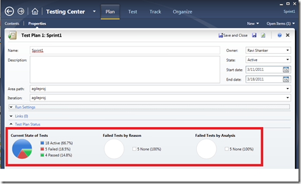

* Test Run status at a Test Suite Level:

  This provides a status of all the tests that have been run, along with their current outcomes, within that specific test suite. This information can be seen on both the Test Activity Center (as shown below) or Plan Activity Center.

  > [!NOTE]
  > The data shown at a suite level includes the tests that are explicitly within that suite node only - it does not include all the child suites within that suite.

  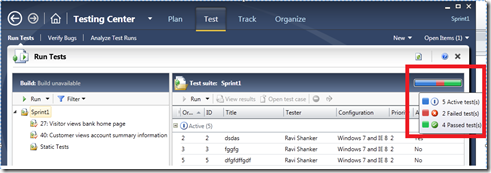

## I would like to create reports in Excel using Work Item Queries, but I cannot do so for all the Test artifacts such as Test Suites, Test Runs etc? Why?

[Creating Reports in Microsoft Excel by Using Work Item Queries](https://msdn.microsoft.com/library/dd433251.aspx)

You can use the above method to query for any TFS "Work Items". So, you should be able to create a report for "Test Case", "Bug", "Task" work items.

However, all the other Test artifacts, such as Test Plan, Test Settings, Test Configurations, Test Suites, Test Points etc are not "work items". Hence, you cannot use the work item queries for them.

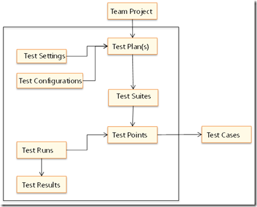

All the test artifacts which are enclosed within the black box (in above diagram) are not work items but they are stored directly within the Test Case Management store.

## The reporting information shown within MTM is very basic in nature - are there any other Test reports that ship out-of-the-box that I can use?

Most of the out-of-the-box TFS reports, including Test related reports, can be accessed from within Team Explorer.

There are two types of reports that can be viewed from Team Explorer - Excel Reports and SQL Reporting Services Reports.

1. Excel Reports: These reports use Excel to connect to the TFS warehouse or Analysis cube to display the reporting data. The figure below shows the list of all Excel reports that ship out of the box. Depending upon the process template (Agile, CMMI) you used at the time of creation of the project, the respective reports are created at project creation time.

   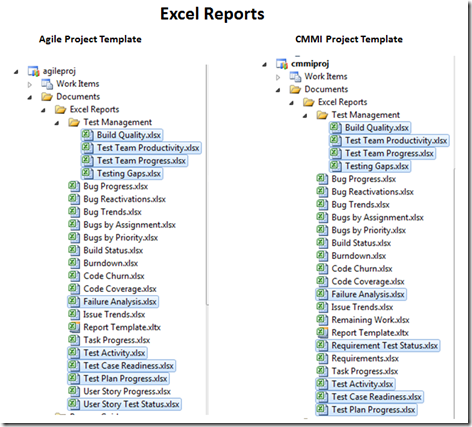

   All the test specific reports are highlighted in the above diagram.

   Details of each of the Test related reports can be found below:

   * [Test Management Reports](https://msdn.microsoft.com/library/ee795293.aspx)

     - [Build Quality Excel Report](https://msdn.microsoft.com/library/ee730418.aspx)

     - [Test Team Productivity Excel Report](https://msdn.microsoft.com/library/ee730422.aspx)

     - [Test Team Progress Excel Report](https://msdn.microsoft.com/library/ee730420.aspx)

     - [Testing Gaps Excel Report (Agile)](https://msdn.microsoft.com/library/ee730419.aspx)

     - [Testing Gaps Excel Report (CMMI)](https://msdn.microsoft.com/library/ee730423.aspx)

   * [Failure Analysis Excel Report](https://msdn.microsoft.com/library/ee461520.aspx)

   * [Test Activity Excel Report](https://msdn.microsoft.com/library/ee461586.aspx)

   * [Test Case Readiness Report](https://msdn.microsoft.com/library/dd380713.aspx)

   * [Test Plan Progress Report](https://msdn.microsoft.com/library/dd380702.aspx)

   * [User Story Test Status Excel Report (Agile)](https://msdn.microsoft.com/library/dd695788.aspx)

   * [Requirement Test Status Excel Report (CMMI)](https://msdn.microsoft.com/library/ee461538.aspx)

2. Reporting Services based Reports: The figure below shows the list of all Reporting Services based reports that ship out of the box. Depending upon the process template (Agile, CMMI) you used at the time of creation of the project, the respective reports are created at project creation time.

   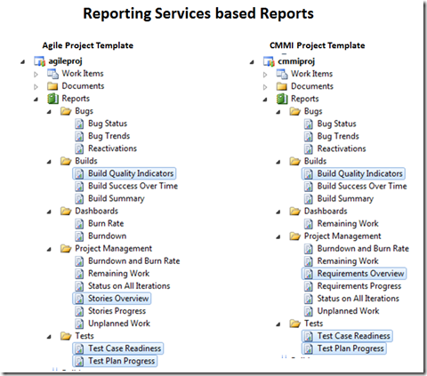

   All the test specific reports are highlighted in the above diagram.

   Details of each of the Test related reports can be found below:

   * [Build Quality Indicators Report](https://msdn.microsoft.com/library/dd380683.aspx)

   * [Stories Overview Report (Agile)](https://msdn.microsoft.com/library/dd380648.aspx)

   * [Requirements Overview Report (CMMI)](https://msdn.microsoft.com/library/ee461517.aspx)

   * [Test Case Readiness Report](https://msdn.microsoft.com/library/dd380713.aspx)

   * [Test Plan Progress Report](https://msdn.microsoft.com/library/dd380702.aspx)

## I am connected to my Team Project within Team Explorer, but I don't see any of the Reporting Services based Reports listed above. Why?

If you want to use the reporting feature (Excel Reports or Reporting Services Reports) in Team Foundation Server, you must have an installation of SQL Server Reporting Services and SQL Server Analysis Services. These features can be installed on the same server or different servers.

Team Foundation Server requires a report server that is dedicated only to its use. You cannot share the report server with any other application.

Links:

* [Installing Team Foundation Components](/azure/devops/server/install/get-started)

* [Configuring Resources to Support Team Projects](https://msdn.microsoft.com/library/dd386330.aspx)

* [Add a Report Server to Your Deployment](https://msdn.microsoft.com/library/ee712737.aspx)

* [Add a Report Server to a Team Project Collection](https://msdn.microsoft.com/library/dd386355.aspx)

* [Add Reports to a Team Project](https://msdn.microsoft.com/library/ee712730.aspx)

## I am connected to my Team Project within Team Explorer, but I don't see any of the Excel Reports listed above. Why?

If you want to use the reporting feature (Excel Reports or Reporting Services Reports) in Team Foundation Server, you must have an installation of SQL Server Reporting Services and SQL Server Analysis Services. These features can be installed on the same server or different servers.

Team Foundation Server requires a report server that is dedicated only to its use. You cannot share the report server with any other application.

In addition, for Excel Reports, you also need to enable SharePoint on the Team Foundation Server because all the Excel reports, by default, get copied and stored in the SharePoint Document Library at the project creation time.

Links:

* [Installing Team Foundation Components](/azure/devops/server/install/get-started)

* [Configuring Resources to Support Team Projects](https://msdn.microsoft.com/library/dd386330.aspx)

* [Modify or Remove Access Between a SharePoint Web Application and Team Foundation Server](https://msdn.microsoft.com/library/dd386329.aspx)

* [Add a SharePoint Web Application to Your Deployment](https://msdn.microsoft.com/library/dd236907.aspx)

* [Configure a Default Location for Team Project Portals](https://msdn.microsoft.com/library/dd386357.aspx)

## We don't plan on installing SharePoint - is there no way of getting the "out-of-the-box" Excel reports, primarily for Test related reports?

You can copy the Excel Reports from a different Server or Project where SharePoint has been configured and use them for a server without SharePoint.

If you don't have any installation of Team Foundation Server with SharePoint, then you can download the attachments [Dev10-Agile-ExcelReports.zip and Dev10-CMMI-ExcelReports.zip](https://msdnshared.blob.core.windows.net/media/MSDNBlogsFS/prod.evol.blogs.msdn.com/CommunityServer.Components.PostAttachments/00/10/22/51/86/Dev10-ExcelReports.zip), change the data source within Excel to point to your TFS server and start using them.

## What are the steps involved in changing the data source of an Excel Report?

For changing the Data source on the Excel reports [Dev10-Agile-ExcelReports.zip and Dev10-CMMI-ExcelReports.zip](https://msdnshared.blob.core.windows.net/media/MSDNBlogsFS/prod.evol.blogs.msdn.com/CommunityServer.Components.PostAttachments/00/10/22/51/86/Dev10-ExcelReports.zip), follow the steps mentioned below:

1. Open one of the Excel Reports file, go to the "Data" tab in Excel, then click on "Connections"

   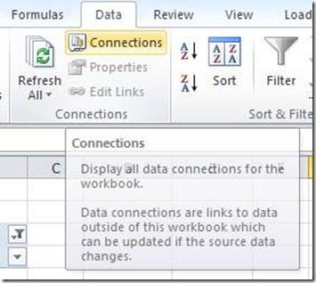

2. It should open up the following window, Click on "Properties"

   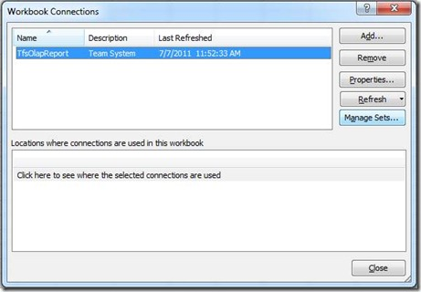

3. Connection Properties window opens up, click on "Definition" tab

   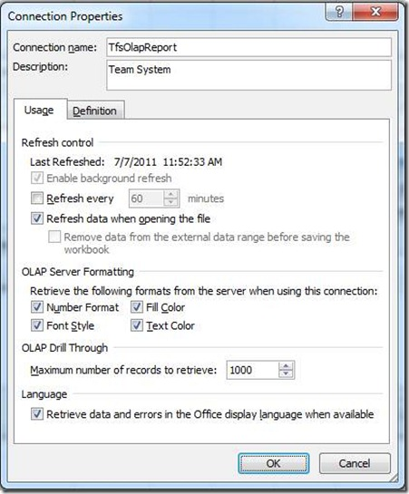

4. In the Definition tab, update the connection string and then keep clicking on OK all the way back.

   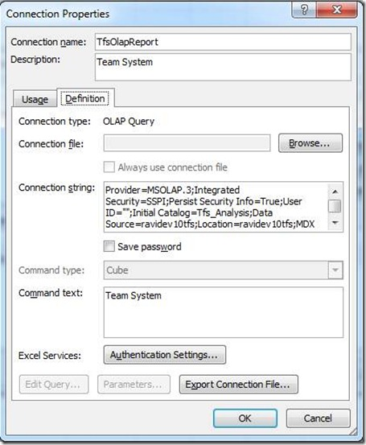

   Change the Connection String

   FROM:

   `Provider=MSOLAP.3;Integrated Security=SSPI;Persist Security Info=True;User ID="";Initial Catalog=Tfs_Analysis;Data Source=ravidev10tfs;Location=ravidev10tfs;MDX Compatibility=1;Safety Options=2;MDX Missing Member Mode=Error`

   TO:

   `Provider=MSOLAP.4;Integrated Security=SSPI;Persist Security Info=True;User ID="";Initial Catalog=Tfs_Analysis;Data Source=<yourtfsserver>;Location=<yourtfsserver>;MDX Compatibility=1;Safety Options=2;MDX Missing Member Mode=Error`

   This should start getting the reporting data from your TFS Server.

## I would like to create custom test reports in Excel based off the Analysis Services cube. How should I go about it?

There are two ways of doing this, start from scratch or use one of the existing out-of-the-box Excel reports as a starting point.

* **Start from Scratch**

  You can always start creating a new Excel report by adding a new data source, as mentioned below:

  1. From "Data" tab, click on "From Other Sources->From Analysis Services" option

     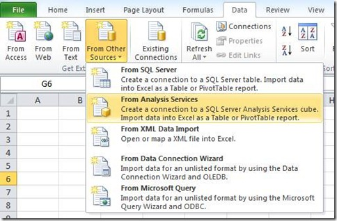

  1. Provide the name of your TFS server.

     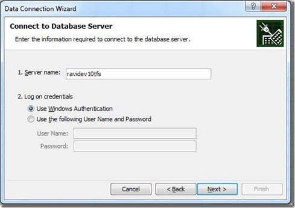

  1. This should connect you to the TFS_Analysis database. If your Azure DevOps data warehouse uses SQL Server Enterprise Edition, the list of cubes will include Team System and a set of perspectives. The perspectives provide a focused view of the data so that you do not have to scroll through all of the dimensions and measure groups that are defined for the whole Team System cube. Choose the CUBE or the TEST perspective to create test related reports.

     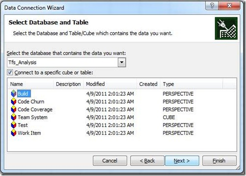

  1. Save the connection information locally or it can also be saved on a SharePoint.

     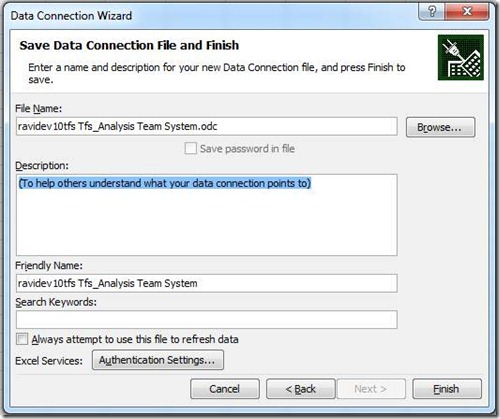

  1. Select where you want to create the PivotTable Report or PivotChart

     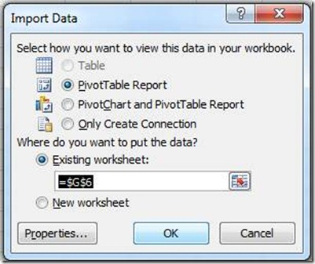

  1. Drag and drop various dimensions and measures from Pivot table field list to construct your custom report.

     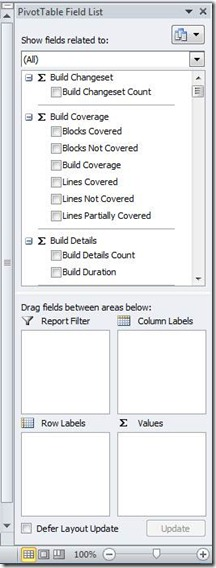

* **Use existing out-of-the-box Excel reports as a starting point**

  You could also start with any of the existing out-of-the-box Excel reports and then customize it to suit your needs by dragging and dropping the different measures or dimensions.

  The simplicity of Excel reports (of just using drag and drop of dimensions or measures) is one of the main reasons why you will see a lot more out-of-the-box reports for Excel rather than Reporting Services based reports.

## What are the different Test related measures in the Analysis Services cube that I can use to create my custom test reports?

All the test related measures present in the Analysis Services cube are shown below:

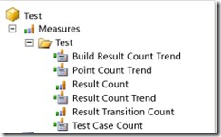

Description for each of above measures can be found here:

[https://msdn.microsoft.com/library/ms244708.aspx#measures](https://msdn.microsoft.com/library/ms244708.aspx#measures)

A list of all the perspectives and measure groups present in Team Foundation Server can be found here:

[https://msdn.microsoft.com/library/ms244710.aspx](https://msdn.microsoft.com/library/ms244710.aspx)

## What are the different Test related dimensions in the Analysis Services cube that I can use to create my custom test reports?

All the dimensions present in the Analysis Services cube are shown below:

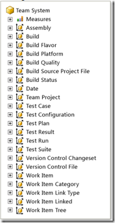

Description for all the Test specific dimensions can be found here:

[https://msdn.microsoft.com/library/ms244708.aspx#dimensions](https://msdn.microsoft.com/library/ms244708.aspx#dimensions)

## Can I control what information makes it into the warehouse or cube? If so, how?

Here is a quick primer on the different components of data warehouse and how data moves from the Operation store to Warehouse to Cube using the warehouse adapters.

[Components of the Data Warehouse for Team Foundation](https://msdn.microsoft.com/library/ms244687.aspx)

Yes, you can control what goes into the warehouse - refer to below topic for details around work item specific fields:

[Adding and Modifying Work Item Fields to Support Reporting](https://msdn.microsoft.com/library/ee921481.aspx)

Note that you can use the above to control Test Case Work item field customizations. However, since the other test artifacts (Test Suites, Test Runs, Test Results etc.) are not work items, it is not possible to use the above approach.

## I don't see any way to report on what steps were passed or failed during manual testing using the warehouse or cube. How can I achieve this?

That is correct - Test Steps along with expected results and the passed or failed information is not present in the warehouse or cube. The entire Test Steps (including Step and Expected Result) is a HTML based custom control, hence this information is not pushed into the warehouse. As a result you cannot create reports for the same using the cube.

However, there are couple of ways of getting this Step related data:

1. **TFS APIs**: You could get this information using the [TFS APIs](https://msdn.microsoft.com/library/microsoft.teamfoundation.testmanagement.client.aspx)
   Refer to a sample Test Steps Report, which was created using the TFS APIs.

   [http://geekswithblogs.net/TarunArora/archive/2011/10/02/mtm-testing-scorecard-using-tfs-api.aspx](http://geekswithblogs.net/TarunArora/archive/2011/10/02/mtm-testing-scorecard-using-tfs-api.aspx)

   Since this sample also has source code, you could customize it to suit your organization needs.

1. **Test Scribe**: You could also use [Test Scribe](https://visualstudiogallery.msdn.microsoft.com/e79e4a0f-f670-47c2-9b8a-3b6f664bf4ae/) tool to generate a document containing Test Steps.
   There are two modes of generating the document using this tool -

   - "Test Plan Summary" view which you can use to review or sign-off the Test Plan and its associated test cases along with individual test steps or expected results or iteration values.

   - "Test Run Summary" view which you can use to get detailed Run level information - however it does not provide a breakdown of individual test results within a particular test run.

## I want to write a custom 3rd party warehouse adapter, how should I go about it?

You can find a Sample custom warehouse adapter below, that you can use as a starting point:

[https://code.msdn.microsoft.com/Tfs2010SampleAdapter](https://code.msdn.microsoft.com/Tfs2010SampleAdapter)

[!INCLUDE [help-and-support-footer](_shared/help-and-support-footer.md)] 
