# Track test status

[!INCLUDE [version-header](includes/version-header.md)] 

View the status of your planned testing using an out-of-the-box Progress Report and lightweight charts.

<a id="charts" /> 

## Track testing progress
::: moniker range=">=azure-devops-2020"

Use test results charts to track how your testing is going.
Choose from a fixed set of pre-populated fields related to results.

Add your own charts for test results to visualize what's important for your team.
If you already know how to add a chart, jump to the [examples](#TestResultsExamples) below of charts that you can create.

1. Select **Test Plans** to open the **Test Plans** page. Select a test plan to open it, then select the **Charts** tab.

1. Under **Charts**, select **New** > **New test result chart**.

   

1. Select the chart type, in this example, a pie chart.
   Based on the chart, configure the fields that you want to use to group by, or for the rows and columns.

   

   All charts roll up the information for any child test suites of the test plan or test suite that you selected.

1. Select **OK** to save the chart.
   The chart is displayed in the **Charts** page for your test plan or test suite.

   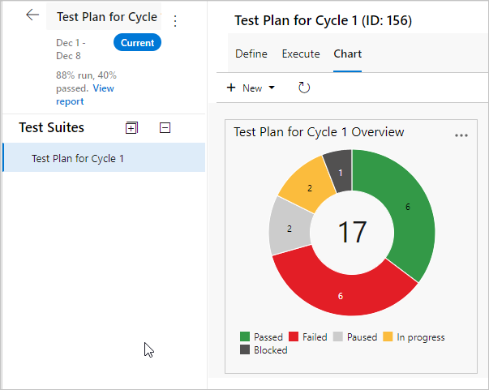

::: moniker-end

::: moniker range="<=azure-devops-2019"

Use test results charts to track how your testing is going. 
Choose from a fixed set of pre-populated fields related to results.
By default, a pie chart is created for each test plan. 
This chart is grouped by the outcome field to show the latest results
for all the tests in the test plan.

View this default chart from the Charts page.

Add your own charts for test results to visualize what's important 
for your team. If you already know how to add a chart, jump to the 
[examples](#TestResultsExamples) below of charts that you can create.

1. Select the test plan or test suite for your chart in the 
   Test Plans page. Then create a new chart.

   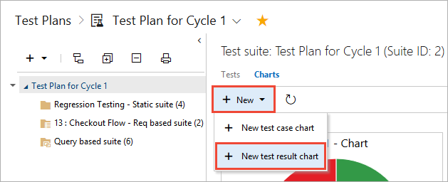

1. Select the chart type. Based on the chart, configure the 
   fields that you want to use to group by, or for the rows and columns.

   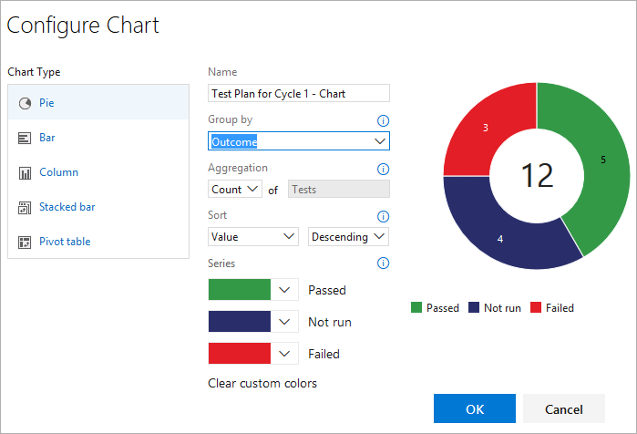

   All charts roll up the information for any child test suites 
   of the test plan or test suite that you selected.

1. Save the chart. Now it will be displayed in the Charts page 
   for the test plan or test suite that you selected.
::: moniker-end

## Test results examples

This section includes examples of useful charts.

::: moniker range=">=azure-devops-2020"

### Check test status for a test suite

You can check the test status for a specific test suite.

Select **Test Plans** to open the **Test Plans** page, and then select a plan to view a test suite.
Select **New** > **New test result chart** to create a test results pie chart.
Group by **Outcome**.

### Check status for user stories per sprint

If you created requirement-based test suites in your test plan for your user stories, you can create a chart to review status for user stories that your team is testing in the current sprint.

Create a static test suite that groups your requirement-based test suites together.
Select that static test suite in the **Test Plans** page.
Add a test results stacked bar chart.

Select **Suite** as the **Y-axis** and **Outcome** as **Group by**.

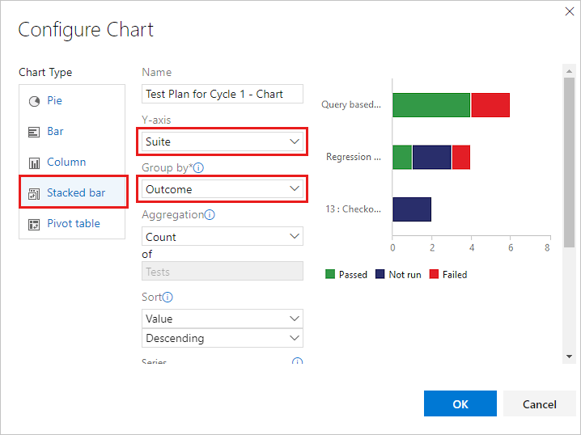

### Check tests for each tester

You can check how many tests that each tester left to run.

Select your test plan in the **Test Plans** page and add a test results pivot table chart.
Choose **Tester** as **Rows** and **Outcome** as **Columns** pivot.

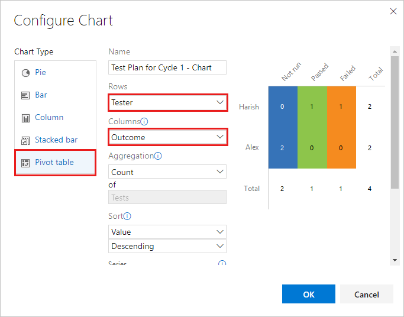

### Check quality based on the configuration

Use either a stacked bar chart or a pivot table chart.
Specify **Configuration** and **Outcome** as pivots.

### Track why tests are failing

You can track why tests are failing for your team.

For failure analysis, use either a stacked bar chart or a pivot table chart.
Select **Tester** and **Failure type**.

> [!NOTE]
> Failure type for test results can only be set using Microsoft Test Manager.

### Track resolutions for failing tests

You can track the resolution for failing tests for your team.

For resolution analysis, use either a stacked bar chart or a pivot table chart.
Choose **Tester** and **Resolution**.

> [!NOTE]
> Resolution type for test results can only be set using Microsoft Test Manager.
::: moniker-end

::: moniker range="<=azure-devops-2019"

**What's the test status for a specific test suite?**

Select the test suite from the Test Plans page and add 
a test results pie chart. Group by **Outcome**.

**What's the test status for user stories that my team's testing this sprint?**

If you have created requirement-based test suites in your test
plan for your user stories, you can create a chart for this.

1. Group these requirement-based test suites together 
   in a static test suite.

1. Select this static test suite in the Test Plans page.

1. Add a test results stacked bar chart. Choose **Suite** 
   as the Y-axis (rows) pivot and **Outcome** as the Group by (columns) pivot.

   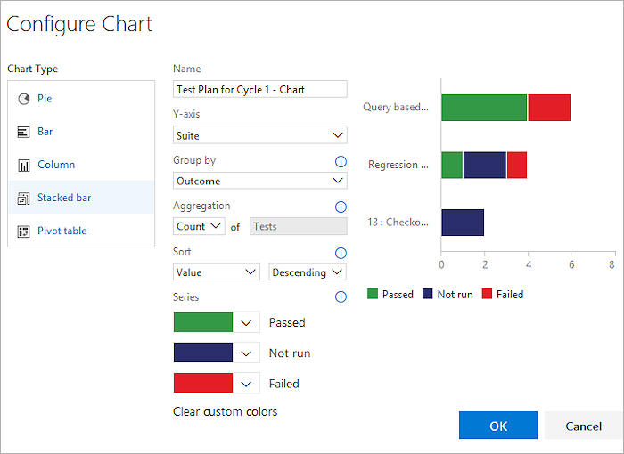

**How many tests has each tester left to run?**

Select your test plan from the Test Plans page and add a test 
results pivot table chart. Choose **Tester** as the rows pivot and
**Outcome** as the columns pivot.

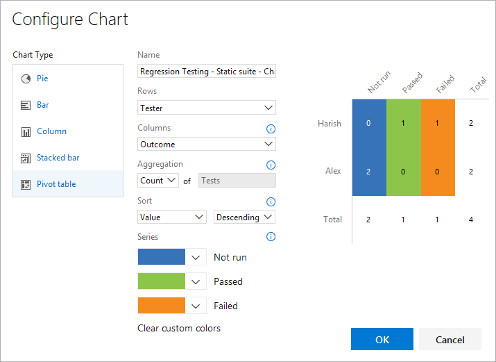

**How can I check quality based on the configuration?**

Use either a stacked bar chart or a pivot table chart. 
Choose **Configuration** as the rows pivot and **Outcome** as 
the columns pivot.

**How can I track why tests are failing for my team?**

For failure analysis, use either a stacked bar chart 
or a pivot table chart. Choose **Tester** for the rows 
and **Failure type** for the columns. (Failure type for 
test results can only be set using Microsoft Test Manager.)

**How can I track the resolution for failing tests for my team?**

For resolution analysis, use either a stacked bar chart 
or a pivot table chart. Choose **Tester** for the rows and 
**Resolution** for the columns. (Resolution type for test 
results can only be set using Microsoft Test Manager.)
::: moniker-end

## Track test case status
::: moniker range=">=azure-devops-2020"

Use test case charts to find out the progress of your test case authoring.
The charts for test cases give you the flexibility to report on columns that you add to the tests page.
By default, test case fields aren't added to the view in the tests page.

If you already know how to add a chart, jump to the [examples](#ExamplesTestCase) below of charts that you can create for test cases.

1. From the **Define** or **Execute** tabs, add any fields you want to use for your test case chart by using  **Column Options**.
   Those fields appear as choices in the lists for grouping for your test case charts.

1. Select the test plan or test suite for your chart in the **Test Plans** page.
   Under **Charts**, Select **New** > **New test case chart**.

   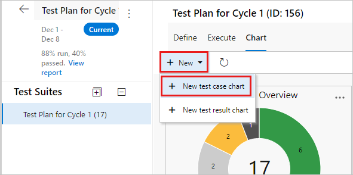

   All charts roll up the information for any child test suites 
   of the test plan or test suite that you selected.

1. Select the chart type. 
   Based on the chart, configure the fields that you want to use to group by, for rows and columns,
   or the range for trend charts.

   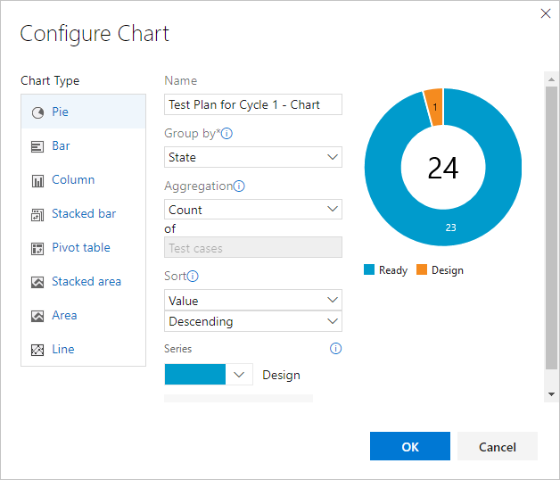

   You can't group by test suite for the test case charts.

1. Select **OK** to save the chart.
   The chart is displayed in the **Charts** page for your test plan or test suite.
::: moniker-end

::: moniker range="<=azure-devops-2019"

Use test case charts to find out the progress of your 
test case authoring. The charts for test cases give 
you the flexibility to report on columns that you add 
to the tests page. By default, test case fields are not 
added to the view in the tests page.

If you already know how to add a chart, jump to the
[examples](#ExamplesTestCase) below of charts that you can 
create for test cases.

1. Add any fields you want to use for your test case chart 
   from the tests page with Column options. Then the fields will 
   appear as choices in the drop-down lists for grouping for 
   your test case charts.

1. Select the test plan or test suite for your chart in 
   the Test Plans page. Then add a test case chart.

   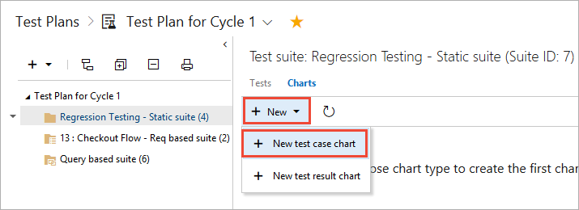

   All charts roll up the information for any child test suites 
   of the test plan or test suite that you selected.

1. Select the chart type. Based on the chart, configure the 
   fields that you want to use to group by, for rows and columns,
   or the range (trend charts only).

   

   You can't group by test suite for the test case charts.

1. Save the chart. Now it will be displayed in the charts 
   page for the test plan or test suite that you selected.
::: moniker-end

## Test case examples
::: moniker range=">=azure-devops-2020"

These examples show common ways to interact with test case results.

### View recent test results

You can view the recent test results for an individual test case.

Select the **Execute** tab in a test suite and then select a test case. Select **More options** or right-click to open the context menu. Select **View test result**.

View the recent test results for this test case.

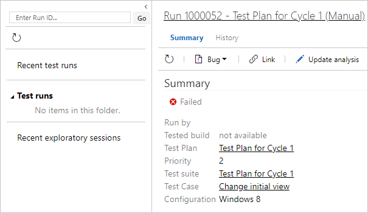

### Track burn down by using a stacked area chart

You can track burn down for test case creation.

Create a stacked area trend chart to view the burn down for how many test cases are ready to be run.
Select **State** for the stack by field and **Ascending** for the sort field.

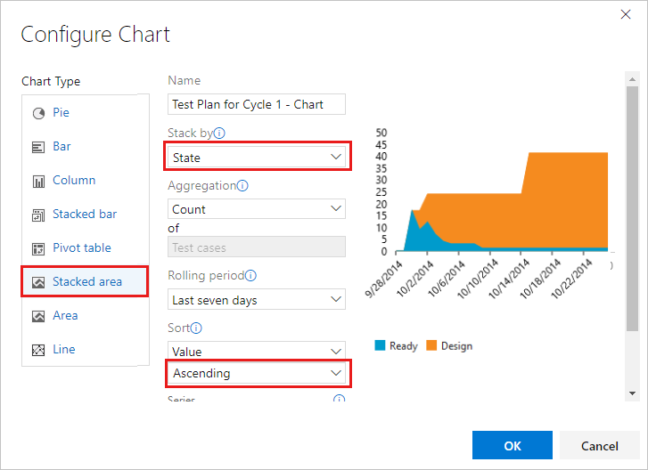

You can track burn down for automation status.

Use a stacked area trend chart to view the burn down for how many test cases have been automated.
Select **Automation status** for the **Stack by** field and **Ascending** for the **Sort** field.

### See test ownership and priorities

If multiple teams own test cases in your test plan, you can see how many test cases each team owns and the priorities of the tests.

If your teams are organized by area path, use a test case pie chart.
Select **Area path** for **Group by**.

If you want to know the priorities of these tests, create a stacked bar chart.
Select **Area path** for the **Y-axis** and **Priority** for **Group by**.

### Track test creation status

You can track test creation status for team members by creating a chart that includes the **Assigned to** value.
Use a stacked bar chart or a pivot table chart.
Select **Assigned to** for **Y-axis** or **Rows**.
Select **State** for **Group by** or **Columns**.

::: moniker-end

::: moniker range="<=azure-devops-2019"

**How can I view the recent test results for an individual test case?**

Select the test case within a test suite and then choose to view the test details pane.

View the recent test results for this test case.

**How can I track burn down for test case creation?**

Use a stacked area trend chart to view the burn down for 
how many test cases are ready to be run. Choose **State** 
for the stack by field and **Ascending** for the sort field.

**How can I track burn down for automation status?**

Use a stacked area trend chart to view the burn down 
for how many test cases have been automated. Choose 
**Automation status** for the stack by field and **Ascending** 
for the sort field.

**If multiple teams own test cases in my test plan, can I see how many each team owns and the priorities of the tests?**

If your teams are organized by area path, then you can use a 
test case pie chart. Choose **Area path** for the group by field.

If you want to know the priorities of these tests, then create 
a stacked bar chart. Choose **Area path** for rows and **Priority**
for the columns.

**How can I track test creation status by team members?**

Test case owners are tracked by the **Assigned to** field. 
Use a stacked bar chart or a pivot table chart. Choose 
**Assigned to** for rows and status for the columns.
::: moniker-end

## Share charts on your team's dashboard
::: moniker range=">=azure-devops-2020"

Pin a chart to your team's dashboard for all the team to view.
Use the chart's context menu.

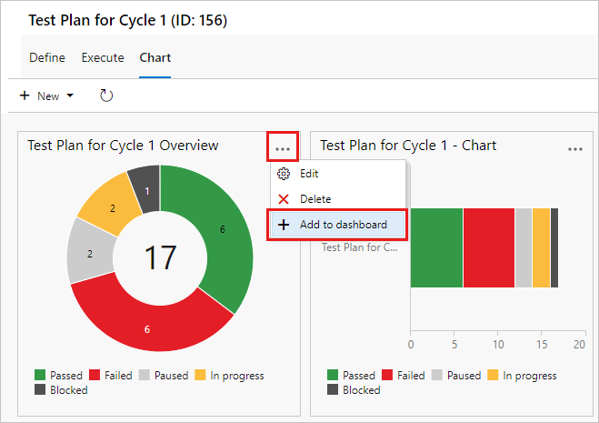

You can [configure the dashboard widget](../report/dashboards/widget-catalog.md) to show a range of chart types.

> [!NOTE]
> You must be a team administrator to configure the dashboard widget, but team members with Stakeholder access can view the charts on the dashboard.
::: moniker-end
 
::: moniker range="<=azure-devops-2019"

Pin a chart to your team's dashboard for all the team to view. 
Use the chart's context menu.

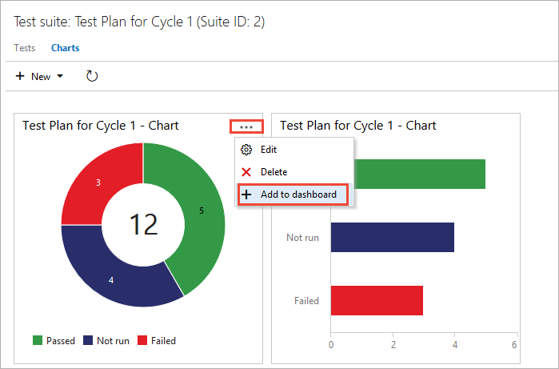

You can [configure the dashboard widget](../report/dashboards/widget-catalog.md)
to show a range of chart types.
You must be a team administrator to configure the dashboard widget, but team members with 
Stakeholder access can view the charts on the dashboard. 
::: moniker-end

## Related articles

- [Progress report](progress-report.md) 
- [Control how long to keep test results](how-long-to-keep-test-results.md)
- [FAQs for manual testing](reference-qa.md#trackstatus)
- [Widget catalog](../report/dashboards/widget-catalog.md)
- [Team administration](../organizations/settings/manage-teams.md) 

