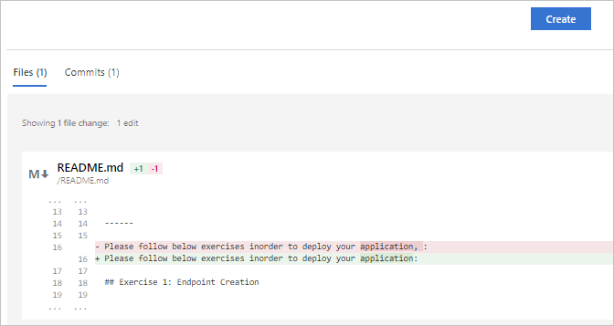
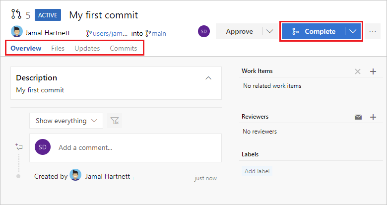
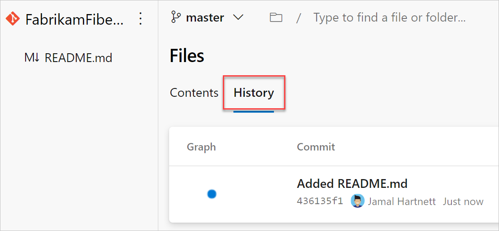
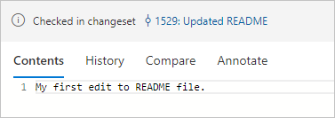

# Share your code with Git

[!INCLUDE [version-lt-eq-azure-devops](../includes/version-lt-eq-azure-devops.md)]

Share your code with others in Azure DevOps when you use a Git repository. 

## Prerequisites

An [organization](../organizations/accounts/create-organization.md) and [project](../organizations/projects/create-project.md) in Azure DevOps. When you create a project, Azure DevOps automatically creates an empty repository in Repos.

## 1. Install Git command-line tools

Install one of the following Git command-line tools:

   - [Git for Windows and Git Credential Manager](../repos/git/set-up-credential-managers.md).
   - [Git for macOS or Linux](https://git-scm.com/book/en/v2/Getting-Started-Installing-Git). For macOS and Linux, we recommend that you [configure SSH authentication](../repos/git/use-ssh-keys-to-authenticate.md).

## 2. Clone the repo to your computer

To work with a Git repo, clone it to your computer, which creates a complete local copy of the repo. Your code might be in one of several places.

1. Complete the following step that's applicable to your scenario:

   - If **You don't have any code yet**, first [Create a new Git repo in your project](../repos/git/create-new-repo.md#create-a-repo-using-the-web-portal), and then complete the next step.
   - If **the code is in another Git repo**, such as a GitHub repo or a different Azure Repo instance, [import it into a new or existing empty Git repo](../repos/git/import-git-repository.md), and then complete the next step.
   - If **the code is on your local computer and not yet in version control**, either [create a new Git repo in your project](../repos/git/create-new-repo.md#create-a-repo-using-the-web-portal) or add your code to an existing repository.

2. From your web browser, open the team project for your organization and select **Repos** > **Files**.

   

3. Select **Clone**.

   :::image type="content" source="media/clone-repo/repos-files-clone-button.png" alt-text="Screenshot shows highlighted clone button in repos files.":::

4. **Copy** the URL.

   :::image type="content" source="media/clone-repo/copy-url-clone-action.png" alt-text="Screenshot shows highlighted copy icon for copying URL.":::

5. Open the Git command window (Git Bash on Git for Windows). Go to the folder where you want the code from the repo stored on your computer, and run `git clone`, followed by the path copied from **Clone URL** in the previous step. See the following example:

   ```
   git clone https://FabrikamFiber01@dev.azure.com/FabrikamFiber01/FabrikamFiber01-01/_git/FabrikamFiber01-01
   ```
  
   Git downloads a copy of the code, including all [commits](../repos/git/commits.md), and [branches](../repos/git/branch-policies-overview.md) from the repo, into a new folder for you to work with.

6. Switch your directory to the repository that you cloned.

   ```
   cd fabrikam-web
   ```

   Keep this command window open to work in a branch.

## 3. Work in a branch

Git [branches](../repos/git/branch-policies-overview.md) isolate your changes from other work being done in the project. We recommend using the [Git workflow](../repos/git/gitworkflow.md), which uses a new branch for every feature or fix that you work on. For our examples, we use the branch, `users/jamal/feature1`.

1. Create a branch with the `branch` command.
   
   ```
   git branch users/jamal/feature1
   ```
   This command creates a reference in Git for the new branch. It also creates a pointer back to the parent commit so Git can keep a history of changes as you add commits to the branch.

   If you're working with a previously cloned repository, ensure you checked out the right branch (`git checkout main`) and that it's up to date (`git pull origin main`) before you create your new branch.

2. Use `checkout` to switch to that branch.

   ```
   git checkout users/jamal/feature1
   ```
   Git changes the files on your computer to match the latest commit on the checked-out branch.

   > [!TIP]
   > When you create a branch from the command line, the branch is based on the currently checked-out branch. When you clone the repository, the default branch (typically `main`) gets checked out. Because you cloned, your local copy of `main` has the latest changes.
   >  ```
   >  git checkout main
   >  git pull origin main
   >  git branch users/jamal/feature1
   >  git checkout users/jamal/feature1
   >  ```
   > You can replace the first three commands in the previous example with the following command, which creates a new branch named `users/jamal/feature1` based on the latest `main` branch.
   >
   >  ```
   >  git pull origin main:users/jamal/feature1
   >  ```
   > Switch back to the Git Bash window that you used in the previous section. Run the following commands to create and check out a new branch based on the main branch.
   >
   >  ```
   >  git pull origin main:users/jamal/feature1
   >  git checkout feature1
   >  ```

## 4. Work with the code

In the following steps, we make a change to the files on your computer, commit the changes locally, and then push the commit to the repo stored on the server.

1. Browse to the folder on your computer where you cloned the repo, open the `README.md` file in your editor of choice, and make some changes. Then, **Save** and close the file.

2. In the Git command window, go to the `contoso-demo` directory by entering the following command:

   ```
   cd contoso-demo
   ```

3. Commit your changes by entering the following commands in the Git command window:

   ```
   git add .
   git commit -m "My first commit"
   ```

   The `git add .` command stages any new or changed files, and `git commit -m` creates a commit with the specified commit message.
   
   Check which branch you're working on before you commit, so that you don't commit changes to the wrong branch. Git always adds new commits to the current local branch.

1. Push your changes to the Git repo on the server. Enter the following command into the Git command window:

   ```
   git push origin users/jamal/feature1
   ```

Your code is now shared to the remote repository, in a branch named `users/jamal/feature1`. To merge the code from your working branch into the `main` branch, use a pull request.

## 5. Merge your changes with a pull request

Pull requests combine the review and merge of your code into a single collaborative process. After you’re done fixing a bug or new feature in a branch, create a new pull request. Add the members of the team to the pull request so they can review and vote on your changes. Use pull requests to review works in progress and get early feedback on changes. There’s no commitment to merge the changes because you can abandon the pull request at any time.

The following example shows the basic steps of creating and completing a pull request.

1. Open the team project for your organization in your web browser and select **Repos** > **Files**. If you kept your browser open after getting the clone URL, you can just switch back to it.

2. Select **Create a pull request** in the upper-right corner of the **Files** window. If you don't see a message like **You updated users/jamal/feature1 just now**, refresh your browser.

   

   New pull requests are configured to merge your branch into the default branch, which in this example is `main`. The title and description are prepopulated with your commit message.

   

   You can [add reviewers](../repos/git/pull-requests.md#add-and-remove-reviewers) and [link work items](../repos/git/pull-requests.md#link-work-items) to your pull request.

   You can review the files included in the pull request at the bottom of the **New Pull Request** window.

   

3. Select **Create**.

   View the details of your pull request from the **Overview** tab. You can also view the changed files, updates, and commits in your pull request from the other tabs. 

4. Select **Complete** to begin the process of completing the pull request.

   

5. Select **Complete merge** to complete the pull request and merge your code into the `main` branch.

   

   >[!NOTE]
   >This example shows the basic steps of creating and completing a pull request. For more information, see [Create, view, and manage pull requests](../repos/git/pull-requests.md).

Your changes are now merged into the `main` branch, and your `users/jamal/feature1` branch is deleted on the remote repository. 

## View history

1. Switch back to the web portal and select **History** from the **Code** page to view your new commit.

   

2. Switch to the **Files** tab, and select the README file to view your changes.

   

## Clean up

To delete your local copy of the branch, switch back to your Git Bash command prompt and run the following command: 

```
git checkout main
git pull origin main
git branch -d users/jamal/feature1
```

This action completes the following tasks:
- The `git checkout main` command switches you to the `main` branch.
- The `git pull origin main` command pulls down the latest version of the code in the main branch, including your changes and the fact that `users/jamal/feature1` was merged.
- The `git branch -d users/jamal/feature1` command deletes your local copy of that branch.

## Next steps  

> [!div class="nextstepaction"]
> [Set up continuous integration & delivery](../pipelines/create-first-pipeline.md?bc=%252fazure%252fdevops%252fuser-guide%252fbreadcrumb%252ftoc.json&toc=%252fazure%252fdevops%252fuser-guide%252ftoc.json)
> 
## Related articles

- [Understand key concepts for new users to Azure Pipelines](../pipelines/get-started/key-pipelines-concepts.md)
- [Discover what Azure Repos is](../repos/get-started/what-is-repos.md)
- [Learn how to work with a Git repo](../repos/git/index.yml)
- [Explore what source control is](source-control.md)
