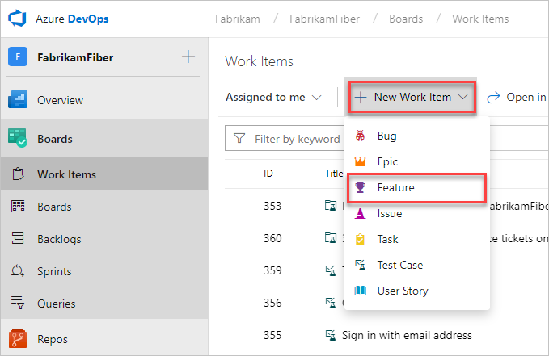

# Plan and track work

[!INCLUDE [version-vsts-only](../_shared/version-vsts-only.md)]

Add work items to plan and manage your project. Use different types of work items to track different types of work&mdash;such as user stories or product backlog items, tasks, bugs, or issues. You can describe the work to be done, assign work, track status, and coordinate efforts within your team.

Learn how to add work items from the web portal and view work items you've created.

<a id="define-new-work">  </a>

## Prerequisites

You can start adding work items once you connect to a project. If you don't have an organization or project yet, create one in [Azure DevOps Services](sign-up-invite-teammates.md).

## Add a work item

[!INCLUDE [temp](../boards/_shared/new-agile-hubs-feature.md)]

# [New navigation](#tab/new-nav)

1. From your web browser, open the project for your Azure DevOps Services organization. If you don't have a project, [create one now](sign-up-invite-teammates.md). If you haven't been added as a team member, [get invited now](sign-up-invite-teammates.md#invite-others).

	The web browser URL follows the following pattern: ```https://dev.azure.com/{yourorganization}/{yourproject}```  

	You can use this URL to quickly open the project, substituting {yourorganization} and {yourproject} with your specific organization and project name (remove braces).

	If you don't see the project you want, choose the  Azure DevOps Services icon to [browse all projects and teams](../project/navigation/work-across-projects.md).  

	

2.	Select **Azure Boards** > **Work Items**. 

    >

3. Choose **New Work Item** and select the work item type you want.  Here, we choose to create a **Feature**. 

   >

4. Enter a title and then **Save** the work item. Before you can change the State from its initial default, you must save it.  

	That's it!

# [Previous navigation](#tab/prev-nav)

1. From your web browser, open the project for your Azure DevOps Services organization. If you don't have a project, [create one now](sign-up-invite-teammates.md). If you haven't been added as a team member, [get invited now](sign-up-invite-teammates.md#invite-others).

	The web browser URL follows this pattern: ```https://dev.azure.com/{yourorganization}/{yourproject}```  

	You can use this URL to quickly open the project, substituting the {organization name} and {project name} with your specific organization and project name (remove braces). 

	If you don't see the team or project you want, choose the  Azure DevOps Services icon to [browse all projects and teams](../project/navigation/work-across-projects.md).  

2.	Select **Work** > **New Work Items** and choose the work item type you want.  Here, we choose to create a **User Story**. 

	 

	If you don't see the **Work** hub, your screen size may be reduced. Select the three dots (), then choose **Work** > **New Work Items**, and then choose the work item type you want.

	 

1. Enter a title and then save the work item. Before you can change the State from its initial default, you must save it.  

	  

	That's it!
---

Create as many work items as you need of the type you need to track the work you want to manage.  

>[!NOTE]  
>Depending on the process chosen when the project was created&mdash;[Scrum](../boards/work-items/guidance/scrum-process.md), 
[Agile](../boards/work-items/guidance/agile-process.md), or [CMMI](../boards/work-items/guidance/cmmi-process.md)&mdash;the types of work items you can create will differ. For example, backlog items may be called product backlog items (Scrum), user stories (Agile), or requirements (CMMI). All three are similar: they describe the customer value to deliver and the work to be performed.
>
> For an overview of all three processes, see [Choose a process](../boards/work-items/guidance/choose-process.md).


## View the work items you've just created  

# [New navigation](#tab/new-nav)

1. Go to your project and select **Azure Boards** > **Work Items**.

   
2. To view any work item listed, select the title.

# [Previous navigation](#tab/prev-nav)

1. Select the **Work** > **Work Items** > **My activity**. This page lists all work items you've recently viewed, created, or modified.

	

4. To view any work item listed, select the title.

---

For more information on using the Work Items page, see [View and add work items](../boards/work-items/view-add-work-items.md).

## Try this next  
 
> [!div class="nextstepaction"]
> [Add & run manual tests](add-run-manual-tests.md)
 
To quickly add backlog items, such as user stories or requirements, see these topics:  
> [!div class="nextstepaction"]
> [Create your backlog](../boards/backlogs/create-your-backlog.md)
> [Kanban quickstart](../boards/boards/kanban-quickstart.md) 

Or, [learn more about planning and tracking work](../boards/work-items/index.md).
 
