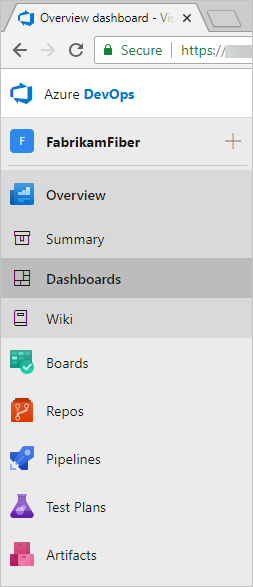
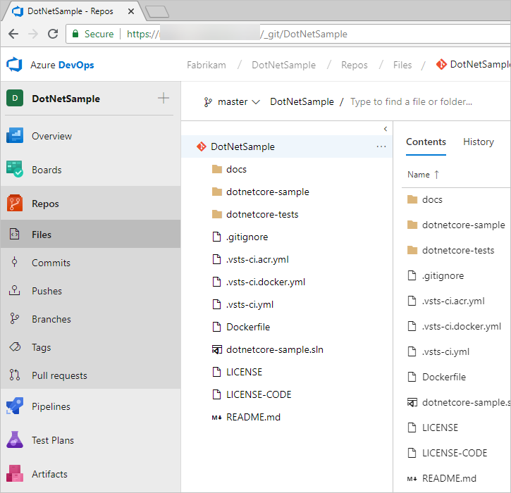
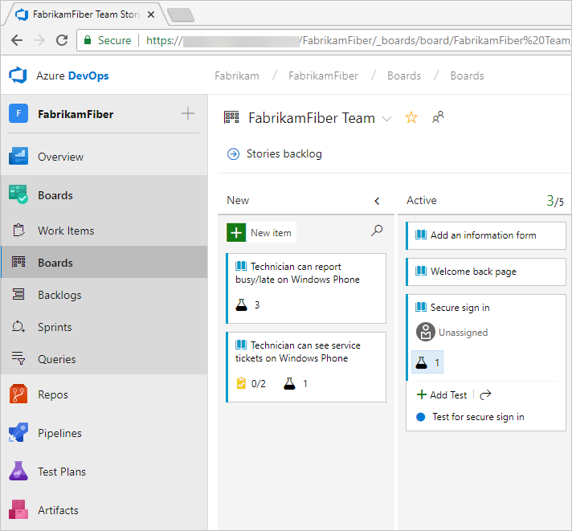
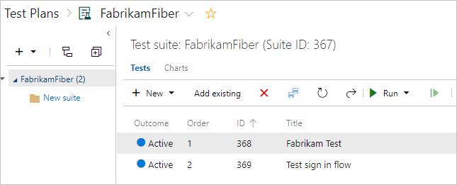
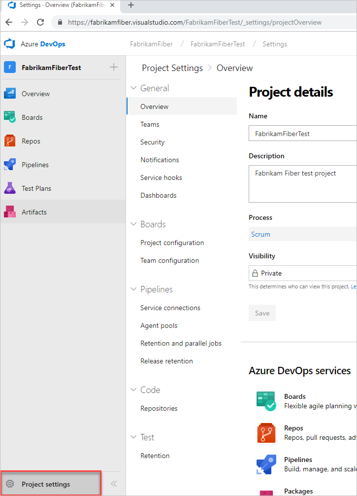

# What do I get with Azure DevOps Services or TFS?
 
[!INCLUDE [temp](../_shared/version-vsts-tfs-all-versions.md)]

With Azure DevOps Services and TFS, you gain an integrated set of services and tools to manage your software projects, from planning and development through testing and deployment. Services are delivered through a client-server model, many of which are delivered through an easy-to-use web interface that you can access from all major browsers. Some services, such as source control, build pipelines, and work tracking can also be managed through a client.  

Access Web services through the following areas, as shown in the following image.

[!INCLUDE [temp](../boards/_shared/new-agile-hubs-feature.md)]

# [New navigation](#tab/new-nav)

# [Previous navigation](#tab/prev-nav)

  

---

Many of our services are either free for small teams or available through a subscription model or per use model. Where needed, you can exercise a hybrid approach where you use an on-premises TFS to manage your code and work, and purchase cloud build or testing services on an as needed basis.  

For information about client tools, see [Tools](tools.md).

<!---
###Video overview
 (Video ala Robert's 1.5 min Commit)
-->

## Dashboards

From **Dashboards** you gain access to user-configurable dashboards.

# [New navigation](#tab/new-nav)

# [Previous navigation](#tab/prev-nav)

---

You can perform the following tasks in Dashboards:

- Add, configure, and manage dashboards
- Configure widgets that you add to dashboards
- Quickly navigate to different areas of your project
 

To learn more, see [Dashboards](../report/dashboards/dashboards.md). 

## Source control 

# [New navigation](#tab/new-nav)
From **Repos**, you gain access to your source control Git-based or TFVC repositories to support version control of your software projects. These repositories are private.

# [Previous navigation](#tab/prev-nav)

From **Code**, you gain access to your source control Git-based or TFVC repositories to support version control of your software projects. These repositories are private.

---

From Azure Repos for Git you can perform the following tasks:

- Review, download, and edit files and review the change history for a file  
- Review and manage commits that have been pushed
- Review, create, approve, comment, and complete pull requests  
- Add and manage Git tags

To learn more, see the overviews for [Git](../repos/git/overview.md) or [TFVC](../repos/tfvc/overview.md). 

## Plan and track work

# [New navigation](#tab/new-nav)

From **Boards**, you gain access to Agile tools to support planning and tracking work.

# [Previous navigation](#tab/prev-nav)

From **Work**, you gain access to Agile tools to support planning and tracking work.

---

Specifically, you can perform the following tasks:

- Add and update work items
- Define work item queries and create status and trend charts based on those queries
- Manage your product backlog
- Plan sprints using sprint backlogs
- Review sprint tasks and update tasks through the task boards
- Visualize the work flow and update status using Kanban boards
- Manage portfolios by grouping stories under features and features under epics

See [Backlogs, boards, and plans](../boards/backlogs/backlogs-boards-plans.md) for an overview of each.
 
## Continuous integration and deployment  

# [New navigation](#tab/new-nav)

**Pipelines** provides an integrated set of features to support building and deploying your applications.

# [Previous navigation](#tab/prev-nav)

**Build and release** provides an integrated set of features to support building and deploying your applications.

---

Use pipelines to implement continuous integration and continuous delivery.

- **Build automation**: Define the steps to take during build and the triggers that will initiate a build. 
- **Release management**: Supports a rapid release cadence and management of simultaneous releases. You can configure release pipelines that represent your environments from development to production. Run automation to deploy your app to each environment. Add approvers to sign off that the app has been successfully deployed in an environment. Create your release manually or automatically from a build. Then track your releases as they are deployed to various environments.

To learn more, see [Continuous integration on any platform](../pipelines/overview.md). 

## Manual, exploratory, and load testing  

Test features support manual and exploratory testing, load or performance testing, and continuous testing.  

# [New navigation](#tab/new-nav)

**Test Plans** supports creating and managing manual tests. 

# [Previous navigation](#tab/prev-nav)

**Test** supports creating and managing manual tests. 

---

With test features, you gain access to the following features:

- Customization of workflows with test plan, test suite and test case work items  
- End-to-end traceability from requirements to test cases and bugs with requirement-based test suites  
- Criteria-based test selection with query-based test suites
- Excel-like interface with the grid for easy test case creation  
- Reusable test steps and test data with shared steps and shared parameters
- Sharable test plans, test suites and test cases for reviewing with stakeholders  
- Browser-based test execution on any platform  
- Real-time charts for tracking test activity 

To learn more, see [Testing overview](../test/index.md).

## Collaboration services

The following services work across the previously mentioned services to support:

::: moniker range="vsts" 
- Team dashboards 
- Project Wiki
- Discussion within work item forms
- Linking of work items, commits, pull requests and other artifacts to support traceability
- Alerts and change notifications managed per user, team, project, or organization 
- Request and manage feedback
- Analytics service, Analytic views, and Power BI reporting
::: moniker-end  

::: moniker range="tfs-2018" 
- Dashboards 
- Project Wiki
- Discussion within work item forms
- Linking of work items, commits, pull requests and other artifacts to support traceability
- Alerts and change notifications managed per user, team, project, or project collection 
- Request and manage feedback
- SQL Server Reporting
::: moniker-end  

::: moniker range="tfs-2017" 
- Dashboards 
- Discussion within work item forms
- Linking of work items, commits, pull requests and other artifacts to support traceability
- Alerts and change notifications managed per user, team, project, or project collection  
- Request and manage feedback
- Team (chat) rooms
- SQL Server Reporting

> [!NOTE]  
> Team rooms are deprecated for TFS 2017.2. Instead, we recommend you [use service hooks to integrate with Microsoft Teams](../service-hooks/services/teams.md).
::: moniker-end  

::: moniker range="tfs-2015" 
- Dashboards 
- Linking of work items, commits, pull requests and other artifacts to support traceability
- Alerts and change notifications managed per user or for teams  
- Request and manage feedback
- Team (chat) rooms
- SQL Server Reporting
::: moniker-end  

::: moniker range="tfs-2013" 
- Team home page  
- Linking of work items, commits, pull requests and other artifacts to support traceability
- Alerts and change notifications managed per user or for teams  
- Request and manage feedback
- Team (chat) rooms
- SQL Server Reporting
::: moniker-end 

## Service hooks

Service hooks enable you to perform tasks on other services when events happen within your project hosted on Azure DevOps Services or TFS. For example, you can send a push notification to your team's mobile devices when a build fails. Service hooks can also be used in custom apps and services as a more efficient way to drive activities when events happen in your projects.

The following services are available as the target of service hooks. To learn about others apps and services that integrate with our Azure DevOps Services or TFS, visit the [Visual Studio Marketplace](https://marketplace.visualstudio.com)

For the latest set of supported services, see [Integrate with service hooks](../service-hooks/index.md)

## Cloud-hosted services based on usage

The following services support your DevOps operations.

- Cloud-based build and deployment Microsoft-hosted agents  
- On-premises self-hosted agents to support build and deployment  
- Cloud-based performance/load testing lets you load test your code by simulating high traffic  

To learn more, see [Pricing](https://visualstudio.microsoft.com/team-services/pricing/).

## Azure cloud-hosted services

Azure provides a number of cloud-hosted services to support application development and deployment. You can make use of these services solely or in combination with Azure DevOps Services or TFS.

To browse Azure's directory of integrated services, features, and bundled suites, see [Azure products](https://azure.microsoft.com/services/).  

For continuous delivery to Azure from Azure DevOps Services, see [Automatically build and deploy to Azure web apps or cloud services](https://azure.microsoft.com/documentation/articles/cloud-services-continuous-delivery-use-vso/).

## Administrative services

There are a number of features and tasks associated with administrating a collaborate software development environment. You perform most of these tasks through the web portal. To learn more, see [About user, team, project, and organization-level settings](../organizations/settings/about-settings.md)

# [New navigation](#tab/new-nav)

# [Previous navigation](#tab/prev-nav)

---

## Related articles

- [Understand differences between Azure DevOps Services and TFS](about-vsts-tfs.md)
- [Key concepts](concepts.md)  
- [Client-server tools](tools.md) 
- [Software development roles](roles.md)  
- [Pricing](https://visualstudio.microsoft.com/team-services/pricing/)

<!---
**System Center integration**: Enables a release pipeline to connect to a System Center Virtual Machine Manager (SCVMM) server to easily provision virtual machines and perform actions on them such as managing checkpoints, starting and **VMware Resource Deployment**: Connect to a VMware vCenter Server from Azure DevOps Services or TFS to provision, start, stop, or snapshot VMware virtual machines. 
-->
