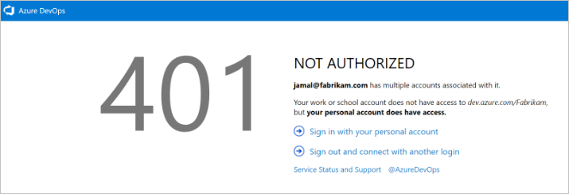
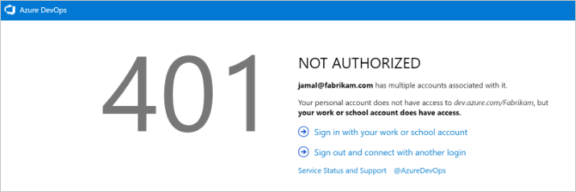

# Troubleshoot connecting to a project

[!INCLUDE [temp](../_shared/version-vsts-tfs-all-versions.md)]

::: moniker range="azure-devops"

## Troubleshoot connectivity

As a first step in resolving connectivity issues with Azure DevOps Services or TFS, complete the following steps:

1. Sign out of your browser. To do this, select the [Visual Studio sign out](https://aka.ms/VsSignout) link.

2. Delete the cookies in your browser. To delete cookies in most browsers, press Ctrl+Shift+Del.

3. Open Internet Explorer and delete the browser cookies. The Visual Studio IDE uses Internet Explorer cookies.

4. Close all browsers and close the Visual Studio IDE.

5. Use a private browser session to retry the connection. If the issue is with the Visual Studio IDE, remove the connection, and then re-add it.

## Troubleshoot signing in

Two types of identities can sign in: Microsoft accounts and Azure Active Directory (Azure AD) accounts. Depending on your account, you might experience one of the following errors.

> 401 - Not Authorized

> [!div class="mx-imgBorder"]

The most common error page is the *401 Not Authorized* error. This occurs when your identity doesn't have permissions to enter an organization. Common reasons for the error include:

* Your identity isn't a member of the organization.
* Your identity has an invalid or missing license assignment.

If you think you're a member of the organization but are blocked by this error page, [contact customer support](https://support.microsoft.com/).

### Scenario 1

Your work or school Azure AD account doesn't have access, but your personal Microsoft account does.

> 401 - Work or school, or Personal account

> [!div class="mx-imgBorder"]

 A highly specific 401 error case. In this case, both a personal Microsoft account and a work or school account (Azure AD) that have the same sign in address exist. You have signed in with your work or school account, but your personal account is the identity that has access to the organization.

### Mitigation

In some cases, you might not know you have two identities with the same sign in address. The work or school Azure AD account might have been created by an administrator when you were added to Office365 or Azure AD.

To sign out of your current work or school Azure AD account, select **Sign in with your personal MSA account**, and then sign in by using your personal Microsoft account. After authentication, you should have access to the organization.

> [!TIP]
> To avoid seeing this prompt, you can rename your Microsoft account. Then, only one identity (your work or school account, or Azure AD account) uses your sign-in address.

### Scenario 2

Your personal Microsoft account doesn't have access but your Azure AD account does. This is an opposite version of the 401 error page. In this case, the personal account (Microsoft account identity) doesn't have access to the organization and the work or school account (Azure AD identity) does. The same guidance from Scenario 1 applies, but in reverse.

> 401 - Work or school, or Personal account

> [!div class="mx-imgBorder"]

### Mitigation

If you enter your credentials correctly but you're redirected back to the original sign-in page, we recommend clearing all cookies, and then reattempting to sign in. If that doesn't fix the issue, contact customer support.

::: moniker-end

::: moniker range=">= tfs-2013 < azure-devops"

## Troubleshoot TFS connectivity

Here's a list of the most frequently encountered connection problems and what to do about them. Complete the list in the order indicated.

1. Verify that you have the required permissions.

    If the errors that you receive indicate read-only or blocked actions, you might not have permissions to act on the data.

2. Verify that your computer is connected to the network and that it can access network resources.

3. Verify that TFS hasn't been taken offline. Talk with your TFS administrator.

4. Check whether your project has been moved to another project collection in TFS. If it has been moved, you must create a connection to the new server name.

For additional troubleshooting tips, see [TF31002: Unable to connect to this Team Foundation Server](../reference/error/tf31002-unable-connect-tfs.md).

::: moniker-end

::: moniker range="azure-devops"

## Switch organizations

When you use two or more organizations that are linked to Azure AD, such as organizations that are created in the Azure portal, the sign-out function might not work as expected. For example, you can't switch between different organizations to connect to multiple organizations that are linked to directory tenants.

When this problem occurs, a blank screen flashes several times. Then, one of the following error messages appears after you connect to or add a new connection in the **Connect to Team Foundation Server** dialog box:

> TF31003: Either you have not entered the necessary credentials, or your user account does not have permission to connect to the Team Foundation Server

> TF31002: Unable to connect to this Team Foundation Server

To resolve this issue, apply Visual Studio 2013.2 or install a later version from the [Visual Studio download website](http://visualstudio.microsoft.com/downloads).

Another solution is to delete your browser cookies. For more information, see the support article [You can't switch between different organizations in Visual Studio Online](https://support.microsoft.com/help/2958966/you-can-t-switch-between-different-organizational-accounts-in-visual-s).

::: moniker-end

::: moniker range=">= tfs-2013 < azure-devops"

## Connect to TFS with Secure Sockets Layer

If you connect to a TFS instance that has Secure Sockets Layer (SSL) configured, you must install a certificate and clear the client cache. For details, see [Set up HTTPS with Secure Sockets Layer (SSL) for TFS - Configuring client computers](/tfs/server/admin/setup-secure-sockets-layer#config-client-computers). 

## Clear the cache on client computers

When the on-premises TFS configuration changes, such as when you move or split a project collection, you might need to clear the cache.

1. Sign in to your client computer for TFS by using the credentials of the user whose cache you want to clear.

2. Close any open instances of Visual Studio.

3. Open a browser and go to one of the following folders, depending on the operating system that's running on the client computer:

    - **Windows 10**
        *Drive*:\\Users\<i>UserName</i>\AppData\Local\Microsoft\Team Foundation\6.0\Cache

    - **Windows 8**
        *Drive*:\\Users\<i>UserName</i>\AppData\Local\Microsoft\Team Foundation\4.0\Cache  

    - **Windows 7 or Windows Vista**
        *Drive*:\\Users\<i>UserName</i>\AppData\Local\Microsoft\Team Foundation\2.0\Cache

4. Delete the contents of the Cache directory, including all subfolders.

::: moniker-end
