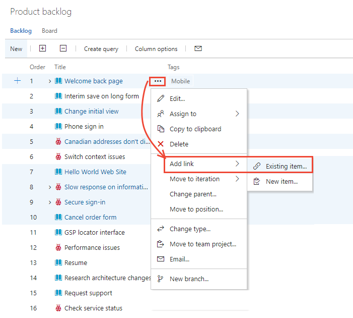
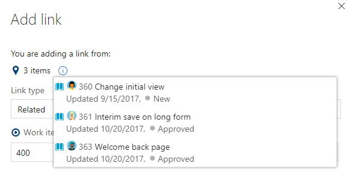
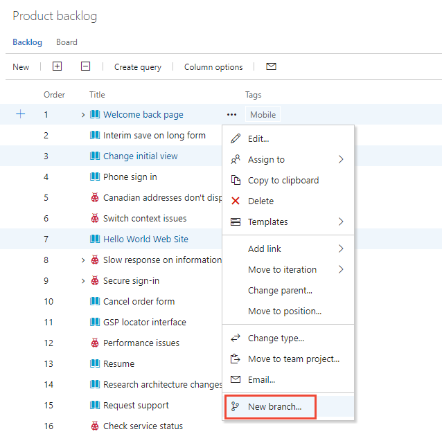

# Add link to work items  

[!INCLUDE [temp](../_shared/version-vsts-tfs-all-versions.md)]

You can add a link to a work item from within the work item form or from a backlog or query results list. From a backlog or query results list, you can [select multiple work items](bulk-modify-work-items.md#multi-select) and then link them to a new or existing work item. In general, use the bulk edit to update several work items to link to the same work item, either new or existing. 

Use this topic to learn how to:  

> [!div class="checklist"]   
> * Link one or more work items to an existing work item   
> * Link one or more work items to a new work item that you add when linking
> * Link several work items to a new git branch
> * Find work items that you want to link to  
> * Other options for bulk modifying link relationships   

For a list of all link types and supported link relationships, see [Link work items to support traceability](../track/link-work-items-support-traceability.md). 

[!INCLUDE [temp](../_shared/prerequisites-work-items.md)] 

  
## Link several items to an existing or new work item 
::: moniker range="vsts || >= tfs-2018"

1. From the web portal, open a backlog or query results page, and [multi-select the work items](bulk-modify-work-items.md#multi-select) you want to add a link to.

2. Open the &hellip; context menu of one of the selected work items, choose **Add link**, and then choose **Existing item**&hellip; or **New item**&hellip;. 

	Here we multi-select from the product backlog and choose **Existing item**&hellip;.

	> [!div class="mx-imgBorder"]  
	>    

::: moniker-end
::: moniker range="tfs-2017"
1. From the web portal, open a backlog or query results page, and [multi-select the work items](bulk-modify-work-items.md#multi-select) you want to add a link to. 

2. Open the &hellip; context menu of one of the selected work items, and then choose **Link to a new item**&hellip; or **Link to an existing item**&hellip;. 

	Here we multi-select from the Queries page and choose <b>Link to a new item&hellip;</b>.

	> [!div class="mx-imgBorder"]  
	>  

::: moniker-end
::: moniker range=">= tfs-2013 <= tfs-2015"
1. From the web portal, open a backlog or query results page, and [multi-select the work items](bulk-modify-work-items.md#multi-select) you want to add a link to.

2. Open the context menu of one of the selected work items, and then choose **Link selected item(s) to a new work item**&hellip; or **Link to an existing item**&hellip;.

	Here we multi-select from the Queries page and choose **Link selected item(s) to a new work item**&hellip;. 

	 
::: moniker-end

  
## Link to an existing work item    

When you link work items, you select a link type. In general, use the following link types as indicated. To learn more about each link type, see [Link work items to support traceability](../track/link-work-items-support-traceability.md#link-type-guidance). 

- Use the **Duplicate** link type when two work items have been created that essentially capture the same information; close one of the work items and keep the other one active  
- Use the **Parent/Child** link types when you want to break down work items into smaller items&mdash;for example, break down features into stories, or stories into tasks
- Use  **Predecessor-Successor** link types when you want to track tasks that must be completed before others can be started; this link type is most often used when you plan work using Project 
- Use the **Related** link type when the work items being linked are at the same level&mdash;such as two user stories that define features that overlap one another&mdash;or to link work items that are defined in different team projects or managed by different teams.

# [Browser](#tab/browser) 

From the Add link dialog, select the link type, enter a work item ID, and then click OK. 

For example, here we use the Related link type to link three items to the bug with ID of *400*. 

> [!div class="mx-imgBorder"]  
>    
	
To link to multiple work items, enter their IDs separated by commas or spaces. If you don't know the IDs or you want to link to an item in a different team project, you can click the &hellip; context menu to open a dialogue that will support you in [choosing work items based on IDs, a query, or title keyword](#find-items). 

::: moniker range="vsts || >= tfs-2018"
To view the work items selected for linking, you can click the . 	 
> [!div class="mx-imgBorder"]  
>    
::: moniker-end		

If you are working from the Query Results page, you'll need to bulk save the work items you've modified. When you work from a backlog, work items are automatically saved.

 	

# [Visual Studio](#tab/visual-studio)
 
From the Add link to Multiple Items dialog, select the link type, enter a work item ID, and then click OK. 

For example, here we use the Related link type to link several items to the user story with ID of *4654*. 

  		

To link to multiple work items, enter their IDs separated by commas or spaces. If you don't know the IDs or you want to link to an item in a different team project, you can click the Browse button to open a dialogue that will support you in [choosing work items based on IDs, a query, or title keyword](#find-items). 

You'll need to bulk save the work items you've modified. 
 	
---

## Link to a new work item   

Here, we have selected to add a link to the selected work items.  

0. Specify the link type, work item type, and title of the new work item. Click OK.
	::: moniker range="vsts || >= tfs-2018"
	 
	::: moniker-end
	::: moniker range=">= tfs-2013 <=tfs-2017"
	
	::: moniker-end

0. A work item of the type selected opens. Enter additional information and save the work item.
	::: moniker range="vsts || >= tfs-2017 <=tfs-2018"
	> [!div class="mx-imgBorder"]  
	>    
	::: moniker-end
0. If you are working from the Query Results page, you'll need to bulk save the work items you've modified as shown in the previous procedure.  

::: moniker range="vsts || >= tfs-2017 <= tfs-2018"

## Link several work items to a new git branch 

<!---
> [!NOTE]  
>**Feature availability**: The **New branch&hellip;** option is available from VSTS and the web portal for TFS 2017 and later versions. 
-->

You can add a new git branch and link them to existing work items at the same time. 

From a backlog or query results page, [multi-select the work items](bulk-modify-work-items.md#multi-select) you want to link to a new git branch. To learn more, see [Link work items to Git development objects](connect-work-items-to-git-dev-ops.md).  
::: moniker-end

::: moniker range="vsts || >= tfs-2018"
> [!div class="mx-imgBorder"]  
>    

::: moniker-end

::: moniker range="tfs-2017"

> [!div class="mx-imgBorder"]  
>    

::: moniker-end

  
## Find work items to link to   
From the Add link dialog you can open a secondary dialog to help you choose one or more work items to link to. If you are going to find and list work items to link to by using a saved query, first [define the query](../track/using-queries.md) that you want to use. 

0.  From the Add link dialog, click the &hellip; context menu or Browse button (Visual Studio) to open the following dialog. 

	 

	If the work items are defined in another team project, then first select the Project. Then, make your selections: 

	-   **Query**. Use this method when you have defined a query that you know contains the set or superset of the work items that you want.   
	-   **IDs**. Use this method when you know the IDs of the work items that you want to link to. 
		  In the **IDs** box, type the IDs of the work items that you want to find, separated by commas or spaces. 
	-   **Title contains**. Use this method to find work items that have a common word or phrase in the title field. In the **and type** list, click the type of work item that you want to retrieve.   
  
        > [!NOTE]
        >  To minimize the time required to run the query, narrow the filter criteria of the search.  
  
6.  Click the **Find** button.
  
     Only those work items defined for the selected team project and specified work item type are listed. To sort on a column field, choose the column title. 

	<!--- You can change the display of the work items that are listed by using one of the following user interface controls:  
  
		To expand or collapse a tree view list, choose the + or signs.    
      To resize a column, point your cursor at the edge of a column header and drag it to a new location.    
      To sort on a column field, choose the column title.    
      To move a column field, choose the column title and drag to another location. -->  
  
7.  In the list of returned work items, select one or more work items.   
  
    -   From the web portal: To select several items in a sequence, hold down the shift key. To select several non-sequential items, use the Ctrl key.   
  
    -   For Visual Studio, select each work item that should link to the current work item. You can also press the SHIFT key while clicking to select a range of work items, or press the CTRL key while clicking to select multiple work items.  
  

## Additional bulk-modify link options

Additional features you can use to quickly link or change links that use the parent-child link type (some features are version dependent, see the linked topic for details):

-   To quickly link backlog items to portfolio backlog items with parent-child links, [use the mapping pane to organize your backlog](organize-backlog.md#mapping). Or, you can choose to Show Parents and [drag-and-drop items within the tree hierarchy](organize-backlog.md#reparent). 

-   To create and link tasks to backlog items, [use the sprint backlog page](../scrum/sprint-planning.md). 

-   To indent (), outdent (), and change the tree hierarchy, use a tree query in Visual Studio.

- To add or delete work items or change the link structure, you can use Excel or Project. See [Bulk add or modify work items with Excel](../backlogs/office/bulk-add-modify-work-items-excel.md) and [Create your backlog and tasks using Project](../backlogs/office/create-your-backlog-tasks-using-project.md).

## Related articles

- [Map backlog items to portfolio backlog items](organize-backlog.md)
- [Link work items to Git development objects](connect-work-items-to-git-dev-ops.md)
- [Use Excel to edit parent-child links](../backlogs/office/bulk-add-modify-work-items-excel.md)
- [Use Project to edit parent-child and predecessor-successor links](../backlogs/office/create-your-backlog-tasks-using-project.md)
- [Link work items to support traceability](../track/link-work-items-support-traceability.md)

