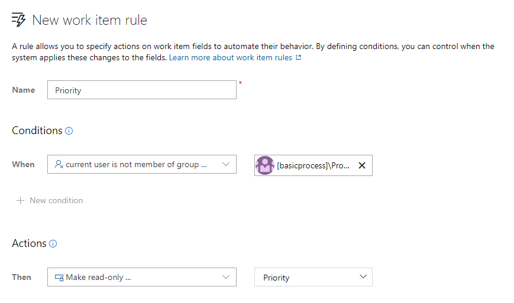
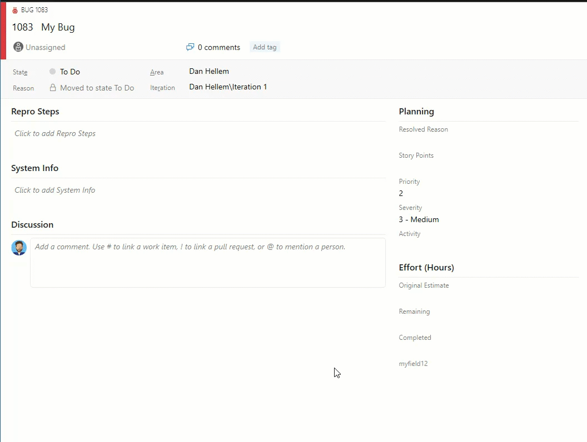
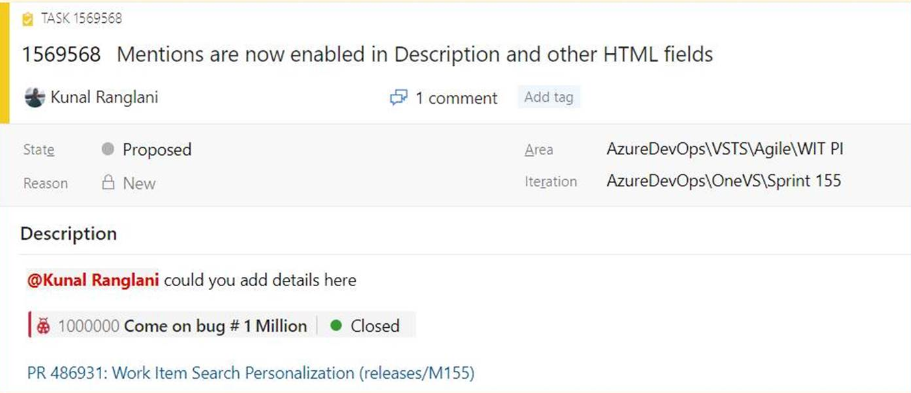
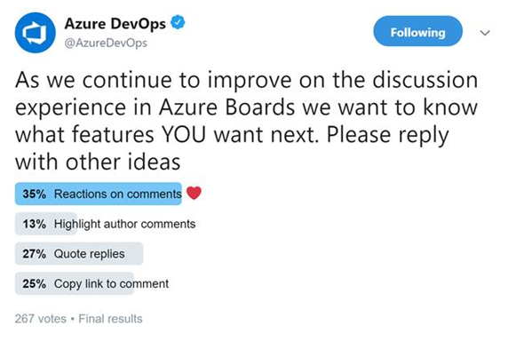
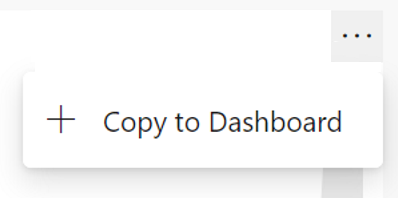

### Read-only and required rules for group membership

Work item rules let you set specific actions on work item fields to automate their behavior. You can create a rule to set a field to read-only or required based on group membership. For example, you may want to grant product owners the ability to set the priority of your features while making it read-only for everyone else.

> [!div class="mx-imgBorder"]
> 

### Customize system picklist values

You can now customize the values for any system picklist (except the reason field) such as Severity, Activity, Priority, etc. The picklist customizations are scoped so that you can manage different values for the same field for each work item type.

> [!div class="mx-imgBorder"]
> 

### New work item URL parameter

Share links to work items with the context of your board or backlog with our new work item URL parameter. You can now open a work item dialog on your board, backlog, or sprint experience by appending the parameter `?workitem=[ID]` to the URL.

Anyone you share the link with will then land with the same context you had when you shared the link!

### Mention people, work items and PRs in text fields

As we listened to your feedback, we heard that you wanted the ability to mention people, work items, and PRs in the work item description area (and other HTML fields) on the work item and not just in comments. Sometimes you are collaborating with someone on a work item, or want to highlight a PR in your work item description, but didn't have a way to add that information. Now you can mention people, work items, and PRs in all long text fields on the work item.

You can see an example here.

> [!div class="mx-imgBorder"]
> 

* To use people mentions, type the **@** sign and the person's name you want to mention. @mentions in work item fields will generate email notifications like what it does for comments.
* To use work item mentions, type the **#** sign followed by the work item ID or title. #mentions will create a link between the two work items.
* To use PR mentions, add a **!** followed by your PR ID or name.

### Reactions on discussion comments

One of our main goals is to make the work items more collaborative for teams. Recently we conducted a [poll on Twitter](https://twitter.com/AzureDevOps/status/1101157288520413185) to find out what collaboration features you want in discussions on the work item. Bringing reactions to comments won the poll, so we add them! Here are the results of the Twitter poll.

> [!div class="mx-imgBorder"]
> 

You can add reactions to any comment, and there are two ways to add your reactions – the smiley icon at the top right corner of any comment, as well as at the bottom of a comment next to any existing reactions. You can add all six reactions if you like, or just one or two. To remove your reaction, click on the reaction on the bottom of your comment and it will be removed. Below you can see the experience of adding a reaction, as well as what the reactions look like on a comment.

> [!div class="mx-imgBorder"]
> 

### Pin Azure Boards reports to the dashboard

In the Sprint 155 Update, we included [updated versions of the CFD and Velocity reports](https://docs.microsoft.com/en-us/azure/devops/release-notes/2019/sprint-155-update?branch=releasenotes%2Fsprint-156-update#get-insights-into-your-teams-health-with-three-new-azure-boards-reports). These reports are available under the Analytics tab of Boards and Backlogs. Now you can pin the reports directly to your Dashboard. To pin the reports, hover over the report, select the ellipsis "..." menu, and **Copy to Dashboard**.

> [!div class="mx-imgBorder"]
> 
