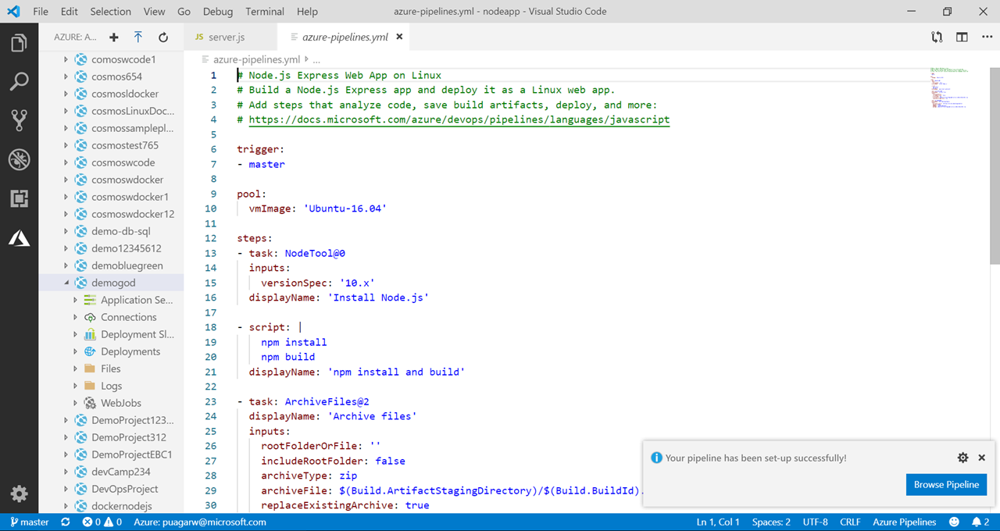
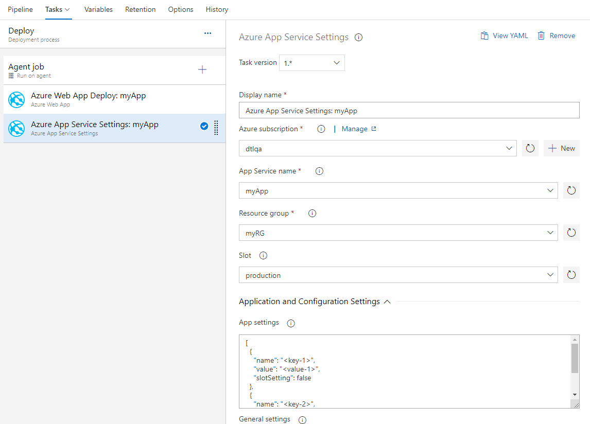
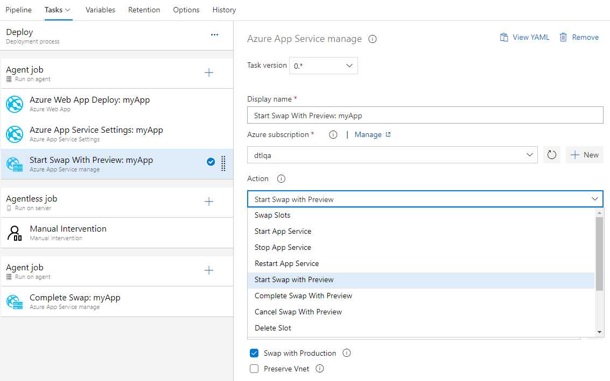
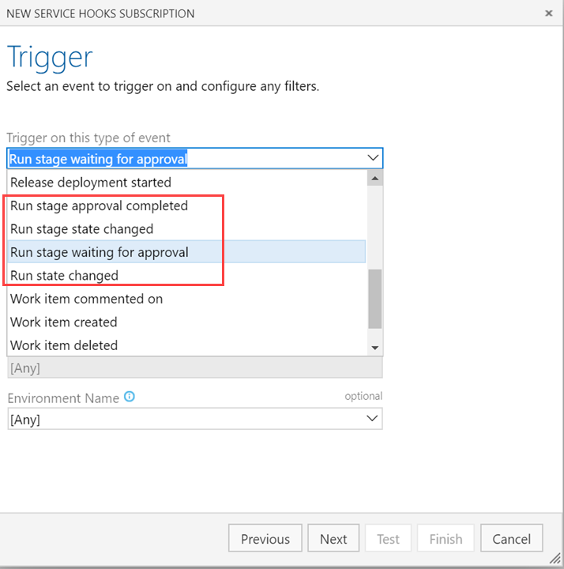
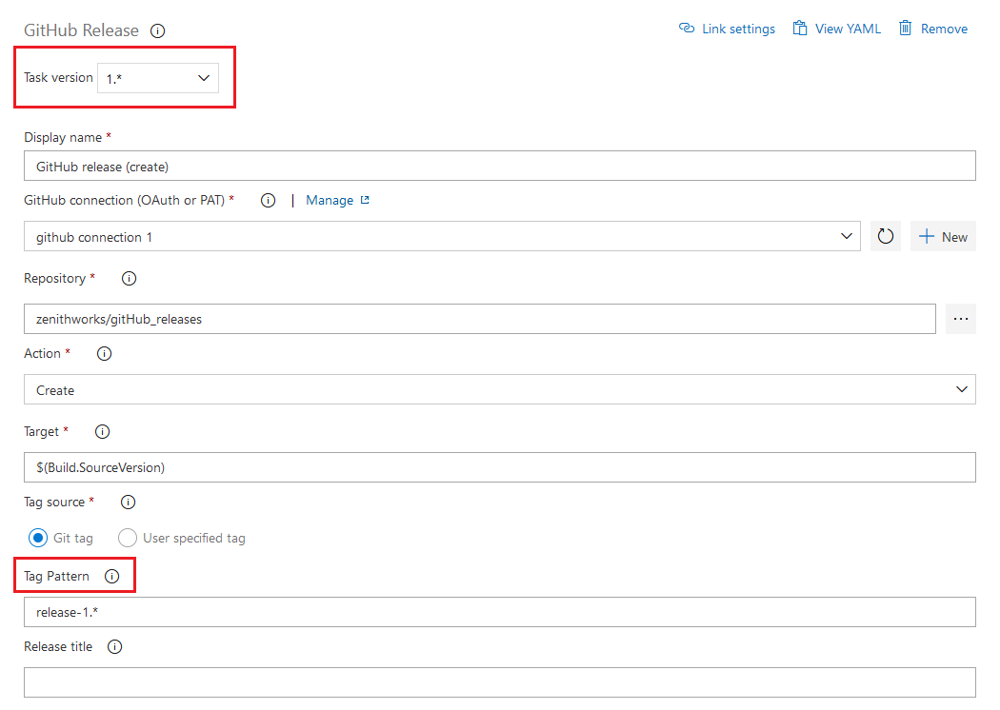
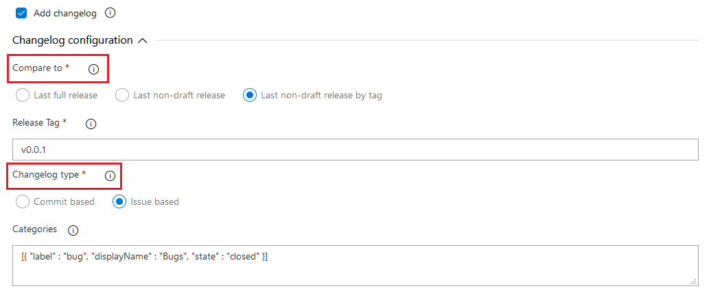
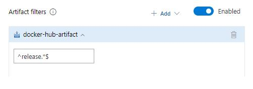
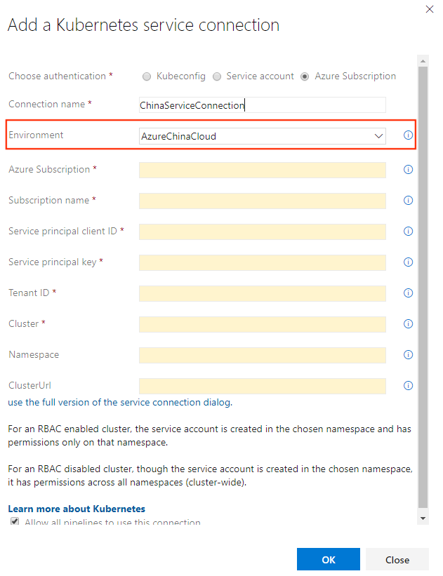

### Create Azure Pipelines from VSCode

We've added a new functionality to the Azure Pipelines extension for VSCode. Now, you will be able to create Azure Pipelines directly from VSCode without leaving the IDE.

> [!div class="mx-imgBorder"]
> 

### New task for configuring Azure App Service app settings

Azure App Service allows configuration through various [settings](https://docs.microsoft.com/en-us/azure/app-service/configure-common) like app settings, connection strings and other general configuration settings. 
We now have a new Azure Pipelines task **Azure App Service Settings** which supports configuring these settings in bulk using JSON syntax on your web app or any of its deployment slots. This task can be used along with other App service tasks to [deploy](https://docs.microsoft.com/en-us/azure/devops/pipelines/targets/webapp?view=azure-devops&amp;tabs=yaml), [manage](https://docs.microsoft.com/en-us/azure/devops/pipelines/tasks/deploy/azure-app-service-manage?view=azure-devops) and configure your Web apps, Function apps or any other containerized App Services.

> [!div class="mx-imgBorder"]
> 

### Azure App Service now supports Swap with preview

Azure App Service now supports **Swap with preview** on its deployment slots. This is a good way to validate the app with production configuration before the app is actually swapped into production. 

Azure App Service task now supports this multi-phase swap through the following new actions:

* **Start Swap with Preview** - Initiates a swap with a preview (multi-phase swap) and applies target slot configuration to the source slot.
* **Complete Swap with Preview** - When you're ready to complete the pending swap, select the Complete Swap with Preview action.
* **Cancel Swap with Preview** - To cancel a pending swap, select Cancel Swap with Preview.

> [!div class="mx-imgBorder"]
> 

### YAML templates for Python and .NET Functions apps

With this update, we are adding support for YAML templates for Functions app based on .NET and Python. In line with YAML based pipelines value proposition, you can now manage the build and deployment of these functions' application in your code.

### Service hooks for YAML pipelines

Integrating services with YAML pipelines just got easier. Using service hooks events for YAML pipelines, you can now drive activities in custom apps or services based on progress of the pipeline runs. For example, you can create a helpdesk ticket when an approval is required, initiate a monitoring workflow after a stage is complete or send a push notification to your team's mobile devices when a stage fails.

Filtering on pipeline name and stage name is supported for all events. Approval events can be filtered for specific environments as well. Similarly, state change events can be filtered by new state of the pipeline run or the stage.

> [!div class="mx-imgBorder"]
> 

### Enhancement to Azure Pipelines app for Jira

The [Azure Pipeline app for Jira](https://marketplace.atlassian.com/apps/1220515/azure-pipelines-for-jira?hosting=cloud&tab=overview) enables bi-directional linking between releases in Azure Pipelines and issues in Jira software cloud. So far the app supported linking only when a GitHub repository was the source for the release. With this update, we have extended the support for linking when Azure Repos are used.

You can use a third party app to integrate Azure Repos with Jira software cloud, and [add Jira issue keys](https://confluence.atlassian.com/adminjiracloud/integrating-with-development-tools-776636216.html) to the commit or pull request message. When a release will deploy these commits, you will be able to associate the Jira issues deployed with the release and also track deployment status in each of the Jira issues.

### GitHub release task enhancements 

We've made several enhancements to the GitHub Release task. You can now have better control over release creation using the tag pattern field by specifying a tag regular expression and the release will be created only when the triggering commit is tagged with a matching string.

> [!div class="mx-imgBorder"]
> 

We've also added capabilities to customize creation and formatting of changelog. In the new section for changelog configuration, you can now specify the release against which the current release should be compared. The **Compare to** release can be the last full release (excludes pre-releases), last non-draft release or any previous release matching your provided release tag. Additionally, the task provides changelog type field to format the changelog. Based on the selection the changelog will display either a list of commits or a list of issues/PRs categorized based on labels.

> [!div class="mx-imgBorder"]
> 

### Stage level filter for Azure Container Registry and Docker Hub artifacts

Previously, regular expression filters for Azure Container Registry and Docker Hub artifacts were only available at the release pipeline level. They have now been added at the stage level as well.

> [!div class="mx-imgBorder"]
> 

### Sovereign cloud support in Kubernetes service connection

Previously, it was possible to use the service account option to setup Kubernetes service connection for Kubernetes clusters in Azure China Cloud and Azure Government Cloud. Now, you can use the Azure option for setting up Kubernetes service connections associated with managed Azure Kubernetes Service clusters that are a part of Azure China Cloud and Azure Government Cloud.

> [!div class="mx-imgBorder"]
> 

### Updates to hosted pipelines images

We've made updates to several of the Azure Pipelines hosted VM images. The following are some the highlights in this update:

* Added AWS, Google Cloud, and Zeit CLIs to Ubuntu 16.04
* Updated Rust 1.36 to 1.37 on Ubuntu 16.04, VS2017, and VS2019
* Updated Ruby 2.6.2 to 2.6.3 on Ubuntu 16.04
* Updated Ruby 2.4.5 to 2.4.6, 2.5.3 to 2.5.5, and 2.6.1 to 2.6.3 on VS2017 and VS2019
* Updated Google Chrome and web driver from 75 to 76
* Added WIX Toolset Visual Studio Extension to VS 2019
* Various bug fixes

You can find more details about the latest releases [here](https://github.com/microsoft/azure-pipelines-image-generation/releases). 

> [!NOTE]
> We will remove Ruby 2.3 from all images in a coming update as it [reached end-of-life on March 31, 2019](https://www.ruby-lang.org/en/news/2019/03/31/support-of-ruby-2-3-has-ended/).