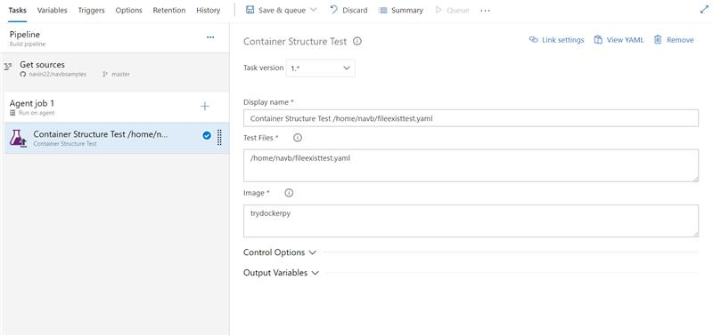
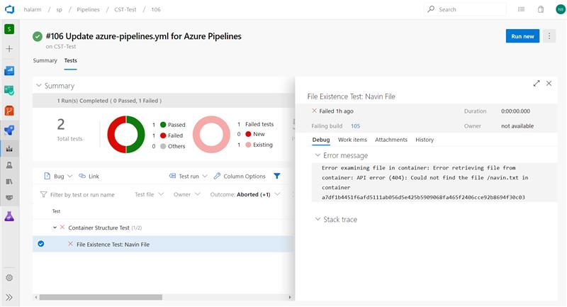
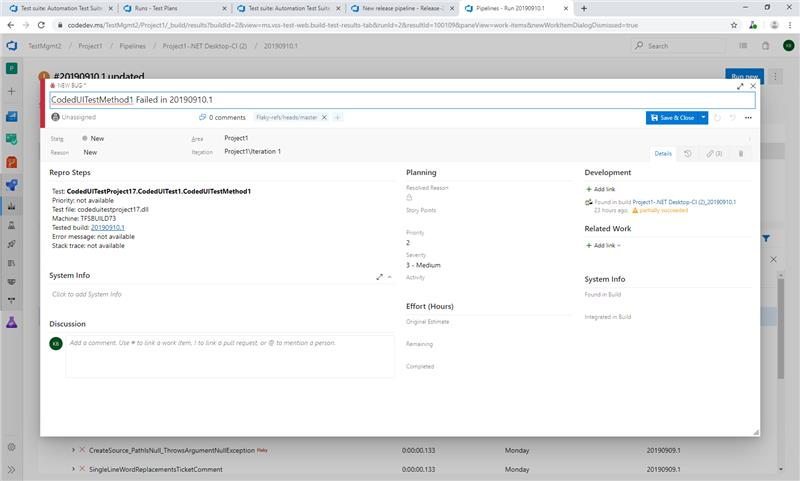
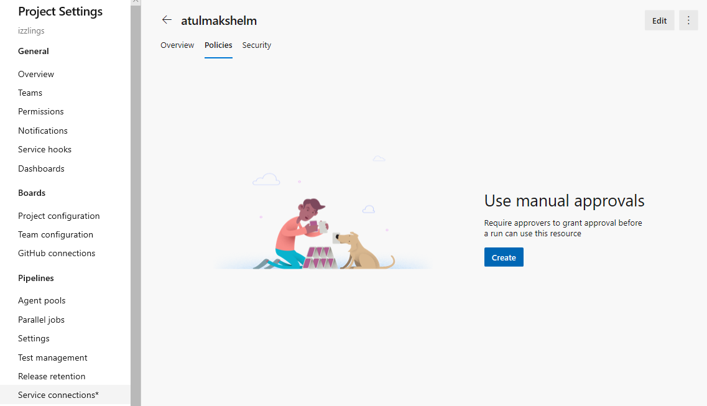
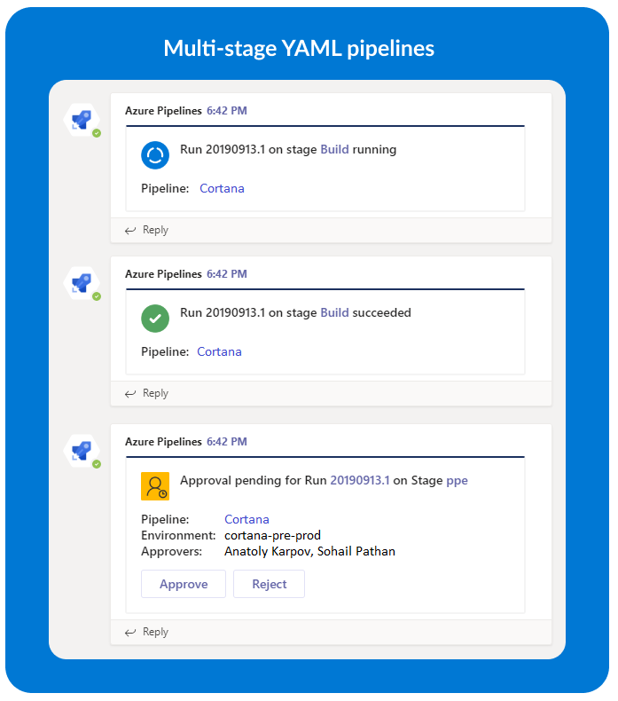
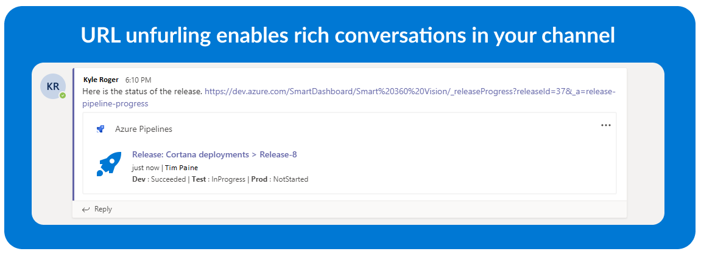

### Retry failed stages

One of the most requested features in multi-stage pipelines is the ability to retry a failed stage without having to start all the way from the beginning. This release brings a big portion of that capability to you.

When a stage in the execution of a pipeline fails, you can retry that stage. Any jobs that failed in the first attempt and those that depend transitively on those failed jobs are all re-attempted.

Here are some examples, where this can help you save time. Say that you run multiple jobs in a stage - each to run tests on a different platform. If the tests on one platform fail while others pass, you can save time by not running the jobs that passed. As another example, a deployment stage may have failed due to flaky network connection. Retrying that stage will help you save time by not having to produce another build.

There are a few known gaps in this feature. You cannot retry a stage that you explicitly cancel.  You also cannot retry a stage that has passed - for instance to redeploy an earlier build. We are working on closing these gaps as soon as we can.

In order to try this feature, you must have the preview feature "Multi-stage pipelines" enabled.

### Container structure testing support in Azure Pipeline
​
Usage of containers in applications is increasing and thus the need for robust testing and validation. Azure Pipelines now brings supports for Container Structure Tests. This framework provides a convenient and powerful way to verify the contents and structure of your containers. You can validate the structure of an image based on four categories of tests - command tests, file existence tests, file content tests and metadata tests and you can use the results in the pipeline to make go/no go decisions. Test data is available in the Pipeline run with error message to help you troubleshoot better. 

Input the config file and image details

> [!div class="mx-imgBorder"]
> 

Test data and summary 

> [!div class="mx-imgBorder"]
> 

### Flaky bug management and resolution

In July, we shipped the functionality for flaky test management. To enhance it further we are adding functionality of flaky bug management and resolution. 

User investigating the flaky test can create a bug using the Bug action which can then be assigned to developer for further investigating the root cause of the flaky test. The bug report includes necessary information about the pipeline, error message, stack trace and other information associated with the test.

> [!div class="mx-imgBorder"]
> 

When a bug report is resolved/closed, our system automatically unmarks that test as unflaky helping in quality signal.

### Approvals for service connections and agent pools

> [NOTE] 
New service connection experience preview feature needs to be enabled to allow configuration of approvals on service connections.

As a continuation of improvements to multi-stage YAML pipelines, we enabled configuring approvals on service connections and agent pools.
For approvals we follow segregation of roles between infrastructure owners and developers. By configuring approvals on their resources (environments, service connections, agent pools), resource owners get assured that all pipeline runs that use resources will first stop and seek their approval. We allowed environment owners to configure approvals a couple of months back. With this development, we have extended the same capability to agent pools and service connections. The experiences are similar to how you configure approvals for environments. When an approval is pending on a resource referenced in a stage, the execution of the pipeline waits until the pipeline is manually approved.

> [!div class="mx-imgBorder"]
> 

To ensure protection is honoured in all scenarios, you cannot use resources with approvals in classic release pipelines. Any classic release pipeline looking to use resources with protection would fail.

### Enhancements to Azure Pipelines app for Slack and Teams

**Multi-stage YAML based pipelines**

Azure pipelines for Slack and Teams now supports multi-stage YAML pipelines for CI and CD. With this enhancement, users will get notified on various events pertaining to YAML pipelines. To turn this feature on please enable 

Events supported for multi-stage YAML pipelines
* Run state changed
* Run stage state changed
* Run stage waiting for approval
* Run stage approval completed

> [!div class="mx-imgBorder"]
> 

To turn this feature on, please enable multi-stage pipelines in the preview features section for the org and the user. For org: Profile -> Preview features -> for this organization [Organization] -> Enable Multi-stage pipelines
For user: Profile -> Preview features -> for [User] -> Enable Multi-stage pipelines

**URL unfurling and messaging extensions**

We have added a [messaging extension](https://docs.microsoft.com/en-us/microsoftteams/platform/concepts/messaging-extensions/messaging-extensions-overview) for Azure Pipelines app for Teams. With this, users can search for pipelines and share relevant details about the pipeline as a card in the channel. URL unfurling helps users to initiate discussions around pipelines and have meaningful & contextual conversations.

> [!div class="mx-imgBorder"]
> 

### Updates to hosted pipelines images

We've made updates to several of the Azure Pipelines hosted VM images. You can find more details on the latest releases [here](https://github.com/microsoft/azure-pipelines-image-generation/releases). Highlights include:
* Added Go 1.13 to Ubuntu 16.04, Ubuntu 18.04, VS2017, and VS2019. Go 1.12 remains the default.
* Added Android SDK and Build Tools 29 to Ubuntu 16.04, Ubuntu 18.04, VS2017, and VS2019.
* Added Az Module 2.6.0 to VS2017 and VS2019.
* Various bug fixes.

You can find more details about the latest releases [here](https://github.com/microsoft/azure-pipelines-image-generation/releases).

> [Note] 
We will be removing Ruby 2.3 from all images in a coming update as it [reached end-of-life on March 31, 2019](https://www.ruby-lang.org/en/news/2019/03/31/support-of-ruby-2-3-has-ended/).

### Open Policy Agent installer task

This task allows for installation of Open Policy Agent on agents. Open Policy Agent. Open Policy Agent is an open source, general-purpose policy engine that enables unified, context-aware policy enforcement. It is particularly useful for in-pipeline policy enforcement with respect to Infrastucture as Code providers. For example, Open Policy Agent can evaluate rego policy files and Terraform plans in pipeline.

### Pipeline decorators for release pipelines

Pipeline decorators allow addition of steps to the beginning and end of every job. This is different than adding steps to a single definition because it applies to all pipelines in an organization.

We have been supporting decorators for builds and YAML pipelines, with customers using them to centrally control the steps in their jobs. We are now extending the support to release pipelines as well. You can create extensions to add steps targeting the new contribution point and they will be added to all agent jobs in release pipelines.