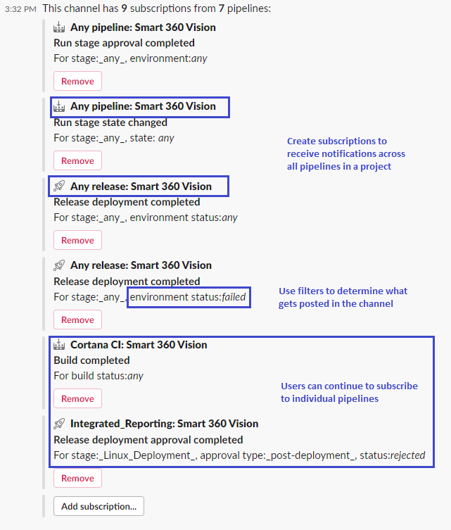
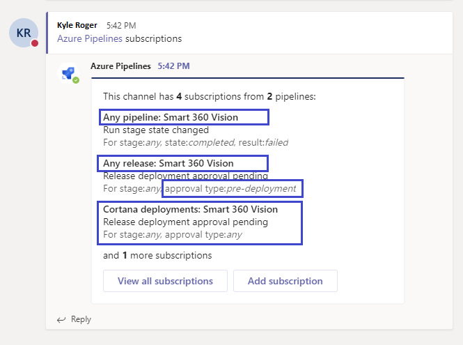

### Checkout multiple repositories in Azure Pipelines

Pipelines often rely on multiple repositories. You can have different repositories with source, tools, scripts, or other items that you need to build your code. Previously, you had to add these repositories as submodules or as manual scripts to run **git checkout**. Now you can fetch and `checkout` other repositories in addition to the one you use to store your YAML pipeline. 

For example, if you have a repository called *MyCode* with a YAML pipeline and a second repository called *Tools*, your YAML pipeline will look like this:

```yaml
resources:
repositories:
  - repository: tools
    name: Tools
    type: git

steps:
- checkout: self
- checkout: tools
- script: dir $(Build.SourcesDirectory)
```

The third step will show two directories, *MyCode* and *Tools* in the sources directory.

Azure Repos Git, GitHub, and Bitbucket Cloud repositories are supported. For more information, see [Multi-repo checkout](/azure/devops/pipelines/repos/multi-repo-checkout#multi-repo-checkout).

### Use GitHub Actions to trigger a run in Azure Pipelines

We now have GitHub Actions for [Azure Pipelines (azure/pipelines)](https://github.com/Azure/pipelines) which lets you trigger a run in Azure Pipelines as part of your GitHub Actions workflow.

[GitHub Actions](https://help.github.com/en/actions/automating-your-workflow-with-github-actions/about-github-actions) makes it easy to build, test, and deploy your code right from GitHub. You can also use it to trigger external CI/CD tools and services. For example, you can use GitHub Actions for continuous integration, and [Azure Pipelines](https://azure.microsoft.com/en-us/services/devops/pipelines/?nav=min) for continuous delivery to leverage features like Approvals, Environments and deep integration with Kubernetes.

You can use this action to trigger a specific pipeline (YAML or classic release pipeline) in Azure DevOps. GitHub Actions will take the Project URL, pipeline name and a [Personal Access Token (PAT)](https://docs.microsoft.com/en-us/azure/devops/organizations/accounts/use-personal-access-tokens-to-authenticate?view=azure-devops&tabs=preview-page) for your Azure DevOps account as inputs.

You can find starter templates [here](https://github.com/Azure/actions-workflow-samples/tree/master/AzurePipelines).

### Updated ServiceNow integration with Azure Pipelines

The [Azure Pipelines app for ServiceNow](https://store.servicenow.com/sn_appstore_store.do#!/store/application/fa788cb5dbb5630040669c27db961940/4.161.0?referer=sn_appstore_store.do%23!%2Fstore%2Fsearch%3Fq%3Dazure%2520devops) helps integrate Azure Pipelines and ServiceNow Change Management. With this update, you can integrate with the New York version of ServiceNow. The authentication between the two services can now be made using OAuth and basic authentication. In addition, you can now configure advanced success criteria so you can use any change property to decide the gate outcome.

### Set VSTest tasks to fail if a minimum number of tests are not run

The VSTest task discovers and runs tests using user inputs (test files, filter criteria, and so forth) as well as a test adapter specific to the test framework being used. Changes to either user inputs or the test adapter can lead to cases where tests are not discovered and only a subset of the expected tests are run. This can lead to situations where pipelines succeed because tests are skipped rather than because the code is of sufficiently high quality. To help avoid this situation, we've added a new option in the VSTest task that allows you to specify the minimum number of tests that must be run for the task to pass.

> [!div class="mx-imgBorder"]
> 

### UCS-4 support for Python 2.7 

Python 2.7 is available on most of the hosted build agents. Previously, we were shipping Python 2.7 built with UCS-2 (2-octet universal character set) support. UCS-2 does not represent all Unicode characters this is why we've switched our Python 2.7 implementation to UCS-4 to represent all the characters available in Unicode. We expect this will have no impact to you since most packages are independent of the Unicode support built into Python.

### Create bulk subscriptions in Azure Pipelines app for Slack and Microsoft Teams

Users of the Azure Pipelines app for [Slack](https://azchatopprodcus1.azchatops.visualstudio.com/_slack/installslackapp) and [Microsoft Teams](https://appsource.microsoft.com/product/office/WA200000055?src=wnblogmar2018) can now bulk subscribe to all of the pipelines in a project. You can use filters to manage what gets posted in the Slack or Teams channels. You can continue to subscribe to individual pipelines too.

Slack:

Slash command: /azpipelines subscribe [project url] ​

Example: /azpipelines subscribe `https://dev.azure.com/myorg/myproject​`

> [!div class="mx-imgBorder"]
> 

Microsoft Teams:

Command: @Azure Pipelines subscribe [project url] ​

Example: @Azure Pipelines subscribe `https://dev.azure.com/myorg/myproject​`

> [!div class="mx-imgBorder"]
> 