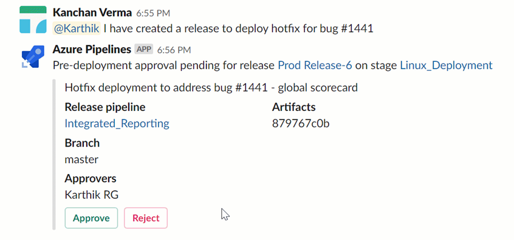
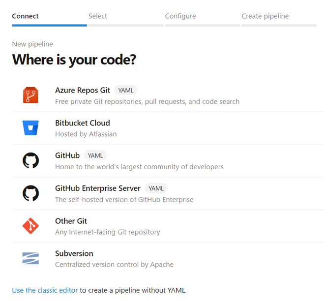
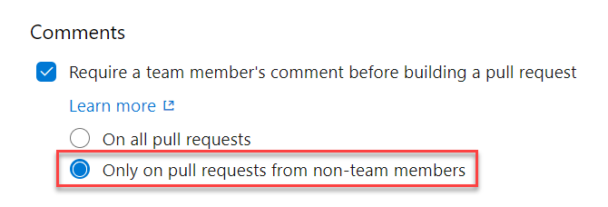

### Choose the directory of checked out code in YAML pipelines

Previously, we checked out repos to the `s` directory under $(Agent.BuildDirectory). Now you can choose the directory where your Git repo will be checked out for use with YAML pipelines.

Use the `path` keyword on `checkout` and you'll be in control of the folder structure. Below is an example of the YAML code that you can use to specify a directory.

```yaml
steps:
- checkout: self
  path: my-great-repo
```

In this example, your code will be checked out to the `my-great-repo` directory in the agent’s workspace. If you don’t specify a path, your repo will continue to be checked out to a directory called `s`.

### Private projects now get 60 minutes of run time per pipeline job

Until now, a free account (that is, one which hadn't purchased parallel jobs) would run a job for up to 30 minutes at a time, up to 1,800 minutes per month. With this update, we have increased the limit from 30 to 60 minutes for free accounts.  

If you need to run your pipeline for more than 60 minutes, you can pay for additional capacity per parallel job or run in a self-hosted agent. Self-hosted agents don't have a job length restrictions.

### Updates to hosted pipeline images

We've made updates to the VS2017, Ubuntu 16.04, and Windows Container 1803 VM images for your hosted Azure Pipelines. You can find more details on the latest releases [here](https://github.com/Microsoft/azure-pipelines-image-generation/releases). For a full look at the tools available on our images, visit our Image Generation repo on GitHub [here](https://github.com/Microsoft/azure-pipelines-image-generation).

In addition, we adopted Moby as the container runtime. Moby is an open framework created by Docker for assembling components into custom container-based systems. This will allow us to deliver frequent upstream patches and improvements to the container runtime.

### Duffle tool installer task in build and release pipeline

Duffle is a command line tool that allows you to install and manage Cloud Native Application Bundles (CNAB). With CNABs, you can bundle, install and manage container-native apps and their services.

In this update, we added a new task for build and release pipelines that allows you to install a specific version of Duffle binary.

> [!div class="mx-imgBorder"]
> 

### Approve Azure Pipelines deployments from Slack

Until now, Slack users have had limited capabilities to manage release deployments from within a channel. The Azure Pipelines app for Slack lets you approve or reject a release deployment from the channel. This will make the approval process easier since you aren't forced to navigate to the Azure Pipelines portal. In addition, you can approve deployments on the go by using the Slack mobile app.

> [!div class="mx-imgBorder"]
> 

For more detailed on Azure Pipelines and Slack see the documentation [here](/azure/devops/pipelines/integrations/slack?view=azure-devops&preserve-view=true).

### All source providers included in the new build pipeline wizard

Until now, source providers like GitHub, Azure Repos, and Bitbucket Cloud were split between the classic pipeline editor and the new pipeline wizard. With this update we added all of them to the new pipeline wizard for a single starting point. You can still click the link at the bottom of the page to create a pipeline without YAML in the classic editor.

> [!div class="mx-imgBorder"]
> 

### GitHub comments trigger optimizations

We improved the experience for teams who use GitHub pull request comments to trigger builds. Usually for security, these teams don’t want to automatically build pull requests. Instead, they want a team member to review the pull request and once it’s deemed safe, trigger the build with a [pull request comment](/azure/devops/pipelines/repos/github?view=azure-devops&preserve-view=true#comment-triggers). A new setting keeps this option while still allowing automatic pull request builds _only_ for team members.

> [!div class="mx-imgBorder"]
> 

### Publish CTest and PHPUnit test results

With this update, we’ve added support to publish test results from a [CTest]( https://cmake.org/cmake/help/latest/manual/ctest.1.html) run in pipelines. To publish CTest results, select the CTest option in the **Test result format** input of the publish test results tab.

> [!div class="mx-imgBorder"]
> 

In addition, we included publishing for [PHPUnit](https://docs.phpunit.de/en/11.0/configuration.html) test runs. While JUnit results format has always been supported, you can now leverage the specific constructs of PHPUnit. For more details on publishing test results see the documentation [here](/azure/devops/pipelines/tasks/reference/publish-test-results-v2?view=azure-devops&preserve-view=true&tabs=yaml).
