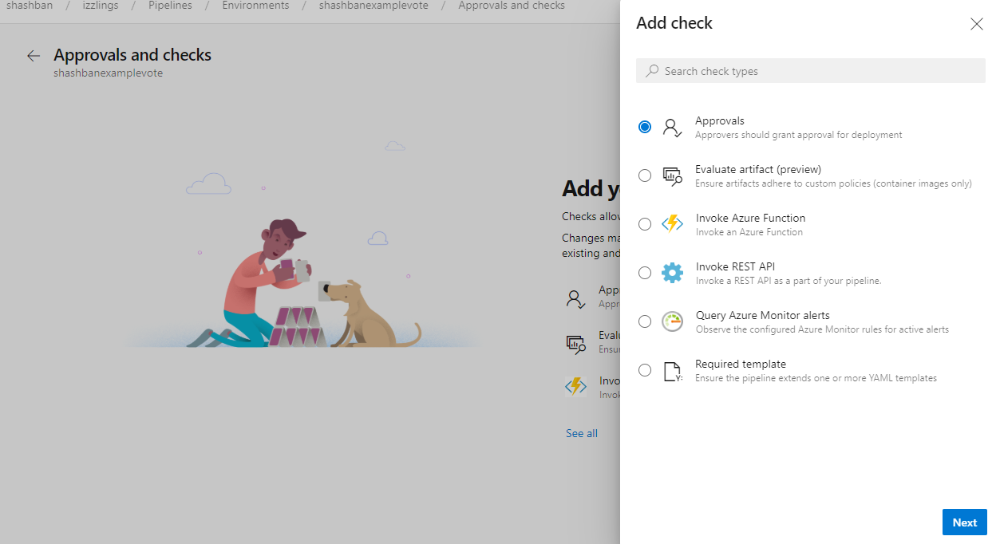
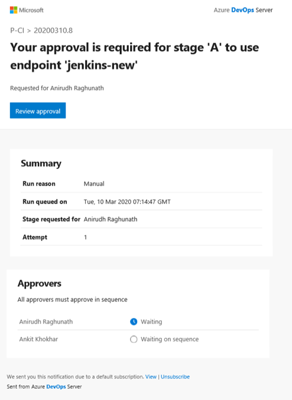

### Additional control of your deployments

Azure Pipelines have supported deployments controlled with manual approvals for some time now. With the latest enhancements, you now get additional control of your deployments.
In addition to approvals , resource owners can now add automated `checks` to verify security and quality policies. The checks can be used for triggering operations and waiting for them to complete. 
Using the additional checks, you can now define a health criteria based off multiple sources and be assured that all deployments targeting your resources are safe, irrespective of the YAML pipeline performing the deployment. Evaluation of each check can be repeated periodically based on the specified **Retry Interval** for the check.  
The following additional checks are now available.

- Invoke REST API. 
- Invoke any http API and perform validation based on response body or a callback from the external service.
- Invoke Azure function. Invoke an Azure function and perform validation based on response or a callback from the function. 
- Query Azure Monitor Alert. Query Azure Monitor for active alerts.
- Required Templates. Ensure the pipeline extends one or more YAML templates.

> [!div class="mx-imgBorder"]
> 

### Approval notification

When you an add approval on an environment or a service connection, all multi-stage pipelines that use the resource automatically wait for the approval at the start of the stage. The designated approvers need to complete the approval before the pipeline can continue.

With this update, the approvers are sent an email notification for the pending approval. Users and team owners can opt-out/configure custom subscriptions from <a href="https://docs.microsoft.com/azure/devops/notifications/navigating-the-ui?view=azure-devops">notification settings</a>.

> [!div class="mx-imgBorder"]
> 

In addition to email notifications, project administrators can continue to setup notifications to <a href="https://docs.microsoft.com/en-us/azure/devops/pipelines/integrations/microsoft-teams?view=azure-devops">Microsoft Teams</a> or <a href="https://docs.microsoft.com/en-us/azure/devops/pipelines/integrations/slack?view=azure-devops">Slack</a>.
