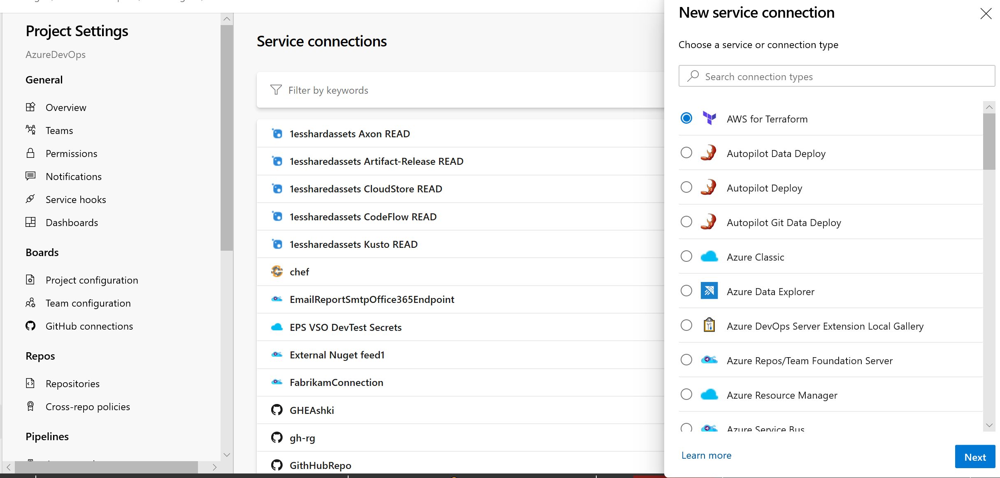
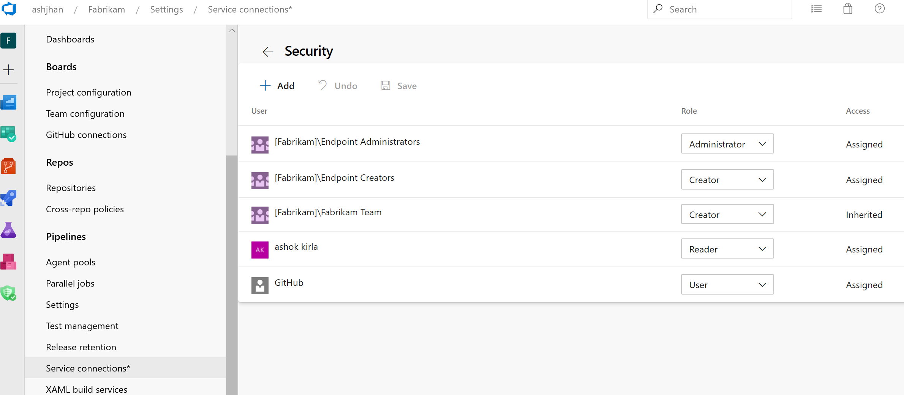
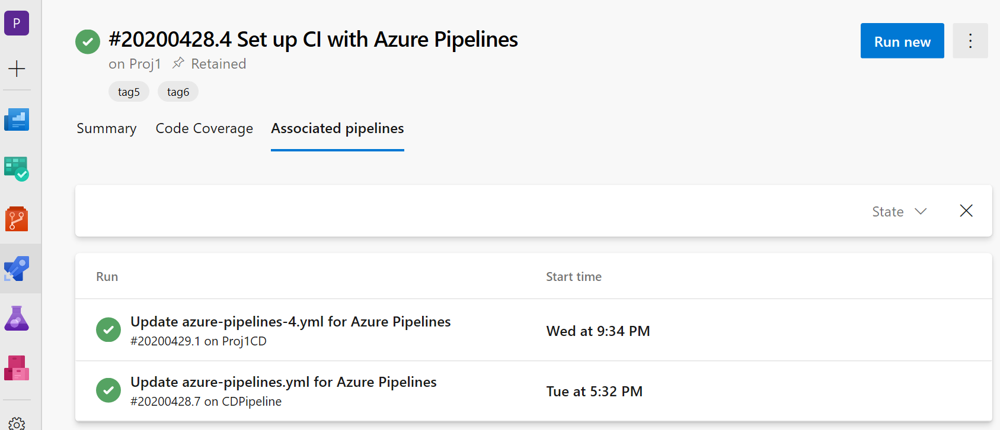
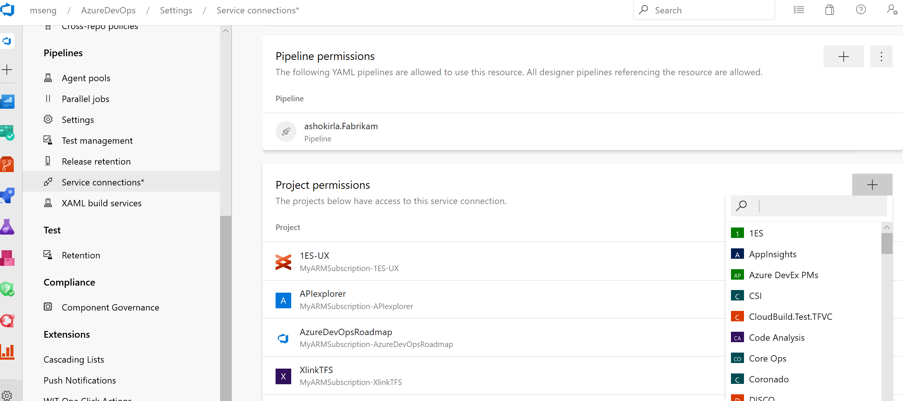
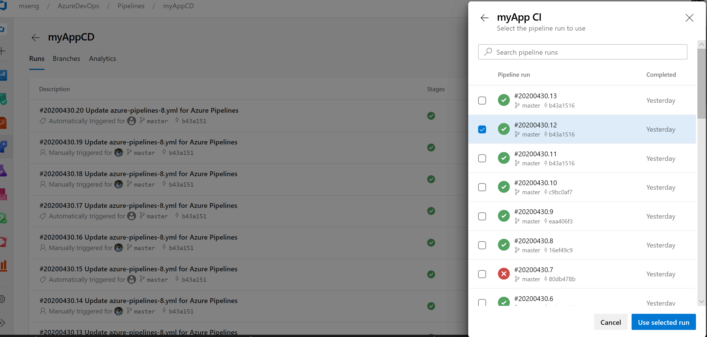

### Pipelines YAML CD features now generally available

We’re excited to announce the general availability of the Azure Pipelines YAML CD features. We now offer a unified YAML experience so you can configure each of your pipelines to do CI, CD, or CI and CD together. YAML CD features introduces several new advanced features that are available for all organizations using multi-stage YAML pipelines. Some of the highlights include:

- [Multi-stage YAML pipelines (for CI and CD)](https://docs.microsoft.com/azure/devops/pipelines/process/stages?view=azure-devops&tabs=yaml)
- [Approvals and checks on resources](https://docs.microsoft.com/azure/devops/pipelines/process/approvals?view=azure-devops&tabs=check-pass)
- [Environments](https://docs.microsoft.com/azure/devops/pipelines/process/environments?view=azure-devops) and [deployment strategies](https://docs.microsoft.com/azure/devops/pipelines/process/deployment-jobs?view=azure-devops#deployment-strategies)
- [Kubernetes](https://docs.microsoft.com/azure/devops/pipelines/process/environments-kubernetes?view=azure-devops) and [Virtual Machine](https://docs.microsoft.com/azure/devops/pipelines/process/environments-virtual-machines?view=azure-devops) resources in environment
- [Review apps for collaboration](https://docs.microsoft.com/azure/devops/pipelines/process/environments-kubernetes?view=azure-devops#setup-review-app)
- [Refreshed UX for service connections](https://docs.microsoft.com/azure/devops/pipelines/library/service-endpoints?view=azure-devops&tabs=yaml)
- [Resources in YAML pipelines](https://docs.microsoft.com/azure/devops/pipelines/process/resources?view=azure-devops&tabs=schema)

If you’re ready to start building, check out the [documentation](https://go.microsoft.com/fwlink/?linkid=2091040")&nbsp;or [blog](https://devblogs.microsoft.com/devops/announcing-general-availability-of-azure-pipelines-yaml-cd/)&nbsp;for building a multi-stage CI/CD pipelines.

### Service connections new UI as default experience

In this sprint, we are making service connections as the default experience and the old service connections UI will no longer be useable. For the past 6 months, we have provided a new UI to service connections as a preview feature. We added various features and improved the experience based on feedback we received from the customers

New service connections UI is built on modern design standards it comes with various critical features for multi-stage YAML CD pipelines like Approvals, Authorizations, and cross-project sharing. Moreover, we have also added a ton of usability improvements.

Learn more about service connections [here](https://aka.ms/SCLearnMore).

### RBAC for Service Connections

In this sprint, we have added role-based access for service connections. Previously, service connection security can be managed only through pre-defined ADO groups (Endpoint administrators and Endpoint Creators).

As part of this work, we have introduced Reader, User, Creator and Administrator roles. You can set these roles at service connections hub level in your project and these are inherited to the individual connections. And in each service connection you have the option to turn inheritance on/off and override the roles in the scope of the service connection.

Learn more about service connections security [here](https://aka.ms/SCLearnMore).

### Showing associated CD pipelines info in CI pipelines

As part of this sprint we have added support to show details about the CD YAML pipelines where the CI pipelines are referred to as 'pipeline' resources. In your CI pipeline run view, you will now see a new tab 'Associated pipelines' where you can find all the pipeline runs that consume your pipeline and artifacts from it.

### Cross-project sharing of service connections is now public

In this sprint, we are enabling support for service connection sharing across projects. For the past 3 months, this feature is in private preview and we have enabled it for many customers who have provided valuable feedback.

Thank you for your support. You can now share your service connections with your projects safely and securely.

Learn more about service connections sharing [here](https://aka.ms/SCLearnMore).

### Pipeline resource version picker in create run dialogue

In this sprint, as part of multi-stage CD YAML pipelines, we have added the ability to manually pick up pipeline resource versions in create run dialogue. If you refer to a CI pipeline as a resource in your pipeline, in the create run dialogue as part of resources, you can see the pipeline resource and you can pick the version of the pipeline run from which you can consume your artifacts.

