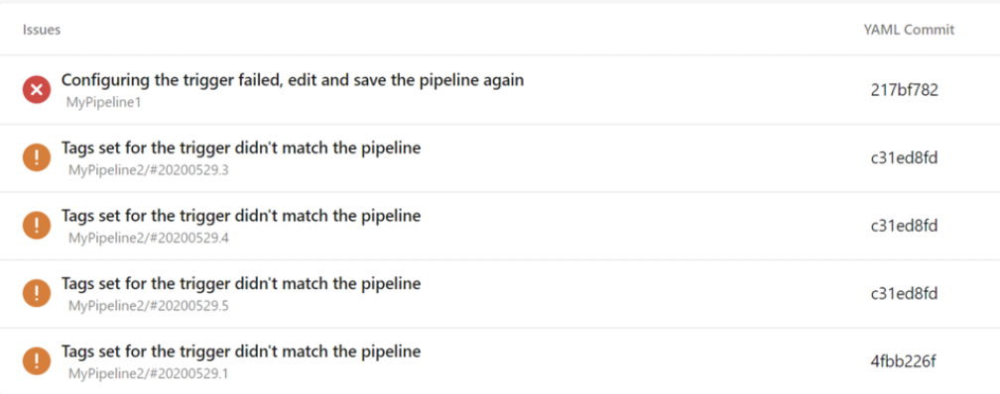

### Exclusive deployment lock policy

With this update, you can ensure that only a single run deploys to an environment at a time. By choosing the "Exclusive lock" check on an environment, only one run will proceed. Future runs which want to deploy to that environment will be paused. Once the run with the exclusive lock completes, the latest run will proceed. Any intermediate runs will be canceled.


### Stages filters for pipeline resource triggers

In this sprint, we added support for 'stages' as a filter for pipeline resources in YAML. With this filter, you don't need to wait for the entire CI pipeline to be completed to trigger your CD pipeline. You can now choose to trigger your CD pipeline upon completion of a specific stage in your CI pipeline.

```yml
resources:
  pipelines:
  - pipeline: MyCIAlias  
    project: Fabrikam  
    source: Farbrikam-CI  
    trigger:    
      stages:            ### This stage filter is used when evaluating conditions for triggering your CD pipeline
      - PreProduction    ### stages are AND'ed. On successful completion of all the stages provided, your CD pipeline will be triggered. 
      - Production
```

When the stage(s) have completed successfully for the provided filter in your CI pipeline, a new run will be automatically created for your CD pipeline.


### Generic webhook based triggers for YAML pipelines

Today, we have various resources (such as pipelines, containers, builds, and packages) through which you can consume artifacts and enable automated triggers. These are first-class resources, and if you need to automate your deployment process based on any generic external event, they cannot be used. We have introduced webhook triggers support in YAML Pipelines to help integrate pipelines with any external service and automate the entire workflow.

You can subscribe to any external events through its webhooks (Github, Github Enterprise, Nexus, Aritfactory, etc.) and trigger your pipelines. You can also configure additional filter conditions on triggers based on the JSON data received from the webhook. The entire JSON data is available to you in the form of variables that can be consumed in your jobs.

Here are the steps to configure the webhook triggers:

1. Setup a webhook on your external service. When creating your webhook, you need to provide the following info:
    - Request Url - "https://dev.azure.com/<ADO Organization>/_apis/public/distributedtask/webhooks/<**WebHook Name**>?api-version=6.0-preview"
    - Secret - This is optional. If you need to secure your JSON payload, provide the **Secret** value
    - Event - The event on which to send the notification
2. Create a new "Incoming Webhook" service connection. This is a newly introduced Service Connection Type that will allow you to define three important pieces of information:
    - **Webhook Name**: The name of the webhook should match webhook created in your external service.
    - **HTTP Header** - The name of the HTTP header in the request that contains the payload hash value for request verification. For example, in the case of the GitHub, the request header will be "**X-Hub-Signature**"
    - **Secret** - The shared secret is used to parse the payload hash used for verification of the incoming request (this is optional). If you have used a secret in creating your webhook, you will need to provide the same secret key


3. A new resource type called `webhooks` is introduced in YAML pipelines. For subscribing to a webhook event, you need to define a webhook resource in your pipeline and point it to the Incoming webhook service connection. Whenever a webhook event is received by the Incoming Webhook service connection, a new run will be triggered for all the pipelines subcribed to the webhook. You can also define additional filters on the webhook resource based on the JSON payload data to further customize the triggers for each pipeline. You can also consume the payload data in the form of variables in your jobs

```yml
trigger: none

resources:
  webhooks:
    - webhook: MyWebhookTrigger          ### Webhook alias
      connection: MyWebhookConnection
      filters:
        - path: repositoryName      ### JSON path in the payload
          value: maven-releases     ### Expected value in the path provided
        - path: action
          value: CREATED

steps:
- task: PowerShell@2
  inputs:
    targetType: 'inline'
    script: |
      Write-Host ${{ parameters.MyWebhookTrigger.repositoryName}} ### JSON payload data is available in the form of ${{ parameters.<WebhookAlias>.<JSONPath>}}
      Write-Host ${{ parameters.MyWebhookTrigger.component.group}}
      Write-Host ${{ parameters.MyWebhookTrigger.component.name}}
      Write-Host ${{ parameters.MyWebhookTrigger.component.version}}
```

4. A new resource type called webhooks is introduced in YAML pipelines. To subscribe to a webhook event, you need to define a webhook resource in your pipeline and point it to the  Incoming Webhook service connection. Whenever a webhook event is received by the Incoming Webhook service connection, a new run will be triggered for all the pipelines subscribed to the webhook event. You can also define additional filters on the webhook resource based on the JSON payload data to further customize the triggers for each pipeline, and you can use that payload data in the form of variables in your jobs.

Webhook triggers are a great way to automate the workflows when you need to integrate with any external services apart from the first-class resources (Jenkins, ACR, and GitHub) we already support.

### YAML resource trigger issues support and traceability

In this Sprint, we have added support for showing info about the resource triggers when it fails to execute. There is a new menu item in the pipeline definition page called 'Trigger issues' where this info is recorded for the customer to track.

Resource triggers can fail to execute for two reasons.

1. Invalid configuration: If the source of the service connection provided is not valid. Or if there are any syntax errors, triggers will not be configured, so we show these as errors. 
2. Trigger conditions did not match: For any resource trigger defined in your YAML pipeline, if the filter conditions didn't match the event received, no action is taken. This info is logged as part for trigger issues along with the event details (CI run in case of pipeline resource) and YAML of the CD pipeline used for evaluation.


