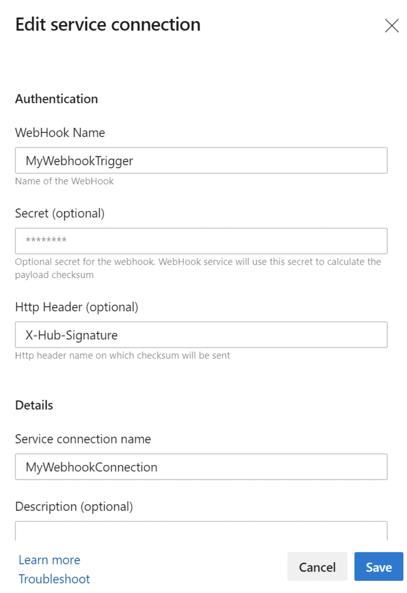

### Exclusive deployment lock policy

With this update, you can ensure that only a single run deploys to an environment at a time. By choosing the &quot;Exclusive lock&quot; check on an environment, only one run will proceed. Future runs which want to deploy to that environment will be paused. Once the run with the exclusive lock completes, the latest run will proceed. Any intermediate runs will be canceled.


### Stages filters for pipeline resource triggers

In this sprint, we added support for 'stages' as a filter for pipeline resources in YAML. With this filter, you need not wait for entire CI pipeline to be completed to trigger you CD pipeline. You can now choose to trigger your CD pipeline upon completion of a specific stage in your CI pipeline.
```yml
resources:
  pipelines:
  - pipeline: MyCIAlias  
    project: Fabrikam  
    source: Farbrikam-CI  
    trigger:    
      stages:            ### This stage filter is used when evaluating conditions for triggering your CD pipeline
      - PreProduction    ### stages are AND'ed. Upon successful completion of the stages provided, your CD pipeline will be triggered. 
      - Production
```
Upon successful completion of the stage(s) provided in the filter, a new run will be automatically created for your CD pipeline.


### Generic webhook based triggers for YAML pipelines

Today, we have various resources (like pipelines, containers, builds and packages) through which you can consume artifacts and enable automated triggers. These are first class resources and if you need to automate your deployment process based on any generic external event, they cannot be used. To extend the support to integrate pipelines with any external service and automate the entire workflow, we have introduced WebHook triggers support in YAML pipelines.

You can subscribe to any external events through its webhooks (Github, Github Enterprise, Nexus, Aritfactory etc.) and trigger your pipelines. You can also configure additional filters conditions on triggers based on the JSON data received from webhook. And the entire JSON data is available to you in the form of variables that can be consumed in your jobs.

Here are the steps to configure webhook triggers:

Event Type - Select either Asset or Component its also possible to select both. For sake of this scenario select only component events.

1. Setup a webhook on your external service. While you create your webhook, you need to provide following info:
    - Request Url - "https://dev.azure.com/<ADO Organization>/_apis/public/distributedtask/webhooks/<**WebHook Name**>?api-version=6.0-preview"
    - Secret - This is optional. If you need to secure your JSON payload, provide the **Secret** value. 
    - Event - The event on which to send the notification.
2. Create a new "Incoming Webhook" service connection, this is a new Service Connection Type which is introduced which allows you to define three important pieces of information.
    - **Webhook Name**: The name of the webhook should match webhook created in your external service.
    - **HTTP Header** - the name of the HTTP Header in the request which contains the payload hash value for request verification. In the case of the GitHub webhook request the header will be "**X-Hub-Signature**".
    - **Secret** - The shared secret which is used to compute the payload hash used for verification of the incoming request. This is optional. If you have used a secret in creating your webhook, you need to provide the same secret key.


3. Setup your Pipeline -  Now you can subscribe to the webhook as part of your YAML pipeline we a new resource type call webhooks. A pipeline run will be triggered each time Azure DevOps receives a request for the incoming webhook endpoint.  You can also filtering the incoming Web Hook requests based on the JSON payload data. You can also consume the payload data in the form of variables in your jobs.

```yml
trigger: none

resources:
  webhooks:
    - webhook: MyWebhookTrigger
      connection: MyWebhookConnection
      filters:
        - path: repositoryName      ### JSON path in the payload
          value: maven-releases     ### Expected value in the path provided
        - path: action
          value: CREATED

steps:
- task: PowerShell@2
  inputs:
    targetType: 'inline'
    script: |
      Write-Host ${{ parameters.MyWebhookTrigger.repositoryName}}
      Write-Host ${{ parameters.MyWebhookTrigger.component.group}}
      Write-Host ${{ parameters.MyWebhookTrigger.component.name}}
      Write-Host ${{ parameters.MyWebhookTrigger.component.version}}
```

4. A new pipeline run is triggered whenever a webhook notification is received and it meets the conditions defined in your YAML pipeline. Multiple pipelines in your project can subscribe to one Webhook and have different filter conditions. Also if you want to use the same webhook across the projects, you can share the Incoming Webhook service connection across projects and subscribe to the shared connection in each project.

Webhooks is a catch all for integrating with any external service. Also, in cases where you have on-premise services to which Azure DevOps does not have line of sight, webhook triggers would be a great way to automate the workflow.

### YAML resource trigger issues support and traceability

In this Sprint, we have added support for showing info about the resource triggers that failed to execute.
There is a new menu item in the pipeline definition page 'Trigger issues' where this info is recorded for customer to track.

Resource triggers can fail to execute for two reasons.

1. Invalid configuration: If the source or the service connection provided is not valid or if there are any syntax errors, triggers will not be configured. We show these as errors. 
2. Filter conditions did not match: Based on the filters set on triggers, some of the CI runs that don't match the condition will not trigger the CD run. We show the exact CI run and the CD YAML commit on which the condition is evaluate.


