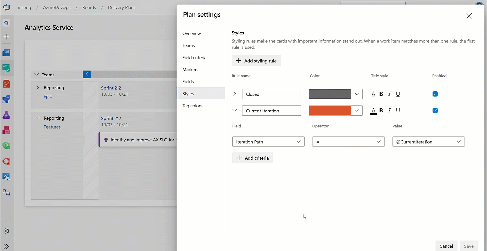

### Edit work item link types

Changing a work item link requires at least three steps to complete. For example, to change a parent link to a related link, you need to copy the work item id, remove the parent link, add a new existing link of type related, and finally paste the copied id and save. It is a cumbersome process.

We solved the problem by allowing you to edit and change the link type directly.  You can quickly change the link type in just one step.

> [!div class="mx-imgBorder"]
> 

### Create temporary query REST endpoint

We have seen several instances of extension authors attempting to run unsaved queries by passing the wiql statement through the querystring. This works fine unless you hve a large wiql statement that reaches the browser limits on querystring length. To solve this, we have created a new REST endpoint to allow tool authors to generate a temporary query. Using the id from the response to pass via querystring eliminates this problem.

Learn more at the [temp queries REST API documentation page](https://learn.microsoft.com/rest/api/azure/devops/wit/temp-queries/create?view=azure-devops-rest-7.1).

### Batch delete API (Private Preview)

Currently, the only way to remove work items from the recycle bin is using this [REST API](https://learn.microsoft.com/rest/api/azure/devops/wit/work-items/delete?view=azure-devops-rest-6.0&tabs=HTTP&viewFallbackFrom=azure-devops-rest-7.0) to delete one at time. This can be a slow process and is subject to rate limiting when trying to do any kind of mass clean up. In response, we have added a new REST API endpoint to delete and/or destroy work items in batch.

If you are interested in participating in a private preview of this new endpoint, please [email us directly](mailto:dahellem@microsoft.com).

### @CurrentIteration macro in Delivery Plans

Adding support for the @CurrentIteration macro for styles in Delivery Plans. This macro will get the current iteration from the team context of each row in your plan.

> [!div class="mx-imgBorder"]
> 