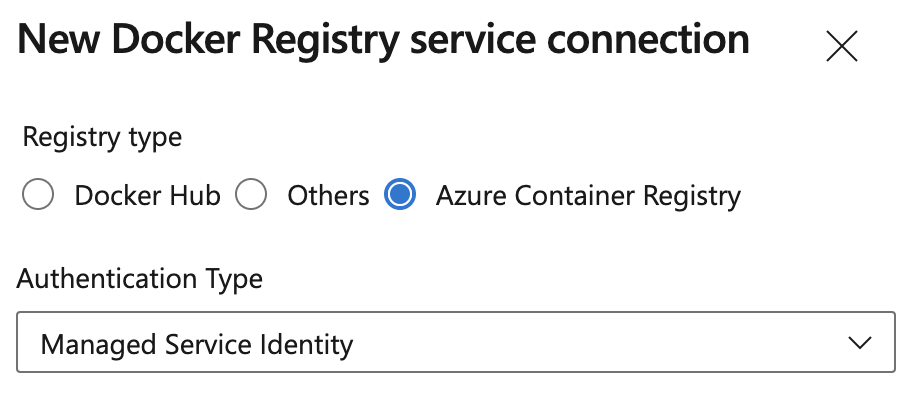
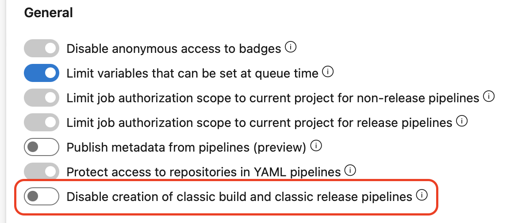
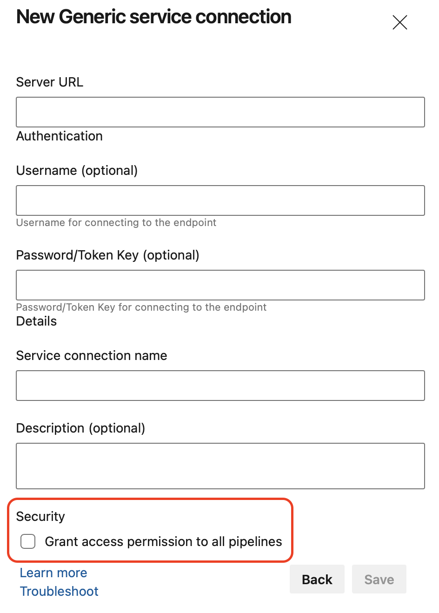

### Container Registry service connections can now use Azure Managed Identities

You can use a System-assigned Managed Identity when creating Docker Registry service connections for Azure Container Registry. This allows you to access Azure Container Registry using a Managed Identity associated with a self-hosted Azure Pipelines agent, eliminating the need to manage credentials.

> [!div class="mx-imgBorder"]
> 

> [!NOTE]
> The Managed Identity used to access Azure Container Registry will need the appropriate Azure Role Based Access Control (RBAC) assignment, e.g. AcrPull or AcrPush role.

### Audit log events related to pipeline permissions

When you restrict pipeline permissions of a protected resource, such as a service connection, the associated Audit Event Log now correctly states that the resource was *successfully _unauthorized_* for its project.

> [!div class="mx-imgBorder"]
> 

### Ensure your organization only uses YAML pipelines

Azure DevOps now lets you ensure your organization only uses YAML pipelines, by disabling the creation of classic build pipelines, classic release pipelines, task groups, and deployment groups. Your existing classic pipelines will continue to run, and you'll be able to edit them, but you won't be able to create new ones.

You can disable creation of classic pipelines at the organization level or project-level, by turning on the corresponding toggles. The toggles can be found in **Project / Organization Settings -> Pipelines -> Settings**. 

> [!div class="mx-imgBorder"]
> 

The toggles state is off by default, and you will need admin rights to change the state. If the toggle is on at the organization-level, the disabling is enforced for all projects. Otherwise, each project is free to choose whether to enforce or not the disablement.

When disabling the creation of classic pipelines is enforced, REST APIs related to creating classic pipelines, task groups, and deployment groups will fail. REST APIs that create YAML pipelines will work.

Disabling creation of classic pipelines is opt-in for existing organizations. For new organizations, it is opt-in for the time being.

### New PAT scope required to update pipeline General Settings 
Invoking the [General Settings - Update](/rest/api/azure/devops/build/general-settings/update) REST API now requires a PAT with scope **Project and Team -> Read & Write**. 

> [!div class="mx-imgBorder"]
> 

### Fine-grained access management for agent pools

Agent pools allow you to specify and manage the machines on which your pipelines run. 

Previously, if you used a custom agent pool, managing which pipelines can access it was coarse-grained. You could allow all pipelines to use it, or you could require each pipeline ask for permission. Unfortunately, once you granted a pipeline access permission to an agent pool, you could not revoke it using the pipelines UI.

Azure Pipelines now provides a fine-grained access management for agent pools. The experience is similar to the one for managing pipeline permissions for Service Connections.

> [!div class="mx-imgBorder"]
> 

### Prevent granting all pipelines access to protected resources

When you create a protected resource such as a service connection or an environment, you have the option to select the **Grant access permission to all pipelines** checkbox. Until now, this option was checked by default. 

While this makes it easier for pipelines to use new protected resources, the reverse is that it favors accidentally granting too many pipelines the right to access the resource.

To promote a secure-by-default choice, Azure DevOps now leaves the checkbox unticked.

> [!div class="mx-imgBorder"]
> 

### Improved security when building pull requests from forked GitHub repositories

You can use Azure DevOps to build and test your public GitHub repository. Having a public GitHub repository lets you  collaborate with developers across the world, but comes with [security concerns related to building pull requests (PRs) from forked repos](/azure/devops/pipelines/security/repos?view=azure-devops#forks&preserve-view=true).

To prevent PRs from forked GitHub repositories from making undesired changes to your repositories, Azure DevOps now limits the GitHub access token to have read-only scope.

### Macos-latest label will point to macos-12 image

The macos-12 Monterey image is ready to be the default version for the “macos-latest" label in Azure Pipelines Microsoft-hosted agents. Until now, this label pointed to macos-11 Big Sur agents. 

For a full list of differences between macos-12 and macos-11, visit the [GitHub issue](https://github.com/actions/runner-images/issues/6384). For a full list of software installed on the image, check [here](https://github.com/actions/runner-images/blob/main/images/macos/macos-12-Readme.md).

### Ubuntu-latest label will point to ubuntu-22.04 image

The ubuntu-22.04 image is ready to be the default version for the **ubuntu-latest** label in Azure Pipelines Microsoft-hosted agents. Until now, this label pointed to ubuntu-20.04 agents. 

For a full list of differences between ubuntu-22.04 and ubuntu-20.04, visit the [GitHub issue](https://github.com/actions/runner-images/issues/6399). For a full list of software installed on the image, check [here](https://github.com/actions/runner-images/blob/main/images/ubuntu/Ubuntu2204-Readme.md).
