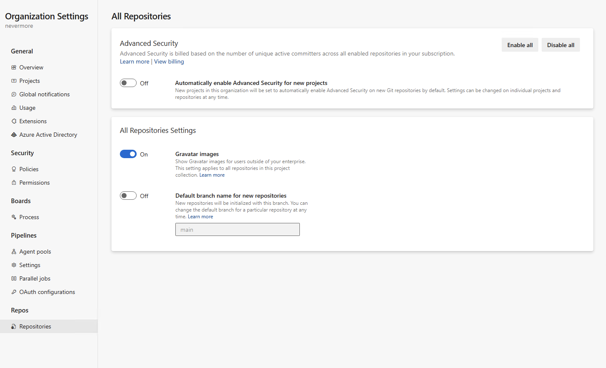
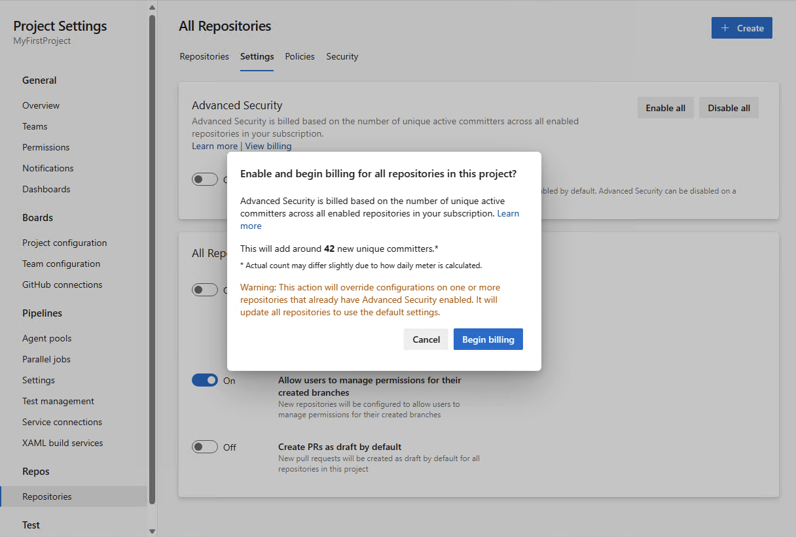

### Project and organization-level enablement for Advanced Security 

You can now enable or disable **Advanced Security** for your entire project or organization. In conjunction with the new addition of displaying committer count prior to enablement, selecting to **"enable all"** at the project or organization-level will also provide you with an estimate of how many new active committers you may be billed for. You can also opt to automatically enable **Advanced Security** for any newly created repositories or projects under your respective project or organization. Any repositories enabled through this setting will have secret repository scanning and push protection active. Through selecting to enable **Advanced Security** for newly created repositories and projects, they will start with push protection enabled by default. 

**Project-level enablement:**

> [!div class="mx-imgBorder"]
> 

**Organization-level enablement:**

> [!div class="mx-imgBorder"]
> 

### Estimated committer count during Advanced Security enablement 

As a part of your Advanced Security onboarding experience, you can now see an estimate of how many active committers may be added as a result of enabling **Advanced Security** for a particular repository, project, or organization. This count is an approximation and you may see slight discrepancies between the provided estimate and what is reported for billing after enablement. This estimate can also be obtained via API with additional documentation for this coming soon. 

> [!div class="mx-imgBorder"]
> 

### Granular Azure DevOps delegated scopes for Microsoft Identity/Azure AD OAuth apps

We have added new Azure DevOps scopes for delegated OAuth apps on the Microsoft Identity platform, also colloquially known as Azure Active Directory OAuth apps. These new scopes will enable app developers to announce specifically which permissions they are hoping to request from the user in order to perform app duties. Learn more about this new release in our [blog post](link to come).