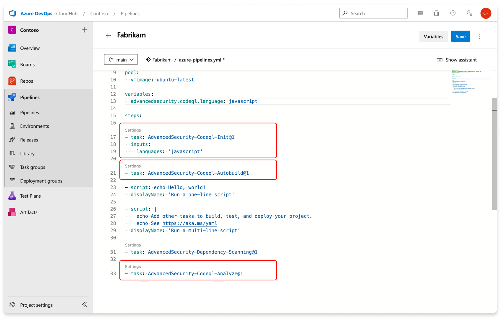

### Managed identity and service principal support for Azure DevOps now in general availability (GA)

Support for Azure Active Directory managed identities and service principals in Azure DevOps has now reached general availability (GA). 

Today, many application integration scenarios rely on Personal Access Tokens (PATs) to integrate with Azure DevOps. While simple to use, PATs can easily be leaked, potentially enabling malicious actors to authenticate as powerful users. To prevent unwanted access, PATs often also require time-consuming maintenance through regular credential rotations.

You can now enable applications to instead use Managed Identities and Service Principals to integrate with Azure DevOps through REST APIs and client libraries. This highly requested feature offers Azure DevOps customers a more secure alternative to PATs. Managed Identities offer the ability for applications running on Azure resources to obtain Azure AD tokens without needing to manage any credentials at all.

Managed Identities and Service Principals can be setup in Azure DevOps and given permissions to specific assets (projects, repos, pipelines), just like regular users. This allows applications that use Managed Identities or Service Principals to connect to Azure DevOps and perform actions on behalf of themselves, instead of on behalf of a user, as PAT do. Teams can now better manage their services collectively, instead of relying on any one individual to provide a token for authentication. Learn more about the GA release in our public [blog post announcement](https://devblogs.microsoft.com/devops/?p=67669) and our [feature documentation](/azure/devops/integrate/get-started/authentication/service-principal-managed-identity?view=azure-devops).

### New Azure DevOps scopes available for Microsoft Identity OAuth delegated flow apps 

We have added new [Azure DevOps scopes](/azure/devops/integrate/get-started/authentication/oauth?view=azure-devops#scopes) for delegated OAuth apps on the Microsoft Identity platform, also colloquially known as [Azure Active Directory OAuth apps](/azure/devops/integrate/get-started/authentication/oauth#azure-ad-oauth). These new scopes will enable app developers to announce specifically which permissions they are hoping to request from the user in order to perform app duties. This highly requested feature allows app developers to request from their users solely the permissions they need for their app.  

Previously, user_impersonation was the only scope available for app developers to choose from. This scope gives the app full access to all Azure DevOps APIs, which means it will be able to do anything that the user is able to do across all organizations that the user belongs to.
Now with more granular scopes available, you can rest easy that apps can only request and access solely those APIs that the requested scopes have granted them permission to access. 

Learn more about these new scopes in our [public blog post announcement](https://devblogs.microsoft.com/devops/?p=67699) and [feature documentation](/azure/devops/integrate/get-started/authentication/oauth?view=azure-devops).

### Changes to Code Scanning (CodeQL) user input task and variables

All user-provided inputs are now specified in the CodeQL Initialize task, which is responsible for configuring the CodeQL analysis environment used for code analysis with CodeQL `AdvancedSecurity-Codeql-Init@1``. See the [configure GitHub Advanced Security for Azure DevOps features documentation](/azure/devops/repos/security/configure-github-advanced-security-features?view=azure-devops&tabs=yaml) for more information on configuring GitHub Advanced Security for Azure DevOps. 

In addition, user inputs take precedence over any values set by variables. For instance, if you establish the language variable as `advancedsecurity.codeql.language: Java` and subsequently, during the CodeQL initialization phase, you specify the language as an input with `Language: cpp,` the input `cpp` will override the variable `Java` for the language. Please ensure that your inputs are configured accurately.

### Publish task is no longer required for Setting up code Scanning

Previously, when configuring code scanning, you were required to include the publish task (AdvancedSecurity-Publish@1) in either the YAML pipeline or classic pipeline. With this update, we've eliminated the need for the publish task, and the results are now directly posted to the advanced security service within the analyze task (AdvancedSecurity-Codeql-Analyze@1).

Below are the require task for code scanning. 

> [!div class="mx-imgBorder"]
> 

For more information, please refer to the set up code scanning [documentation](/azure/devops/repos/security/configure-github-advanced-security-features?view=azure-devops&tabs=yaml#set-up-code-scanning).

### CodeQL code scanning now supports Swift

We're expanding our support for CodeQL code scanning to include Swift! This means that developers working on Swift libraries and applications for Apple platforms can now take advantage of our top-notch code security analysis. Our current capabilities include the detection of issues such as path injection, risky web view fetches, various cryptographic misuses, and other forms of unsafe handling or processing of unfiltered user data.

Swift is now part of our roster of supported programming languages, which includes C/C++, Java/Kotlin, JavaScript/TypeScript, Python, Ruby, C#, and Go. Altogether, these languages enable us to perform nearly 400 comprehensive checks on your code, all while maintaining a low rate of false positives and ensuring high precision.

See the [configure GitHub Advanced Security for Azure DevOps features documentation](/azure/devops/repos/security/configure-github-advanced-security-features?view=azure-devops&tabs=yaml) for more information on configuring GitHub Advanced Security for Azure DevOps for your repositories.

