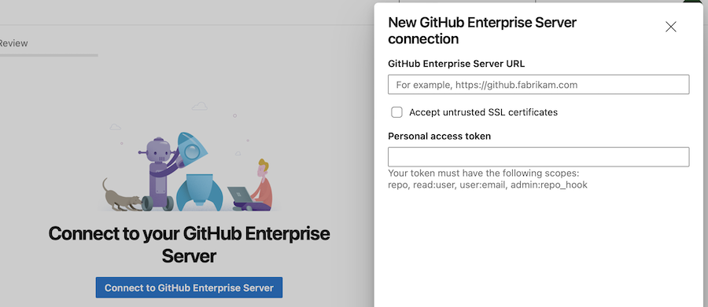

### Node runner download task

Customers that are adopting [agent releases that exclude the Node 6 task runner](https://github.com/microsoft/azure-pipelines-agent/blob/master/docs/node6.md) may have an occasional need to run tasks that have not been updated to use a newer Node runner. For those customers we provide a method to still use tasks dependent on Node End-of-Life runners, see Node runner guidance [blog post](https://devblogs.microsoft.com/devops/node-runner-update-guidance-for-azure-pipelines-task-authors/#upcoming-changes).

The below task is a method to install the Node 6 runner just-in-time, so an old task can still execute:


```yaml
  steps:
  - task: NodeTaskRunnerInstaller@0
    inputs:
      runnerVersion: 6
```
### TFX validates whether a task is using an EOL Node runner
Task authors use [TFX](https://learn.microsoft.com/azure/devops/extend/publish/command-line?view=azure-devops&preserve-view=true ) to publish extensions. TFX has been updated to perform validations on Node runner versions, see Node runner guidance [blog post](https://aka.ms/node-runner-guidance).

Extensions that contain tasks using the Node 6 runner will see this warning:

```
Task <TaskName> is dependent on a task runner that is end-of-life and will be removed in the future. Authors should review Node upgrade guidance: https://aka.ms/node-runner-guidance.
```


### Service Hook for Job State Change

Service Hooks allow you to react in response to events related to state changes in your pipeline. Up until now, you could configure service hooks for pipeline run and stage state changes. 

Starting now, you can configure service hooks that fire when the state of a job in your pipeline changes. The payload structure of the new service hook is similar to the following example.

```json
{
    "subscriptionId": "8d91ad83-1db5-4d43-8c5a-9bb2239644b1",
    "notificationId": 29,
    "id": "fcad4962-f3a6-4fbf-9653-2058c304503f",
    "eventType": "ms.vss-pipelines.job-state-changed-event",
    "publisherId": "pipelines",
    "message":
    {
        "text": "Run 20221121.5 stage Build job Compile succeeded.",
        "html": "Run 20221121.5 stage Build job <a href=\"https://dev.azure.com/fabrikamfiber/fabrikamfiber-viva/_build/results?buildId=2710088\">Compile</a> succeeded.",
        "markdown": "Run 20221121.5 stage Build job [Compile](https://dev.azure.com/fabrikamfiber/fabrikamfiber-viva/_build/results?buildId=2710088) succeeded."
    },
    "detailedMessage":
    {
        "text": "Run 20221121.5 stage Build job Compile succeeded.",
        "html": "Run 20221121.5 stage Build job <a href=\"https://dev.azure.com/fabrikamfiber/fabrikamfiber-viva/_build/results?buildId=2710088\">Compile</a> succeeded.",
        "markdown": "Run 20221121.5 stage Build job [Compile](https://dev.azure.com/fabrikamfiber/fabrikamfiber-viva/_build/results?buildId=2710088) succeeded."
    },
    "resource":
    {
        "job":
        {
            "_links":
            {
                "web":
                {
                    "href": "https://dev.azure.com/fabrikamfiber/fabrikamfiber-viva/_build/results?buildId=2710088"
                },
                "pipeline.web":
                {
                    "href": "https://dev.azure.com/fabrikamfiber/fabrikamfiber-viva/_build/definition?definitionId=4647"
                }
            },
            "id": "e87e3d16-29b0-5003-7d86-82b704b96244",
            "name": "Compile",
            "state": "completed",
            "result": "succeeded",
            "startTime": "2022-11-21T16:10:28.49Z",
            "finishTime": "2022-11-21T16:10:53.66Z"
        },
        "stage": { ... },
        "run": { ... },
        "pipeline": { ... },
        "repositories": [ ... ]
    },
    "resourceVersion": "5.1-preview.1",
    "createdDate": "2022-11-21T16:11:02.9207334Z"
}
```
Run, stage, and job state change service hook events now contain a `repository` property that shows source Azure Repos code version information associated to the pipeline run. For example,

```json
"repositories":
[
    {
        "type": "Git",
        "change":
        {
            "author":
            {
                "name": "Fabrikam John",
                "email": "john@fabrikamfiber.com",
                "date": "2022-11-11T15:09:21Z"
            },
            "committer":
            {
                "name": "Fabrikam John",
                "email": "john@fabrikamfiber.com",
                "date": "2022-11-11T15:09:21Z"
            },
            "message": "Added Viva support"
        },
        "url": "https://fabrikamfiber@dev.azure.com/fabrikamfiber/fabrikamfiber-viva/_git/fabrikamfiber"
    }
]
```
### Improved security when creating GitHub Enterprise Server-hosted Pipelines

When you create your first GitHub Enterprise Server (GHES) hosted pipeline, you may have to create a GHES service connection.

Previously, you had only one option for the authentication mechanism: to use a Personal access token. This promotes creating less secure service connections.

> [!div class="mx-imgBorder"]
> 


Starting with this sprint, we've made OAuth2 the default authentication mechanism when creating a GHES service connection, be it during pipeline creation or when adding a service connection.

> [!div class="mx-imgBorder"]
> 