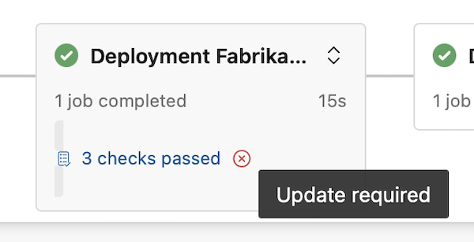

### Invoke Azure Function & REST API Checks - Phase 2 Rollout

As mentioned in [our blogpost](https://devblogs.microsoft.com/devops/updates-to-approvals-and-checks/#phase-2), this sprint we are starting Phase 2 of the rollout of scalable checks.

In Phase 2:
* You can only create compliant Invoke Azure Function / REST API checks
* When you edit a check, you can save changes only if its settings are compliant
* Azure DevOps shows more prominent warnings for non-compliant checks encouraging you to update their settings

In addition to the warnings in Phase 1, we show warnings in a pipeline run’s detail page.

We show warnings in the Stages card. For example, this is how it looks for a stage named Deployment FabrikamFiber Feed WUS1 that accessed resources protected by non-compliant checks.

> [!div class="mx-imgBorder"]
> 

If you open the Approvals and checks side panel, we show warnings next to the non-compliant check.

> [!div class="mx-imgBorder"]
> 

### Centralized control for building PRs from forked GitHub repos

If you build public repositories from GitHub, you must consider your stance on fork builds. Forks are especially dangerous since they come from outside your organization. 

You can improve the security of pipelines that build GitHub public repositories by following our recommendations [here](/azure/devops/pipelines/repos/github?view=azure-devops&tabs=yaml#important-security-considerations&preserve-view=true ) and [here](/azure/devops/pipelines/security/repos?view=azure-devops#forks&preserve-view=true ). Alas, when you have multiple pipelines, it's tedious to ensure all of them follow best practices. 

To help you more easily keep your pipelines safe, we added an organization-level control for defining how pipelines build PRs from forked GitHub repos. The new setting is named _Limit building pull requests from forked GitHub repositories_ and works at organization and project level.

The organization-level setting restricts the settings projects can have, and the project-level setting restricts the settings pipelines can have. Let's look at how the toggle works at organization level. The new control is off by default, so no settings are universally enforced.

[screenshot]

When you turn on the toggle, you can choose to disable building PRs from forked GitHub repos. This means, no pipeline will run when such a PR is created.

[screenshot]

When you choose the _Securely build pull requests from forked repositories_ option, all pipelines, organization-wide, *cannot* make secrets available to builds of PRs from forked repositories, *cannot* make these builds have the same permissions as normal builds, and *must* be triggered by a PR comment. Projects can still decide to *not* allow pipelines to build such PRs.

[screenshot]

When you choose the _Configure..._ option, you can define how to restrict pipeline settings. For example, you can ensure that all pipelines require a comment in order to build a PR from a forked GitHub repo, when the PR belongs to non-team members and non-contributors. But, you can choose to allow them to make secrets available to such builds. Projects can decide to *not* allow pipelines to build such PRs, or to build them securely, or have even more restrictive settings that what is specified at the organization level.

[screenshot]

### No classic build pipelines for new organizations

To improve the security of newly-created organizations, one can create only YAML pipelines, by default. This is because such organisations have the _Disable creation of classic build pipelines_ and _Disable creation of classic release pipelines_ toggles on upon creation. 

Existing projects and organizations aren't affected.

### TBD