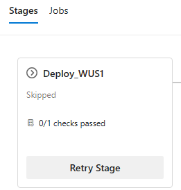
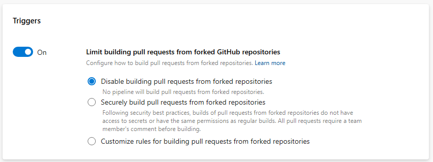
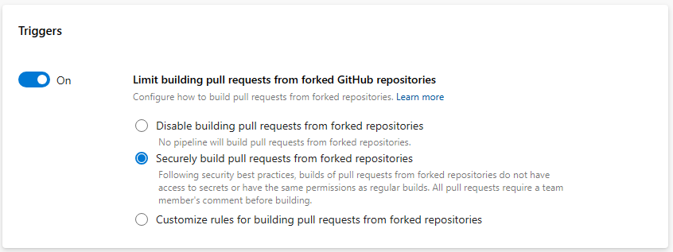
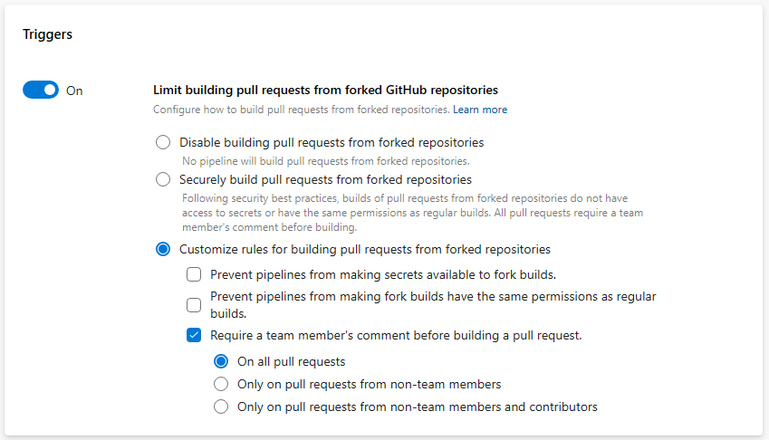

### Retry a stage when Approvals and Checks time out

When Approvals & Checks time out, the stage they belong to is skipped. Stages that have a dependency on the skipped stage are also skipped. 

Now you can retry a stage when Approvals and Checks time-out. Previously, this was possible only when an approval timed out. 

> [!div class="mx-imgBorder"]
> 

### Administrator Role for all Environments

[Environments](/azure/devops/pipelines/process/environments) in YAML pipelines represent a compute resource to which you deploy your application, for example an AKS cluster or a set of VMs. They provide you with security controls and traceability for your deployments.

Managing environments can be quite challenging. This is because, when an environment is created, the person creating it automatically becomes the sole administrator. For example, if you wanted to manange the Approvals & Checks of all environments in a centralized fashion, you had to ask every environment administrator to add a specific user or group as administrator, and then use REST API to configure the checks. This approach is tedious, error-prone, and doesn't scale when new environments are added. 
 
With this sprint, we introduce an [Administrator role](/azure/devops/pipelines/policies/permissions#set-environment-permissions) at the environments-hub level. This brings environments up to par with service connections or agent pools. To assign the Administrator role to a user or group, you need to already be an environments-hub administrator or organization-owner. 

> [!div class="mx-imgBorder"]
> 

A user with this Administrator role can administer permissions, manage, view and use any environment. This includes opening up environments to all pipelines.

When you grant a user Administrator role at environments-hub level, they become administrators all existing environments and for any future environments.

### Centralized control for building PRs from forked GitHub repos

If you build public repositories from GitHub, you must consider your stance on fork builds. Forks are especially dangerous since they come from outside your organization. 

You can improve the security of pipelines that build GitHub public repositories by reviewing our recommendations on how to [Build GitHub repositories](/azure/devops/pipelines/repos/github?view=azure-devops&tabs=yaml#important-security-considerations&preserve-view=true) and [Repository protection](/azure/devops/pipelines/security/repos?view=azure-devops#forks&preserve-view=true). Unfortunately, managing numerous pipelines and ensuring their adherence to best practices can require a substantial amount of effort. 

To enhance the security of your pipelines, we added an organization-level control for defining how pipelines build PRs from forked GitHub repos. The new setting is named _Limit building pull requests from forked GitHub repositories_ and works at organization and project level.

The organization-level setting restricts the settings projects can have, and the project-level setting restricts the settings pipelines can have. 

Let's look at how the toggle works at organization level. The new control is off by default, so no settings are universally enforced.

> [!div class="mx-imgBorder"]
> 

When you turn on the toggle, you can choose to disable building PRs from forked GitHub repos. This means, no pipeline will run when such a PR is created.

> [!div class="mx-imgBorder"]
> 

When you choose the _Securely build pull requests from forked repositories_ option, all pipelines, organization-wide, *cannot* make secrets available to builds of PRs from forked repositories, *cannot* make these builds have the same permissions as normal builds, and *must* be triggered by a PR comment. Projects can still decide to *not* allow pipelines to build such PRs.

> [!div class="mx-imgBorder"]
> 

When you choose the _Customize_ option, you can define how to restrict pipeline settings. For example, you can ensure that all pipelines require a comment in order to build a PR from a forked GitHub repo, when the PR belongs to non-team members and non-contributors. But, you can choose to allow them to make secrets available to such builds. Projects can decide to *not* allow pipelines to build such PRs, or to build them securely, or have even more restrictive settings that what is specified at the organization level.

> [!div class="mx-imgBorder"]
> 
