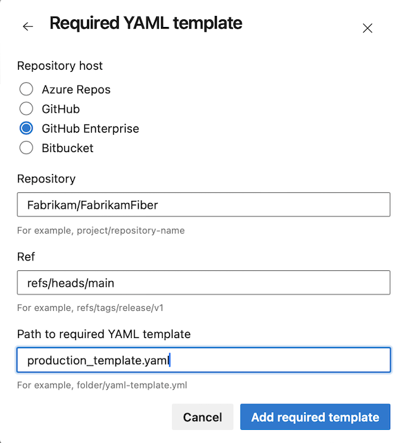

### Azure Pipelines tasks use Node 16

Pipeline tasks use a runner to execute. Most Pipeline tasks use Node as a runner. Azure Pipelines task that use NodeJS as a runner now all use Node 16. As Node 16 is the first runner to support Apple silicon, this also provides full task support for macOS on Apple silicon.

As the Node 16 end-of-life date has been [moved forward](https://nodejs.org/en/blog/announcements/nodejs16-eol), we are currently adding the ability to run tasks with Node 20.

### Pipeline tasks that have been deprecated will start showing warning messages

Azure Pipelines has a number of tasks that have been deprecated. Deprecated tasks will be retired early 2024. To help customers identify pipelines that are using deprecated tasks, pipeline will show warnings if such a task is used. We have also updated the [Task Reference](/azure/devops/pipelines/tasks/reference/?view=azure-pipelines&preserve-view=true) to more clearly convey deprecation status and retirement date. The Task reference also includes alternatives (e.g. a newer major version) to the task.

The following tasks have been deprecated for a number of years and will emit warnings:  
`AppCenterDistributeV1`, `AppCenterDistributeV2`, `AzureMonitorV0`, `ChefKnifeV1`, `ChefV1`, `CondaEnvironmentV1`, `DeployVisualStudioTestAgentV2`, `DotNetCoreInstallerV1`, `DownloadPackageV0`, `DownloadPipelineArtifactV0`, `DownloadPipelineArtifactV1`, `IISWebAppDeployment`, `NuGetAuthenticateV0`, `NuGetInstallerV0`, `NuGetPackagerV0`,` NuGetPublisherV0`, `NuGetRestoreV1`, `NuGetV0`, `PublishPipelineArtifactV0`, `QuickPerfTestV1`, `RunJMeterLoadTestV1`, `RunLoadTestV1, SqlServerDacpacDeployment`,`XamarinTestCloudV1`.

Please update pipelines using any of the above tasks to use an alternative such as a newer task version.

### The AzureRmWebAppDeploymentV4 task supports Entra ID authentication

The AzureRmWebAppDeploymentV3 and AzureRmWebAppDeploymentV4 tasks have been updated to honor the [App Service setting for basic authentication](/azure/app-service/configure-basic-auth-disable?tabs=portal&preserve-view=true). If basic authentication has been disabled on the App Service, the AzureRmWebAppDeploymentV3/4 tasks will use Entra ID authentication to perform deployments to the App Service Kudu endpoint. This requires a recent version of msdeploy.exe installed on the agent, which is the case on the windows-2022/windows-latest [Hosted agents](/azure/devops/pipelines/agents/hosted?view=azure-devops&tabs=yaml#software&preserve-view=true).


### Improvements to Approvals REST API

We improved searching for approvals assigned to a user more by including in the results approvals assigned to groups the user belongs to.

Approvals now contain information about the pipeline run they belong to.

For example, the following GET REST API call `https://dev.azure.com/fabrikam/FabrikamFiber/_apis/pipelines/approvals?api-version=7.2-preview.2&top=1&assignedTo=john@fabrikam.com&state=pending` returns 

```json
{
    "count": 1,
    "value":
    [
        {
            "id": "7e90b9f7-f3f8-4548-a108-8b80c0fa80e7",
            "steps":
            [],
            "status": "pending",
            "createdOn": "2023-11-09T10:54:37.977Z",
            "lastModifiedOn": "2023-11-09T10:54:37.9775685Z",
            "executionOrder": "anyOrder",
            "minRequiredApprovers": 1,
            "blockedApprovers":
            [],
            "_links":
            {
                "self":
                {
                    "href": "https://dev.azure.com/fabrikam/26dcfaeb-d8fe-495c-91cb-fec4acb44fbb/_apis/pipelines/approvals/7e80b987-f3fe-4578-a108-8a80c0fb80e7"
                }
            },
            "pipeline":
            {
                "owner":
                {
                    "_links":
                    {
                        "web":
                        {
                            "href": "https://dev.azure.com/buildcanary/26dcfaeb-d8fe-495c-91cb-fec4acb44fbb/_build/results?buildId=73222930"
                        },
                        "self":
                        {
                            "href": "https://dev.azure.com/buildcanary/26dcfaeb-d8fe-495c-91cb-fec4acb44fbb/_apis/build/Builds/73222930"
                        }
                    },
                    "id": 73222930,
                    "name": "20231109.1"
                },
                "id": "4597",
                "name": "FabrikamFiber"
            }
        }
    ]
}
```


### Bypass Approvals and Checks

[Approvals and checks]() help protect access to important resources, such as service connections, repos, or agent pools. A common use case is to use Approvals and Checks when deploying to production, and you wish to protect the ARM Prod service connection. 

Say you added the following checks on the service connection: an Approval, a Business Hours check, and an Invoke Azure Function check (to enforce a delay between different regions).

Now, imagine you have to do a hotfix deployment. You start a pipeline run, but it doesn't proceed,it waits for most of the checks to complete. You cannot afford to wait for the approvals and checks to complete.

In this sprint we've added the possibility to bypass running approvals and checks, so you can completed your hotfix. 

You can bypass running Approvals, Business Hours, Invoke Azure Function, and Invoke REST API checks.

Bypass an Approval.
> [!div class="mx-imgBorder"]
> 

Bypass Business Hours check.
> [!div class="mx-imgBorder"]
> 

Bypass Invoke Azure Function check.
Bypass Business Hours check.
> [!div class="mx-imgBorder"]
> 

When a check is bypassed, you can see this in the checks panel.
> [!div class="mx-imgBorder"]
> 

You can bypass a check only if you're an Administrator of the resource on which the checks were defined.

### Support for GitHub Enterprise Server in Requited template check

[Templates](/azure/devops/pipelines/security/templates) are a security mechanism that enables you to control the stages, jobs, and steps of pipelines in your organization.

The [Require template check](/azure/devops/pipelines/process/approvals?view=azure-devops&tabs=check-pass#required-template&preserve-view=true) enables you to enforce that a pipeline extend from a set of approved templates before accessing a protected resource, such as an agent pool or service connection.

> [!div class="mx-imgBorder"]
> 

Starting with this sprint, you can specify templates located in GitHub Enterprise Server repos.


### Rerun Invoke Azure Function checks

Imagine you deploy your system in multiple stages. Before deploying the second stage, there's an Approval and an Invoke Azure Function check that runs a sanity check on the already-deployed part of the system. 

Say you come to review the Approval request and you notice the sanity check ran 2 days ago. Say you're aware there was another deployment that might have affected the result of the sanity check.

Starting with this sprint, you'll be able to rerun Invoke Azure Function and Invoke REST API check.

> [!div class="mx-imgBorder"]
> 