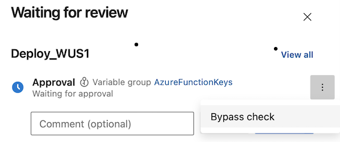
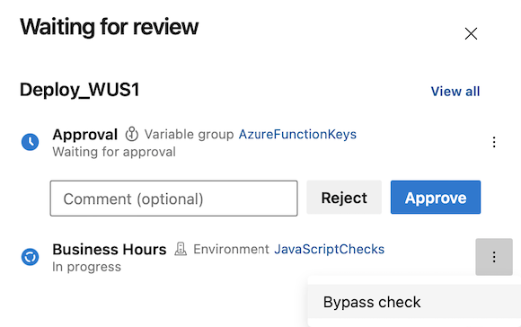
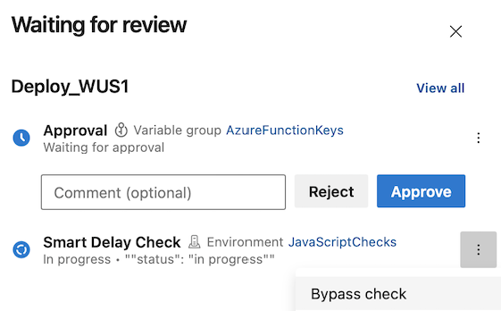
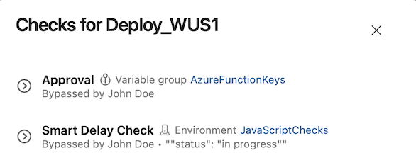

### Azure Pipelines tasks use Node 16

Pipeline tasks use a runner to execute, in most cases Node is used as the runner. Azure Pipelines tasks that use Node as a runner now all use Node 16. As Node 16 is the first Node version to natively support Apple silicon, this also completes full task support for macOS on Apple silicon. Agents running on Apple silicon do not need Rosetta to run.

As the Node 16 end-of-life date has been [moved forward](https://nodejs.org/en/blog/announcements/nodejs16-eol), we have started the work to run tasks with Node 20.

### Announcing retirement of deprecated tasks

Azure Pipelines has a number of tasks that have been deprecated. Deprecated tasks will be retired January 31st 2024. To help customers identify pipelines that are using deprecated tasks, pipelines will show warnings if such a task is used. We updated the [Task Reference](/azure/devops/pipelines/tasks/reference/?view=azure-pipelines&preserve-view=true) to clearly convey deprecation status and retirement date.

The following tasks have been deprecated and will start emitting warnings:  
* AppCenterDistributeV1, 
* AppCenterDistributeV2 
* AzureMonitorV0 
* ChefKnifeV1 
* ChefV1 
* CondaEnvironmentV1
* DeployVisualStudioTestAgentV2 
* DotNetCoreInstallerV1 
* IISWebAppDeployment 
* QuickPerfTestV1 
* RunJMeterLoadTestV1 
* RunLoadTestV1 
* SqlServerDacpacDeploymentV1 
* XamarinTestCloudV1

Please update your pipelines to use a newer task version or an alternative.

### AzureRmWebAppDeployment task supports Microsoft Entra ID authentication

The AzureRmWebAppDeploymentV3 and [AzureRmWebAppDeployment@4](/azure/devops/pipelines/tasks/reference/azure-rm-web-app-deployment-v4?view=azure-pipelines&preserve-view=true) tasks have been updated to support App Service with [basic authentication disabled](/azure/app-service/configure-basic-auth-disable?tabs=portal&preserve-view=true). If basic authentication is disabled on the App Service, the AzureRmWebAppDeploymentV3/4 tasks use Microsoft Entra ID authentication to perform deployments to the App Service Kudu endpoint. This requires a recent version of msdeploy.exe installed on the agent, which is the case on the windows-2022/windows-latest [Hosted agents](/azure/devops/pipelines/agents/hosted?view=azure-devops&tabs=yaml#software&preserve-view=true) (see [task reference](/azure/devops/pipelines/tasks/reference/azure-rm-web-app-deployment-v4?view=azure-pipelines#i-cant-web-deploy-to-my-azure-app-service-using-microsoft-entra-id-authentication-from-my-windows-agent&preserve-view=true)).


### Improvements to Approvals REST API

We improved locating approvals assigned to a user by including the groups the user belongs to in the search results.

Approvals now contain information about the pipeline run they belong to.


For example, the following GET REST API call `https://dev.azure.com/fabrikam/FabrikamFiber/_apis/pipelines/approvals?api-version=7.2-preview.2&top=1&assignedTo=john@fabrikam.com&state=pending` returns 

```json
{
    "count": 1,
    "value":
    [
        {
            "id": "7e90b9f7-f3f8-4548-a108-8b80c0fa80e7",
            "steps":
            [],
            "status": "pending",
            "createdOn": "2023-11-09T10:54:37.977Z",
            "lastModifiedOn": "2023-11-09T10:54:37.9775685Z",
            "executionOrder": "anyOrder",
            "minRequiredApprovers": 1,
            "blockedApprovers":
            [],
            "_links":
            {
                "self":
                {
                    "href": "https://dev.azure.com/fabrikam/26dcfaeb-d8fe-495c-91cb-fec4acb44fbb/_apis/pipelines/approvals/7e80b987-f3fe-4578-a108-8a80c0fb80e7"
                }
            },
            "pipeline":
            {
                "owner":
                {
                    "_links":
                    {
                        "web":
                        {
                            "href": "https://dev.azure.com/buildcanary/26dcfaeb-d8fe-495c-91cb-fec4acb44fbb/_build/results?buildId=73222930"
                        },
                        "self":
                        {
                            "href": "https://dev.azure.com/buildcanary/26dcfaeb-d8fe-495c-91cb-fec4acb44fbb/_apis/build/Builds/73222930"
                        }
                    },
                    "id": 73222930,
                    "name": "20231109.1"
                },
                "id": "4597",
                "name": "FabrikamFiber"
            }
        }
    ]
}
```


### Bypass Approvals and Checks

[Approvals and checks](/azure/devops/pipelines/process/approvals?view=azure-devops&tabs=check-pass&preserve-view=true ) help protect access to important resources, such as service connections, repos, or agent pools. A common use case is to use Approvals and Checks when deploying to production, and you wish to protect the ARM service connection. 

Say you added the following checks on the service connection: an Approval, a Business Hours check, and an Invoke Azure Function check (to enforce a delay between different regions).

Now, imagine you have to do a hotfix deployment. You start a pipeline run, but it doesn't proceed,it waits for most of the checks to complete. You cannot afford to wait for the approvals and checks to complete.

In this sprint we've made it possible to bypass running approvals and checks, so you can complete your hotfix. 

You can bypass running Approvals, Business Hours, Invoke Azure Function, and Invoke REST API checks.

Bypass an Approval.
> [!div class="mx-imgBorder"]
> 

Bypass Business Hours check.
> [!div class="mx-imgBorder"]
> 

Bypass Invoke Azure Function check.
Bypass Business Hours check.
> [!div class="mx-imgBorder"]
> 

When a check is bypassed, you can see it in the checks panel.
> [!div class="mx-imgBorder"]
> 

You can bypass a check only if you're an Administrator of the resource on which the checks were defined.

### Support for GitHub enterprise server in required template check

[Templates](/azure/devops/pipelines/security/templates) are a security mechanism that enables you to control the stages, jobs, and steps of pipelines in your organization.

The [Require template check](/azure/devops/pipelines/process/approvals?view=azure-devops&tabs=check-pass#required-template&preserve-view=true) enables you to enforce that a pipeline extends from a set of approved templates before accessing a protected resource, such as an agent pool or service connection.

Starting with this sprint, you can specify templates located in GitHub Enterprise Server repos.

> [!div class="mx-imgBorder"]
> 

### Rerun invoke Azure function checks

Imagine that you deploy your system in multiple stages. Before deploying the second stage, there's an Approval and an Invoke Azure Function check that runs a sanity check on the already-deployed part of the system. 

When reviewing the Approval request, you notice the sanity check ran two days earlier. In this scenario, you may be aware of another deployment that affected the result of the sanity check.

With this update, you can rerun Invoke Azure Function and Invoke REST API checks. This functionality is available only for checks that succeeded and have no retries.

> [!div class="mx-imgBorder"]
> 

> [!NOTE]
> You can rerun a check only if you are an Administrator of the resource on which the checks were defined.