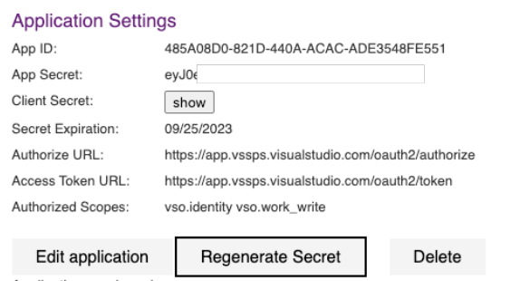

### Custom CodeQL Queries Now Supported in GitHub Advanced Security for Azure DevOps 

We are thrilled to announce the introduction of support for custom CodeQL queries in Code scanning! This empowers you to craft your own queries tailored to identify issues specific to your codebase. With this enhancement, you can create and publish packs containing custom queries, execute these queries in your pipelines, and thereby customize the detection of vulnerabilities that are pertinent to your organization.

For more details on utilizing custom queries for code scanning in GitHub Advanced Security for Azure DevOps, refer to [Code scanning alerts for GitHub Advanced Security for Azure DevOps](/azure/devops/repos/security/github-advanced-security-code-scanning?view=azure-devops&preserve-view=true)

We value your input. If you have any questions or feedback, we encourage you to engage with our community at [Developer Community](https://developercommunity.visualstudio.com/home). 

### Azure Devops OAuth self-service secret rotation

Every five years, it’s essential to updated the **Client Secret** for your Azure DevOps OAuth app, to ensure continuous generation of access and refresh tokens necessary for utilizing Azure DevOps APIs. As your **Client Secret** approaches expiration, you can now independently generate a new one, providing your team the freedom to manage it without relying on customer support. This flexibility in scheduling secret rotation minimizes potential outage time for your customers waiting for a replacement due to an expired secret. 

> [!div class="mx-imgBorder"]
> 

Look for this new functionality in each of your Azure DevOps app pages, which can be accessed through your [profile here](https://aex.dev.azure.com/me?mkt=en-US). Learn more about this new step in our [Azure DevOps OAuth guide](/azure/devops/integrate/get-started/authentication/azure-devops-oauth?view=azure-devops&preserve-view=true).