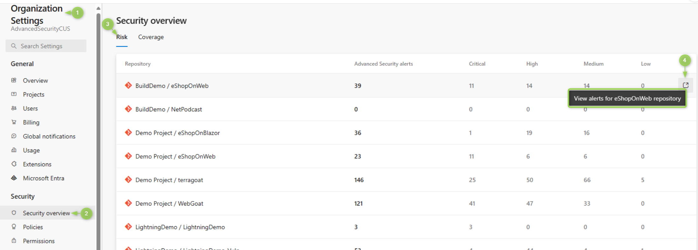

### Security overview risk view links to repository alerts

The security overview risk page now links directly to each repository's individual Advanced Security alerts page. Similar to the coverage page, for a particular repository, hover over the row and click on the icon on the right side of the row to navigate directly to the alerts page.

> [!div class="mx-imgBorder"]
> 

### Publish task for integrating with third-party providers

Previously, in order to set up code scanning with CodeQL, users were required to include the publish task (AdvancedSecurity-Publish@1) in either YAML or classic pipelines. However, with our update, this necessity has been eliminated, as outlined in our release notes. (https://learn.microsoft.com/azure/devops/release-notes/2023/sprint-228-update#publish-task-is-no-longer-required-for-setting-up-code-scanning).

Continuing our commitment to enhancing the integration of GitHub Advanced Security with Azure DevOps, we're excited to introduce the capability to utilize the publish task (AdvancedSecurity-Publish@1) for retrieving results from third-party providers. These providers can include both open-source and commercial security analysis pipeline tasks that generate results in the conforming SARIF format. By leveraging this, users can now view the results within the Advanced Security Code Scanning alerts hub, providing a unified view of code security alerts from currently supported analysis tools directly within Azure DevOps. This integration supports SARIF 2.1, offering users a comprehensive overview of their security posture.

For detailed instructions on configuring code scanning in GitHub Advanced Security with Azure DevOps, please refer to our documentation: https://learn.microsoft.com/azure/devops/repos/security/configure-github-advanced-security-features?view=azure-devops&tabs=yaml#set-up-code-scanning