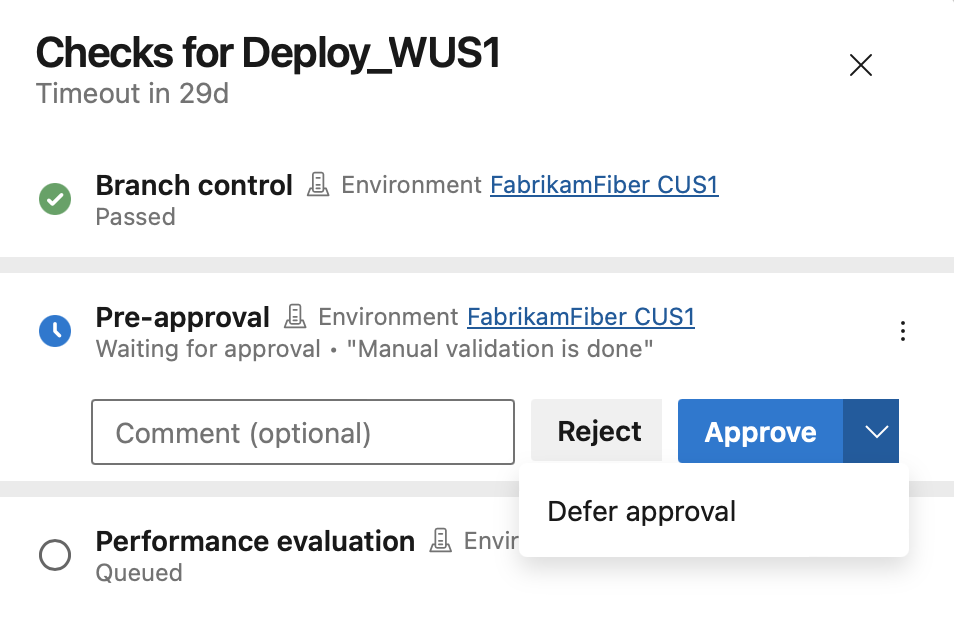
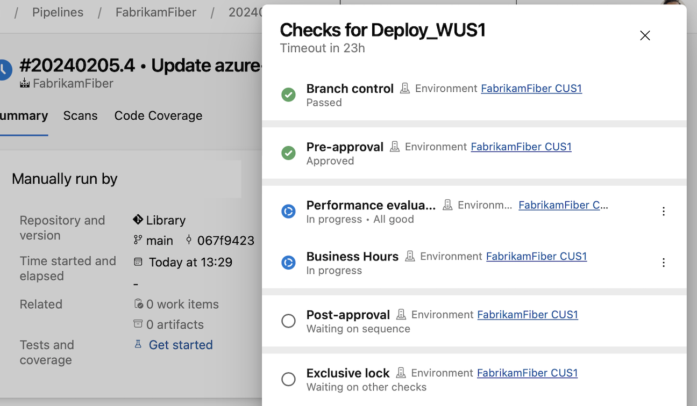
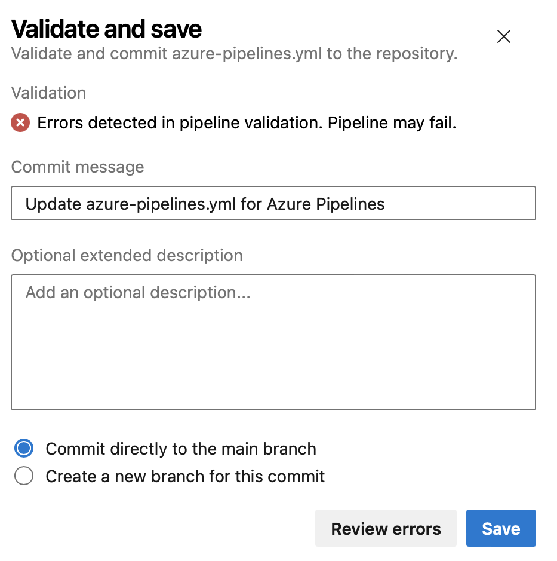

### Provide discoverable resource utilization information

### Artifacts support for Rust Crates

Azure Artifacts support for Rust Crates will enter General Availability starting from 2/16/2024. Billing meters will be turned, following the same pricing model applicable to the rest of the supported protocols. 

### Download EOL Node runners out-of-band

### Deprecated tasks fail 

### Deferred approval

Approvals can be used to sign off on a deployment. However, there are situations when the time when the approval is given and the time the deployment should start do not match. For example, for the particular deployment you review, you know it's an out-of-bounds one. Imagine it cannot proceed immediately, rather it should take place during the night.

To cover such scenarios, we've added the option to defer approvals for YAML pipelines. Now, you can approve a pipeline run and specify when should the approval be effective.

> [!div class="mx-imgBorder"]
> 

When you select _Defer approval_, you can configure the time when the approval becomes effective.

> [!div class="mx-imgBorder"]
> 

> [!div class="mx-imgBorder"]
> 

The approval shows up as deferred in the checks panel.After the deferred-to time, the approval is effective.

> [!div class="mx-imgBorder"]
> 

### Sequencing approvals and checks

Starting this sprint, you'll be able to specify the order in which Approvals and checks run.

[Approvals and checks](https://learn.microsoft.com/azure/devops/pipelines/process/approvals) allow you to control deployments to production. For example, you can specify that only pipelines that run on the `main` branch of a repository are allowed to use a production ARM service connection. Furthermore, you can require human approval and that the system passes a performance check.

Up until today, all approvals and checks ran in parallel, with the exception of exclusive lock. This meant that if your deployment process required performance checks to pass before manual approval is given, you could not enforce this in Azure Pipelines. You had to rely on approval instructions and internal process documentation.

With this sprint, we're introducing sequencing in Approvals and Checks. There are now 5 categories of Approvals and Checks:

1. Static checks: Branch control, Required template, and Evaluate artifact
2. Pre-dynamic checks Approval
3. Dynamic checks: Approval, Invoke Azure Function, Invoke REST API, Business Hours, Query Azure Monitor alerts
4. Post-dynamic checks Approval
5. Exclusive lock

> [!div class="mx-imgBorder"]
> 

The order is shown also in the Approvals and checks tab.

> [!div class="mx-imgBorder"]
> 

Within each category, the checks run in parallel. That is, if you have an Invoke Azure Function check and a Business hours check, they run at the same time.

> [!div class="mx-imgBorder"]
> 

Check categories run one by one and if one fails, the rest of the checks are not executed. This means that if you have a Branch control check and an Approval, if the Branch control fails, the Approval will fail, too. So no needless emails will be sent.

> [!div class="mx-imgBorder"]
> 

We added pre-dynamic checks and post-dynamic checks Approvals, so you can sign off a deployment after all dynamic checks ran (post checks Approvals) or do a manual validation before proceeding with dynamic checks (pre-dynamic checks Approvals).

### Validate and Save by default when editing YAML pipelines

An incorrect YAML pipeline can lead to wasted time and effort. To improve your pipeline editing productivity, we are changing the _Save_ button in the editor to also do YAML validation. 

> [!div class="mx-imgBorder"]
> 

> [!div class="mx-imgBorder"]
> 

If your pipeline has errors, you'll still be able to save it.

> [!div class="mx-imgBorder"]
> 

> [!div class="mx-imgBorder"]
> 

We also improved the _Validate_ experience, so you can see the errors in a list thats easier to understand.

> [!div class="mx-imgBorder"]
> 

