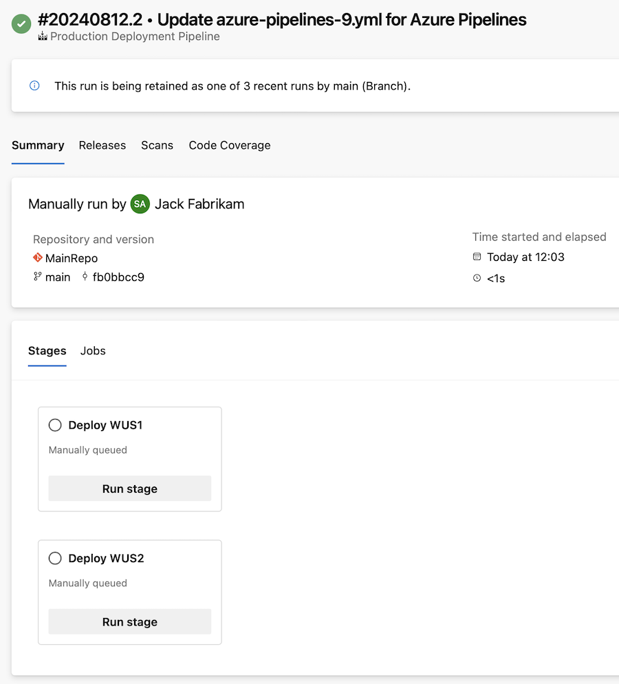

### Azure Pipelines tasks use Node 20

Most Pipeline tasks use Node as a runner. Azure Pipelines task that use NodeJS as a runner now all use NodeJS 20. Authors of task extensions should update their tasks to use Node 20, see https://aka.ms/node-runner-guidance for upgrade guidance.

### Create build pipeline permission

To increase pipeline security, we are introducing a new permission, _Create build pipeline_, at Pipelines level. 

> [!div class="mx-imgBorder"]
> [](../../media/243-pipelines-01.png#lightbox)

Previously, users required the _Edit build pipeline_ permission to either create a pipeline or edit a pipeline. This posed a security concern, because it meant that all users who should be able to create a pipeline could also edit pipelines they didn't create by default. Preventing this was tedious.

To prevent negatively impacting your pipeline experience, all users and groups who have _Edit build pipeline_ permission will get the _Create build pipeline_ permission. 

When a pipeline is created, its creator gets the _Edit build pipeline_ permission. 

You may choose to remove the _Edit build pipeline_ permission from user groups such as _Contributors_ and _Readers_, to improve your pipelines' security. This means that, by default, only a pipeline's creator is able to edit the pipeline.

Note: The _Edit build pipeline_ permission does not protect a YAML pipeline from being edited by those who dont have this permission. It protects the pipeline from having its properties edited.

Note: For new projects, users and group who have the _Edit build pipeline_ permission also get the _Create build pipeline_ permission. This is subject to change in the future.

### Exclusive lock check at stage level

There are use cases that require only one run of a pipeline access a specific resource at any point in time. To support this use case, we have the [Exclusive lock](https://learn.microsoft.com/azure/devops/pipelines/process/approvals?view=azure-devops&tabs=check-pass#exclusive-lock) check.

A similar use case is when only a single pipeline run can access a stage at any point in time. For example, you have a stage that deploys to an Azure resource group, and you dont want multiple pipeline runs to concurrently update the same resource group. Today, to obtain this behavior, you have a to use a proxy resource, for example, an environment, and place the Exclusive lock check on that environment. This is tedious, adds complexity, and increases maintenance efforts.

In this sprint we're adding support for specifying the exclusive lock behavior at stage level. If you have a stage that has an id and you specify its `lockBehavior` property, a lock is automatically created for that stage. The `sequential` behavior is the same for resource-level and stage-level locks. The `runLatest` behavior differs in that it only cancels the runLatest builds for the same branch, not for all branches of the pipeline. 

### Template information in pipeline runs

We updated the [Pipelines Runs - Get](https://learn.microsoft.com/rest/api/azure/devops/pipelines/runs/get?view=azure-devops-rest-7.2#run) REST API with information about the templates extended and included in a pipeline run.

For example, consider you have the following YAML pipeline code:
```yml
extends:
  template: template-stages.yml@templates
  parameters:
    stages:
    - stage: deploy
      jobs:
      - job:
        steps:
        - template: template-step.yml
```

The new REST API will have the following new properties:
```yml
"yamlDetails":
    {
        "extendedTemplates":
        [
            {
                "yamlFile": "template-stages.yml",
                "repoAlias": "templates"
            }
        ],
        "includedTemplates":
        [
            {
                "yamlFile": "template-step.yml",
                "repoAlias": "templates"
            }
        ],
        "rootYamlFile":
        {
            "ref": "refs/heads/main",
            "yamlFile": "azure-pipelines.yml",
            "repoAlias": "self"
        },
        "expandedYamlUrl": "https://dev.azure.com/fabrikamfiber/161cfeeb-d9fd-395c-917b-fec46db44fbb/_apis/build/builds/39224/logs/1"
    }
```

### Manually triggered YAML pipeline stages

One of the frequent asks we received is about manually triggered YAML pipeline stages. They are useful when you want to have a unified pipeline, but dont wish to always run the pipeline to completion.

 For example, your pipeline can build, test, deploy to a staging environment, and, finally, to production. You may wish to always run all stages but the one that deploys to production. For production deployments you wish to manually run the stage, at your convenience.

Starting with this sprint, we're adding support for manually triggered YAML pipeline stages. To use this feature, you need to add the `trigger: manual` property to a stage.

Consider the following YAML pipeline example.
```yaml
stages:
- stage: stage_WUS1
  displayName: Deploy WUS1
  trigger: manual
  jobs:
  - job: DeployJob
    steps:
    - task: AzureCLI@2
      inputs:
        azureSubscription: 'AzureWIF'
        scriptType: 'ps'
        scriptLocation: 'inlineScript'
        inlineScript: 'Write-host ''hello, world'''     
- stage: stage_WUS2
  displayName: Deploy WUS2
  trigger: manual
  jobs:
  - job: DeployJob
    steps:
    - task: AzureCLI@2
      inputs:
        azureSubscription: 'AzureWIF'
        scriptType: 'ps'
        scriptLocation: 'inlineScript'
        inlineScript: 'Write-host ''hello, world'''
```

When you run this pipeline, the experience is the following.

> [!div class="mx-imgBorder"]
> 

Manually triggered stages have no dependencies. The pipeline run completes when there are only manually triggered stages left to execute.

### Managed DevOps Pools (Public Preview)

Engineering teams ideally want to spend all their time writing code to create applications and services for their users! In reality, many end up spending a significant portion of their time on other tasks, such as maintaining DevOps infrastructure.

Today, we’re excited to announce the public preview of [Managed DevOps Pools (MDP)](https://aka.ms/mdp-docs), a feature of Azure DevOps that enables dev teams or platform engineering teams to quickly spin up custom DevOps pools that suit their team’s unique needs. It combines the flexibility of Scale Set agents and the ease of maintenance of Microsoft Hosted agents. It enables engineering teams to establish consistency and best practices while maximizing performance, security, compliance, and cost-efficiency for their custom DevOps Pools.

By using Managed DevOps Pools, teams can expect to see the following key benefits:
Hosted on your behalf: MDP is a fully managed service where VMs powering the agents are created/managed by Microsoft services in Microsoft owned Azure subscriptions.
Time spent in Management: MDP drastically reduces time spent in management of agents that are based on on-premises infrastructure or manually maintained.
Specific Pools: Due to the ease with which new pools can be created, organizations can very easily create multiple team-specific or workload-specific pools.
DevOps Billing: MDP helps optimize a team’s DevOps bill through many features. It makes it easy for teams to find an optimal balance between a pool’s QoS/performance and cost.
Scalable: MDP scales to 1000s of agents in a single pool.
Teams can create pools with [quick-starter images](https://learn.microsoft.com/azure/devops/managed-devops-pools/configure-images?view=azure-devops&tabs=azure-portal#azure-pipelines-images) that contain the same software present in Microsoft hosted agents or with images that the team has created with pre-requisites that are unique to their scenario.

Learn more about Managed DevOps Pools by reading our [blogpost](https://devblogs.microsoft.com/devops/managed-devops-pools/) or its [documentation](https://aka.ms/mdp-docs).