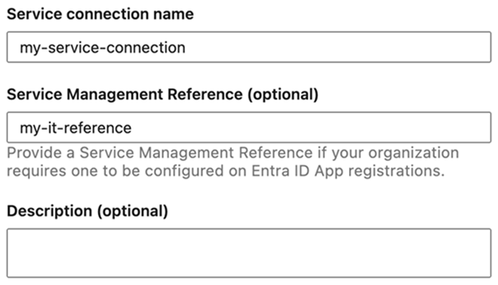

### macOS-15 Sequoia is available in preview

The `macOS-15` image is now available in preview for Azure Pipelines hosted agents. To use this image, update your YAML file to include `vmImage:'macos-15'`:  

```yaml
- job: macOS15
  pool:
    vmImage: 'macOS-15'
  steps:
  - bash: |
      echo Hello from macOS Sequoia Preview
      sw_vers
```

For macOS-15 installed software, see [image configuration](https://github.com/actions/runner-images/blob/main/images/macos/macos-15-Readme.md).

The `macOS-14` image will still be used when specifying `macOS-latest`. Once `macOS-15` is generally available, `macOS-latest` migrates directly to `macOS-15`.


### Improvements to Service connection App registration attribution

Service connection that target Azure by default create an App registration.
To find the identity associated with a service connection, you can follow the 'Manage App registration' link on the service connection details page. We received feedback that, when browsing app registrations directly in Entra ID, it is not always clear what an App registration is used for. To improve the attribution experience, we made the following changes.

#### App registration notes and service management reference

Newly created Azure service connections can have a service management reference specified in addition to a description.

> [!div class="mx-imgBorder"]
> 

This will be used to populate App registration metadata which can be found on the Branding & properties blade.

> [!div class="mx-imgBorder"]
> 

If a description was not specified at service connection creation time, we will create a default note on the App registration.

#### New naming convention for app registrations in Azure service connections

Previously, service connections were named using the format `<azure devops org>-<azure devops project>-<azure subscription id>`, making it challenging to distinguish between App registrations linked to the same Azure subscription. To improve clarity, App registration names will now include the service connection id, following this format: `<azure devops org>-<azure devops project>-<service connection id>`.

You can find the service connection id on the service connection details page:

> [!div class="mx-imgBorder"]
> 

### Azure Pipelines tasks use Node 20

Tasks that run on a pipeline agent are executed using a runner. The [Azure Pipelines tasks](/azure/devops/pipelines/tasks/reference) that use Node as a runner now all use Node 20.
