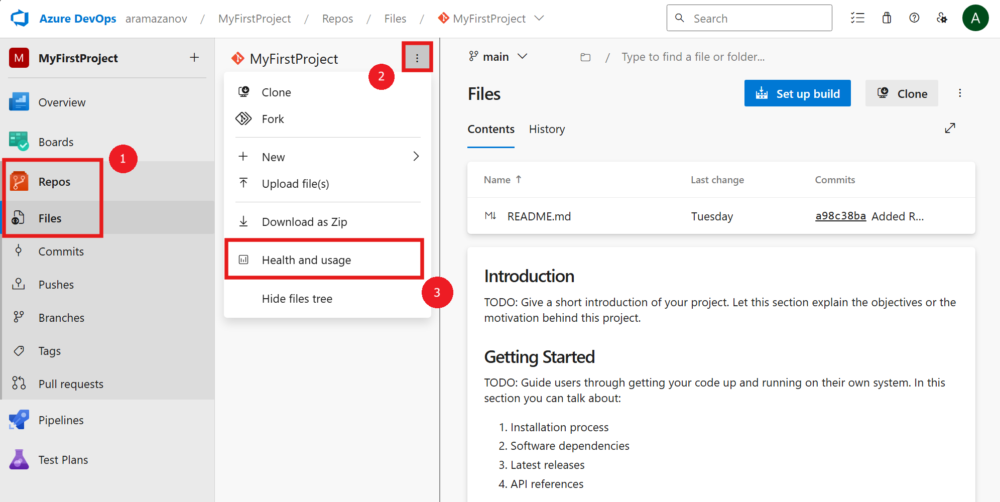

###  New "Health and usage" panel in repo file hub 

Our customers depend on Azure DevOps Git repositories for their day-to-day work. For our larger customers, these repositories can grow to a few GB in size and contain several thousands of reachable commits and blobs. Frequent Git operations on such repositories can impose a stress on Azure DevOps infrastructure and impact your experience. Maintaining optimal health is crucial to ensuring performance and reliability of Azure DevOps repositories.
To promote this goal, we now actively monitor a range of factors that contribute to the health of a repository. These factors include size, commit frequency, contents, structure, and more. If your repository excessively impacts our infrastructure, you might receive an email from our support team asking you to take corrective action. By effectively managing your repository’s size and overall health, you can prevent it from negatively impacting our infrastructure and your experience.

To review the health of your repository, navigate to the Azure Repos Git repo. Select Repo > Files and then choose "Health and usage" from the ellipsis menu to open the "Repository health and usage" panel.

> [!div class="mx-imgBorder"]
> 
