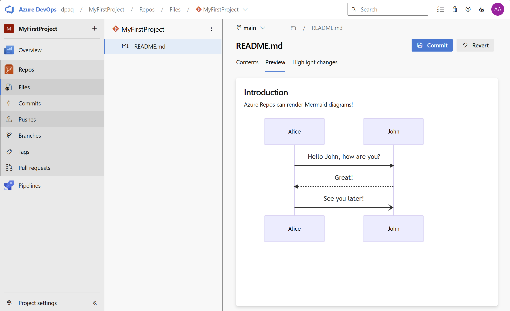

### Configure target branches for pull requests

Managing multiple branches in a repository can be challenging, especially when creating new pull requests. With the new Configure Target Branches for Pull Requests feature, you can now specify a list of preferred target branches, ensuring that pull request suggestions are more accurate and relevant. This helps streamline your workflow and reduces the chances of targeting the wrong branch.
To use this feature, create a .azuredevops/pull_request_targets.yml file in your repository's default branch. This YAML file should contain a list titled pull_request_targets with the branch names or prefixes that match the candidate branches. For example:
pull_request_targets:
  - main
  - release/*
  - feature/*

In this configuration, the main branch is prioritized, but branches starting with release/ or feature/ will also be considered when appropriate. The configuration is applied in the following scenarios:

- **Pull Request Suggestions:** After pushing a branch to Azure DevOps, the Repos page may suggest creating a pull request from that branch, dynamically choosing the target branch.
- **Pull Request URL:** When navigating directly to the pull request creation page using a sourceRef parameter but omitting the targetRef parameter, Azure DevOps selects a target branch based on this dynamic choice.

It’s recommended to include only branches protected by pull request policies to ensure consistency in the first-parent history of the tip commit.

### Support mermaid diagrams in markdown file preview

Markdown files containing mermaid syntax will now render as diagrams inside file previews in repos file browser and in pull requests. This can help you add richer documentation to your repositories.

> [!div class="mx-imgBorder"]
> 